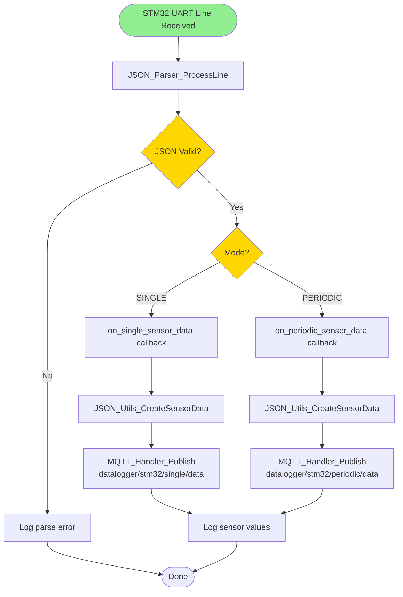
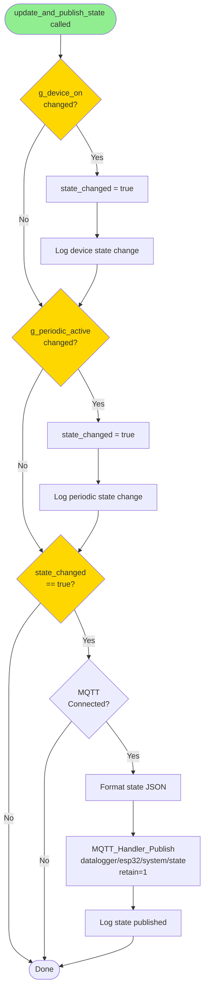
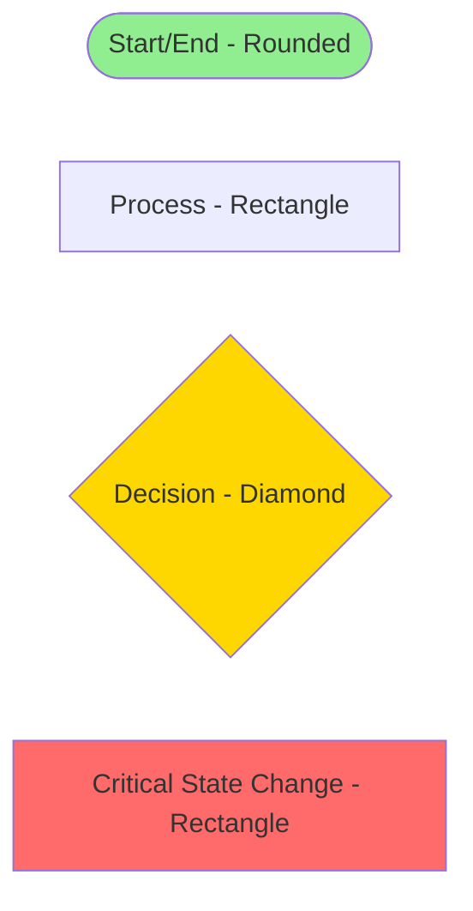

# ESP32 IoT Bridge - Flow Diagram

This document describes the control flow and decision logic within the ESP32 firmware.

## Main Application Flow

```mermaid
flowchart TD
    Start([System Power On]) --> NVSInit[Initialize NVS Flash]
    NVSInit --> EventInit[Initialize Event Loop]
    EventInit --> NetifInit[Initialize Network Interface]
    
    NetifInit --> InitWiFi[Initialize WiFi Manager]
    InitWiFi --> InitUART[Initialize STM32 UART]
    InitUART --> InitLED[Initialize WiFi/MQTT LED GPIOs]
    InitLED --> ConnectWiFi[WiFi Manager Connect<br/>15s timeout]
    
    ConnectWiFi --> CheckWiFi{WiFi Connected<br/>within 15s?}
    CheckWiFi -->|Yes| MarkTime[Mark WiFi reconnect time]
    CheckWiFi -->|No| WarnRetry[Log warning, continue<br/>WiFi will retry in background]
    
    MarkTime --> InitComponents[Initialize Components:<br/>MQTT Handler, Relay Control,<br/>JSON Parser, Buttons]
    WarnRetry --> InitComponents
    
    InitComponents --> CheckInit{All Components<br/>Initialized?}
    CheckInit -->|No| Restart[ESP Restart]
    CheckInit -->|Yes| StartServices[Start Services<br/>Button Task, UART RX Task]
    
    StartServices --> MainLoop{Main Monitoring Loop}
    
    MainLoop --> CheckWiFiState{WiFi State?}
    
    CheckWiFiState -->|FAILED| CheckRetry{5s retry<br/>interval passed?}
    CheckRetry -->|Yes| RetryWiFi[WiFi Manager Connect]
    CheckRetry -->|No| CheckStabilize
    RetryWiFi --> CheckStabilize
    
    CheckWiFiState -->|CONNECTED| CheckStabilize{WiFi stable<br/>for 4s?}
    CheckStabilize -->|Yes & MQTT not started| StartMQTT[MQTT Handler Start]
    CheckStabilize -->|No| CheckMQTTState
    StartMQTT --> CheckMQTTState
    
    CheckWiFiState -->|DISCONNECTED| StopMQTT[MQTT Handler Stop]
    StopMQTT --> CheckMQTTState
    
    CheckMQTTState{MQTT State<br/>Changed?}
    CheckMQTTState -->|Connected| NotifySTM32Conn[Send "MQTT CONNECTED" to STM32]
    CheckMQTTState -->|Disconnected| NotifySTM32Disc[Send "MQTT DISCONNECTED" to STM32]
    CheckMQTTState -->|No Change| LogStatus
    
    NotifySTM32Conn --> SetLED[Set MQTT LED ON]
    NotifySTM32Disc --> ClearLED[Set MQTT LED OFF]
    SetLED --> LogStatus[Log periodic status every 30s]
    ClearLED --> LogStatus
    
    LogStatus --> Delay[Delay 100ms]
    Delay --> MainLoop
    
    style Start fill:#90EE90
    style MainLoop fill:#FFD700
    style CheckWiFiState fill:#FFD700
    style CheckMQTTState fill:#FFD700
    style Restart fill:#FF6B6B
```

## MQTT Data Received Flow

```mermaid
flowchart TD
    Start([MQTT Message Received]) --> CheckTopic{Topic?}
    
    CheckTopic -->|datalogger/stm32/command| ForwardSTM32[STM32_UART_SendCommand]
    CheckTopic -->|datalogger/esp32/relay/control| ProcessRelay[Relay_ProcessCommand]
    CheckTopic -->|datalogger/esp32/system/state| CheckRequest{Data contains<br/>"REQUEST"?}
    CheckTopic -->|Other| Ignore([Ignore])
    
    ForwardSTM32 --> CheckCmd{Command Type?}
    CheckCmd -->|PERIODIC ON| UpdateStatePOn[update_and_publish_state<br/>periodic=true]
    CheckCmd -->|PERIODIC OFF| UpdateStatePOff[update_and_publish_state<br/>periodic=false]
    CheckCmd -->|Other| Done([Done])
    
    UpdateStatePOn --> Done
    UpdateStatePOff --> Done
    
    ProcessRelay --> CheckRelayCmd{Command?}
    CheckRelayCmd -->|ON| SetRelayOn[Relay_SetState(true)]
    CheckRelayCmd -->|OFF| SetRelayOff[Relay_SetState(false)]
    CheckRelayCmd -->|Invalid| Done
    
    SetRelayOn --> Done
    SetRelayOff --> Done
    
    CheckRequest -->|Yes & mqtt_reconnected flag| PublishState[publish_current_state]
    CheckRequest -->|No| Done
    PublishState --> ClearFlag[Clear mqtt_reconnected flag]
    ClearFlag --> Done
    
    style Start fill:#90EE90
    style CheckTopic fill:#FFD700
    style CheckCmd fill:#FFD700
```

## STM32 Data Received Flow



## Relay State Changed Flow

```mermaid
flowchart TD
    Start([Relay Hardware State Changed]) --> LogState[Log new relay state]
    LogState --> CheckOff{Relay<br/>turned OFF?}
    
    CheckOff -->|Yes| ForcePeriodic[Force periodic=false]
    CheckOff -->|No| KeepPeriodic[Keep periodic state]
    
    ForcePeriodic --> UpdateState[update_and_publish_state]
    KeepPeriodic --> UpdateState
    
    UpdateState --> Delay[Wait 500ms for STM32 boot]
    Delay --> CheckMQTT{MQTT<br/>Connected?}
    
    CheckMQTT -->|Yes| SendConnected[Send "MQTT CONNECTED" to STM32]
    CheckMQTT -->|No| SendDisconnected[Send "MQTT DISCONNECTED" to STM32]
    
    SendConnected --> Done([Done])
    SendDisconnected --> Done
    
    style Start fill:#90EE90
    style CheckOff fill:#FFD700
    style CheckMQTT fill:#FFD700
    style UpdateState fill:#FF6B6B
```

## Button Press Flow

```mermaid
flowchart TD
    Start([Button Pressed]) --> Debounce[Hardware debounce + software filter]
    Debounce --> CheckButton{Which Button?}
    
    CheckButton -->|GPIO_5 Relay| ToggleRelay[Toggle relay state]
    CheckButton -->|GPIO_17 Single| CheckDevOn1{Device ON?}
    CheckButton -->|GPIO_16 Periodic| CheckDevOn2{Device ON?}
    CheckButton -->|GPIO_4 Interval| CheckDevOn3{Device ON?}
    
    ToggleRelay --> UpdateGlobal[Update g_device_on]
    UpdateGlobal --> CheckNewState{New state<br/>OFF?}
    CheckNewState -->|Yes| ForcePeriodicOff[Force g_periodic_active=false]
    CheckNewState -->|No| StateCallback[Relay callback will handle]
    ForcePeriodicOff --> StateCallback
    StateCallback --> Done([Done])
    
    CheckDevOn1 -->|No| LogIgnore1[Log ignored - device OFF]
    CheckDevOn1 -->|Yes| SendSingle[Send "SINGLE" to STM32]
    LogIgnore1 --> Done
    SendSingle --> Done
    
    CheckDevOn2 -->|No| LogIgnore2[Log ignored - device OFF]
    CheckDevOn2 -->|Yes| TogglePeriodic[Toggle g_periodic_active]
    LogIgnore2 --> Done
    TogglePeriodic --> FormatCmd{New periodic<br/>state?}
    FormatCmd -->|true| SendPOn[Send "PERIODIC ON" to STM32]
    FormatCmd -->|false| SendPOff[Send "PERIODIC OFF" to STM32]
    SendPOn --> UpdatePublish[update_and_publish_state]
    SendPOff --> UpdatePublish
    UpdatePublish --> Done
    
    CheckDevOn3 -->|No| LogIgnore3[Log ignored - device OFF]
    CheckDevOn3 -->|Yes| CycleInterval[Cycle g_interval_index]
    LogIgnore3 --> Done
    CycleInterval --> BuildCmd[Build "SET PERIODIC INTERVAL {value}"]
    BuildCmd --> SendInterval[Send command to STM32]
    SendInterval --> Done
    
    style Start fill:#90EE90
    style CheckButton fill:#FFD700
    style CheckNewState fill:#FFD700
```

## WiFi State Change Flow

```mermaid
flowchart TD
    Start([WiFi State Changed]) --> CheckState{WiFi State?}
    
    CheckState -->|CONNECTING| LogConn[Log "Connecting..."]
    CheckState -->|CONNECTED| LogSuccess[Log "Connected"]
    CheckState -->|DISCONNECTED| LogDisc[Log "Disconnected"]
    CheckState -->|FAILED| LogFail[Log "Failed"]
    
    LogConn --> LEDOff1[Set WiFi LED OFF]
    LogSuccess --> LEDOn[Set WiFi LED ON]
    LogDisc --> LEDOff2[Set WiFi LED OFF]
    LogFail --> LEDOff3[Set WiFi LED OFF]
    
    LEDOn --> GetIP[Get IP address]
    GetIP --> GetRSSI[Get RSSI]
    GetRSSI --> ResetFlag[Reset disconnect flag]
    ResetFlag --> Done([Done])
    
    LEDOff1 --> Done
    LEDOff2 --> Done
    LEDOff3 --> Done
    
    style Start fill:#90EE90
    style CheckState fill:#FFD700
```

## State Update and Publish Flow



## MQTT Connection State Machine

```mermaid
flowchart TD
    Start([MQTT Handler]) --> CheckWiFi{WiFi<br/>Connected?}
    
    CheckWiFi -->|No| StateDisc[State: DISCONNECTED]
    CheckWiFi -->|Yes| Check4s{Network stable<br/>for 4s?}
    
    Check4s -->|No| Wait[Wait for stability]
    Check4s -->|Yes| StartClient[esp_mqtt_client_start]
    
    Wait --> CheckWiFi
    StartClient --> StateConn[State: CONNECTING]
    
    StateConn --> WaitEvent{MQTT Event?}
    
    WaitEvent -->|CONNECTED| SetConnected[connected = true]
    WaitEvent -->|DISCONNECTED| SetDisconnected[connected = false]
    WaitEvent -->|ERROR| HandleError[Exponential backoff retry]
    
    SetConnected --> SubTopics[Subscribe to command topics]
    SubTopics --> SetReconnFlag[Set mqtt_reconnected flag]
    SetReconnFlag --> StateActive[State: ACTIVE]
    
    SetDisconnected --> StateDisc
    HandleError --> CheckRetry{Max retries<br/>reached?}
    
    CheckRetry -->|Yes| StateDisc
    CheckRetry -->|No| BackoffDelay[Delay: min(60s, 2^retry * 1s)]
    BackoffDelay --> StartClient
    
    StateActive --> WaitMsg{New Message?}
    WaitMsg -->|DATA| CallCallback[Call data_callback]
    WaitMsg -->|DISCONNECT| SetDisconnected
    
    CallCallback --> WaitMsg
    
    style Start fill:#90EE90
    style CheckWiFi fill:#FFD700
    style WaitEvent fill:#FFD700
    style StateActive fill:#87CEEB
    style StateDisc fill:#FF6B6B
```

## Legend



---

**Notes:**
- Green nodes: Entry/exit points
- Yellow nodes: Decision points
- Red nodes: Critical state changes
- Blue nodes: Active/stable states
- WiFi manager handles automatic retries (5 attempts with 2s intervals)
- MQTT starts only after 4-second network stabilization delay
- All button actions require device (relay) to be ON except relay toggle
- Relay state changes trigger 500ms delay before sending MQTT status to STM32 (for STM32 boot time)
