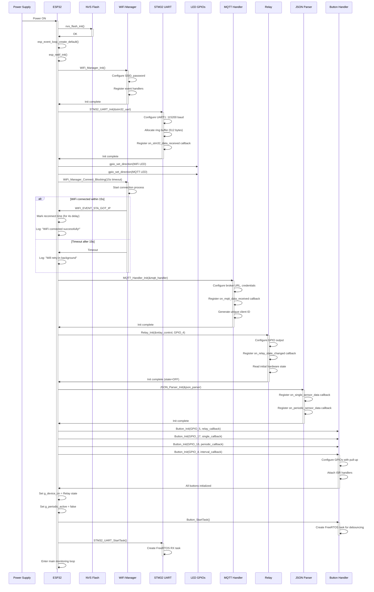
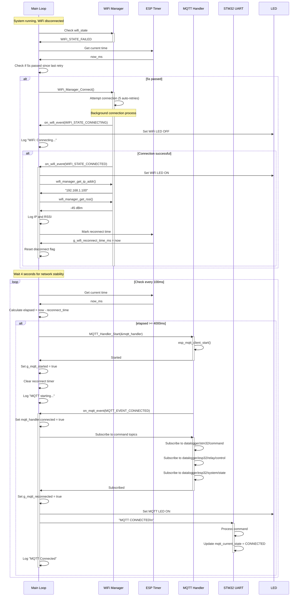
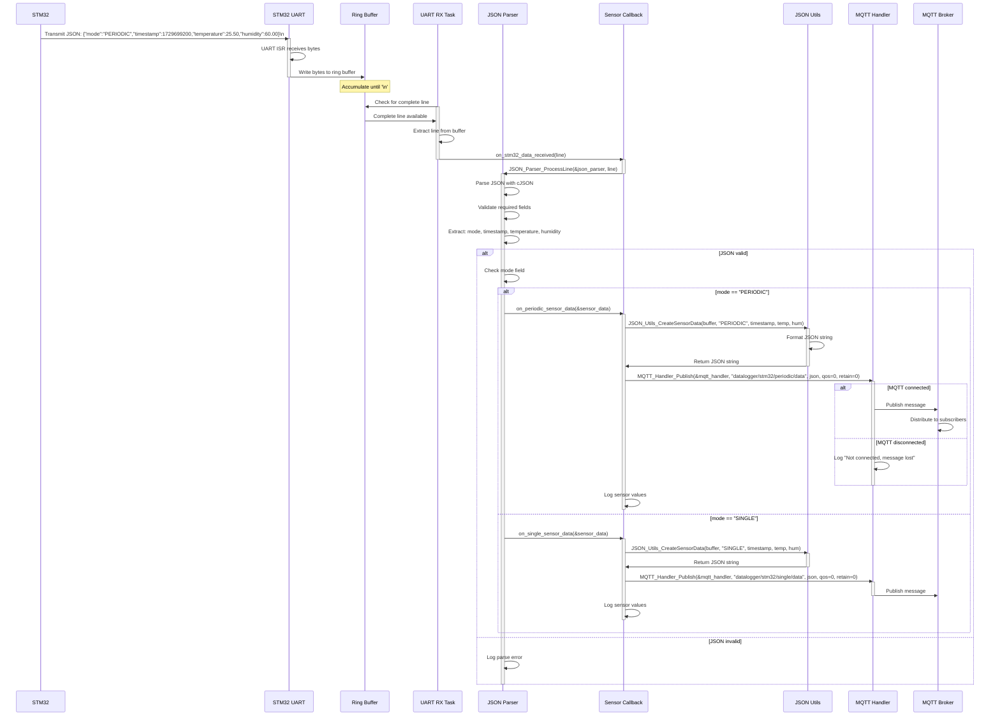
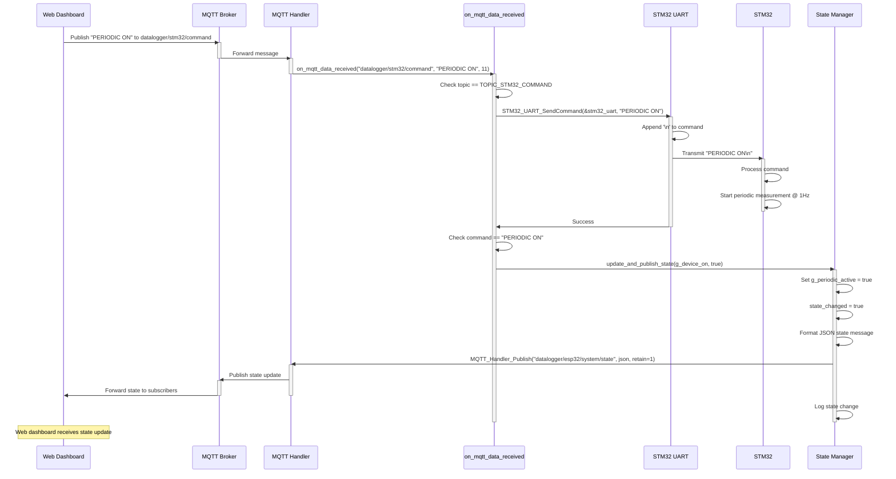
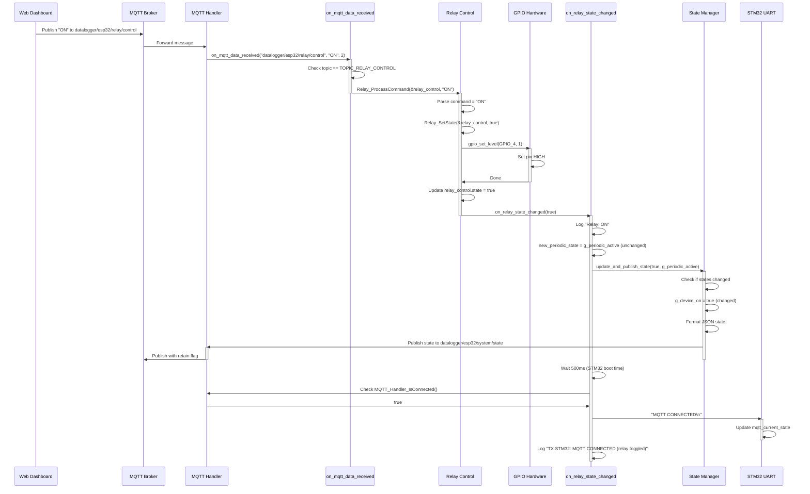
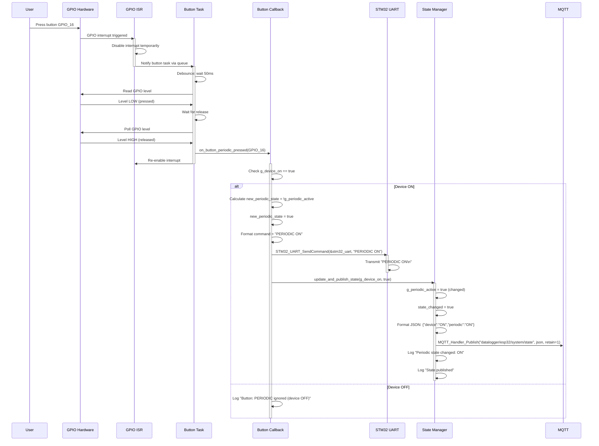
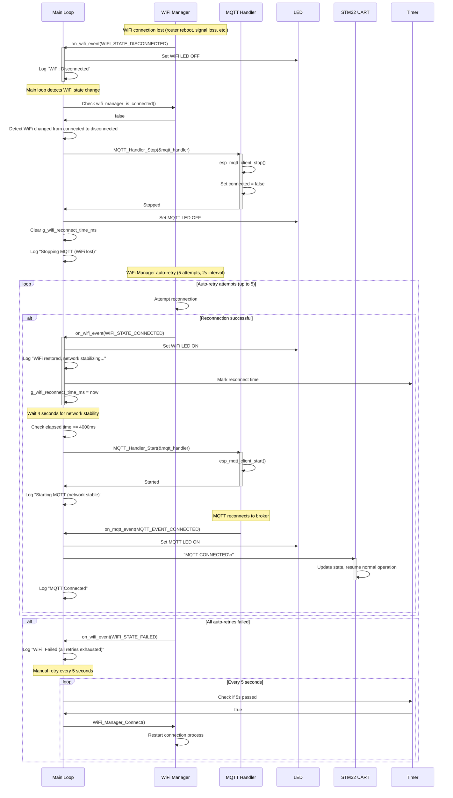
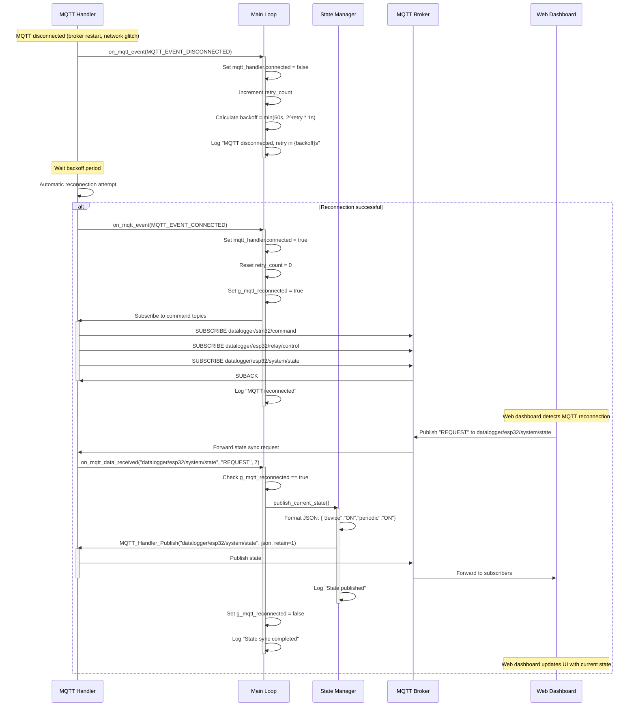

# ESP32 IoT Bridge - Sequence Diagrams

This document illustrates the time-ordered interactions between components in the ESP32 firmware.

## System Initialization Sequence

## WiFi Connection and MQTT Start Sequence

## Sensor Data Reception and Publishing Sequence

## MQTT Command Reception and Forwarding Sequence

## Relay Control via MQTT Sequence

## Button Press Sequence (Periodic Toggle)

## WiFi Disconnection and Reconnection Sequence

## MQTT Reconnection with State Sync Sequence

---

**Key Sequence Characteristics:**

1. **Asynchronous Communication**: UART RX, MQTT events, and button presses all use interrupt-driven, non-blocking I/O with FreeRTOS queues
2. **State Synchronization**: ESP32 maintains authoritative state and publishes to MQTT with retain flag for persistence
3. **Boot Delay Handling**: 500ms delay after relay toggle ensures STM32 receives MQTT status after reboot
4. **Network Stability**: 4-second delay after WiFi connection before starting MQTT ensures network stack is fully ready
5. **Exponential Backoff**: MQTT retries use exponential backoff (min 1s, max 60s) to avoid overwhelming broker
6. **Button Debouncing**: Hardware and software debouncing (50ms) prevents spurious button presses
7. **Ring Buffer**: UART uses 512-byte ring buffer for reliable byte-level reception
8. **Callback Chain**: Data flows through callbacks: Hardware ISR → Task → Parser → Sensor Callback → MQTT Publish
