# ESP32 IoT Bridge - UML Diagrams

This document contains all UML diagrams for the ESP32 firmware architecture, including class diagrams, component diagrams, and structural relationships.

## Complete System Class Diagram

```mermaid
classDiagram
    class main {
        +wifi_manager_t g_wifi_manager
        +stm32_uart_t g_stm32_uart
        +mqtt_handler_t g_mqtt_handler
        +relay_control_t g_relay
        +json_sensor_parser_t g_json_parser
        +bool g_device_on
        +bool g_periodic_active
        +bool mqtt_current_state
        +uint8_t g_interval_index
        +bool mqtt_reconnected
        +int64_t wifi_reconnect_time_us
        +app_main() void
        +initialize_components() void
        +start_services() void
        +create_state_message(char*, size_t) int
        +publish_current_state() void
        +update_and_publish_state(bool, bool) void
        +on_wifi_event(wifi_state_t, void*) void
        +on_stm32_data_received(const char*) void
        +on_mqtt_data_received(const char*, const char*, int) void
        +on_single_sensor_data(const sensor_data_t*) void
        +on_periodic_sensor_data(const sensor_data_t*) void
        +on_relay_state_changed(bool) void
        +on_button_relay_pressed(gpio_num_t) void
        +on_button_single_pressed(gpio_num_t) void
        +on_button_periodic_pressed(gpio_num_t) void
        +on_button_interval_pressed(gpio_num_t) void
    }
    
    class WiFiManager {
        -wifi_state_t current_state
        -uint8_t retry_count
        -wifi_event_callback_t callback
        -void* callback_arg
        +WiFi_Init(wifi_manager_config_t*) bool
        +WiFi_Connect() bool
        +WiFi_Disconnect() bool
        +WiFi_GetState() wifi_state_t
        +WiFi_IsConnected() bool
        +WiFi_GetIPInfo(esp_netif_ip_info_t*) bool
        +WiFi_GetRSSI(int8_t*) bool
        +WiFi_GetStateString(wifi_state_t) const char*
        +WiFi_SetCredentials(const char*, const char*) bool
        +WiFi_ClearCredentials() void
        +WiFi_RegisterEventCallback(wifi_event_callback_t, void*) void
        +WiFi_UnregisterEventCallback() void
        +WiFi_StartScan() bool
        +WiFi_GetScanResults(wifi_ap_record_t*, uint16_t*) bool
        +WiFi_SetAutoReconnect(bool) void
        +WiFi_GetAutoReconnect() bool
    }
    
    class STM32_UART {
        -uart_port_t uart_num
        -gpio_num_t tx_pin
        -gpio_num_t rx_pin
        -int baud_rate
        -QueueHandle_t uart_queue
        -TaskHandle_t rx_task_handle
        -stm32_data_callback_t data_callback
        -void* callback_arg
        -ring_buffer_t rx_buffer
        +STM32_UART_Init(stm32_uart_config_t*) bool
        +STM32_UART_SendCommand(const char*) int
        +STM32_UART_SendData(const uint8_t*, size_t) int
        +STM32_UART_RegisterCallback(stm32_data_callback_t, void*) void
        +STM32_UART_UnregisterCallback() void
        +STM32_UART_SetBaudRate(int) bool
        +STM32_UART_GetBaudRate() int
        +STM32_UART_FlushRxBuffer() void
        +STM32_UART_IsConnected() bool
        +STM32_UART_GetBufferSize() size_t
        +STM32_UART_Deinit() void
        -rx_task(void*) void
        -process_received_data(const uint8_t*, size_t) void
        -validate_json_message(const char*) bool
    }
    
    class MQTTHandler {
        -esp_mqtt_client_handle_t mqtt_client
        -mqtt_state_t current_state
        -mqtt_config_t config
        -mqtt_data_callback_t data_callback
        -void* callback_arg
        -TaskHandle_t publish_task_handle
        -QueueHandle_t publish_queue
        -char client_id[32]
        +MQTT_Init(mqtt_config_t*) bool
        +MQTT_Connect() bool
        +MQTT_Disconnect() void
        +MQTT_Publish(const char*, const char*, int, int) int
        +MQTT_Subscribe(const char*, int) int
        +MQTT_Unsubscribe(const char*) int
        +MQTT_IsConnected() bool
        +MQTT_GetState() mqtt_state_t
        +MQTT_SetWillMessage(const char*, const char*) bool
        +MQTT_RegisterDataCallback(mqtt_data_callback_t, void*) void
        +MQTT_UnregisterDataCallback() void
        +MQTT_GetClientId() const char*
        +MQTT_SetKeepAlive(int) bool
        +MQTT_SetCleanSession(bool) bool
        +MQTT_GetLastError() esp_err_t
        -mqtt_event_handler(void*, esp_event_base_t, int32_t, void*) void
        -publish_task(void*) void
        -validate_topic(const char*) bool
        -generate_client_id() void
    }
    
    class RelayControl {
        -gpio_num_t relay_pin
        -bool current_state
        -bool invert_logic
        -relay_state_callback_t state_callback
        -void* callback_arg
        -uint32_t min_switch_interval_ms
        -int64_t last_switch_time_us
        +Relay_Init(relay_config_t*) bool
        +Relay_SetState(bool) bool
        +Relay_GetState() bool
        +Relay_Toggle() bool
        +Relay_RegisterStateCallback(relay_state_callback_t, void*) void
        +Relay_UnregisterStateCallback() void
        +Relay_SetInvertLogic(bool) void
        +Relay_GetInvertLogic() bool
        +Relay_SetMinSwitchInterval(uint32_t) void
        +Relay_GetMinSwitchInterval() uint32_t
        +Relay_TestOperation() bool
        +Relay_GetSwitchCount() uint32_t
        +Relay_ResetSwitchCount() void
        -validate_switch_timing() bool
        -update_switch_statistics() void
    }
    
    class JSONSensorParser {
        -cJSON* json_root
        -char* json_buffer
        -size_t buffer_size
        -parse_error_t last_error
        +JSON_Parser_Init(size_t) bool
        +JSON_Parser_ParseSensorData(const char*, sensor_data_t*) bool
        +JSON_Parser_CreateSensorJSON(const sensor_data_t*, char*, size_t) int
        +JSON_Parser_ValidateFormat(const char*) bool
        +JSON_Parser_GetLastError() parse_error_t
        +JSON_Parser_GetErrorString(parse_error_t) const char*
        +JSON_Parser_ExtractField(const char*, const char*, char*, size_t) bool
        +JSON_Parser_SetField(cJSON*, const char*, const char*) bool
        +JSON_Parser_Cleanup() void
        +JSON_Parser_GetBufferUsage() float
        +JSON_Parser_ResetBuffer() void
        -validate_sensor_fields(cJSON*) bool
        -convert_to_sensor_data(cJSON*, sensor_data_t*) bool
        -handle_parse_error(parse_error_t) void
    }
    
    class JSONUtils {
        +JSON_CreateObject() cJSON*
        +JSON_CreateArray() cJSON*
        +JSON_AddStringToObject(cJSON*, const char*, const char*) bool
        +JSON_AddNumberToObject(cJSON*, const char*, double) bool
        +JSON_AddBoolToObject(cJSON*, const char*, bool) bool
        +JSON_GetStringValue(cJSON*, const char*) const char*
        +JSON_GetNumberValue(cJSON*, const char*) double
        +JSON_GetBoolValue(cJSON*, const char*) bool
        +JSON_HasField(cJSON*, const char*) bool
        +JSON_PrintObject(cJSON*) char*
        +JSON_ParseString(const char*) cJSON*
        +JSON_Delete(cJSON*) void
        +JSON_ValidateSchema(cJSON*, const char*) bool
        +JSON_GetArraySize(cJSON*) int
        +JSON_GetArrayItem(cJSON*, int) cJSON*
        +JSON_CompareObjects(cJSON*, cJSON*) bool
    }
    
    class ButtonHandler {
        -gpio_num_t relay_button_pin
        -gpio_num_t single_button_pin
        -gpio_num_t periodic_button_pin
        -gpio_num_t interval_button_pin
        -button_callback_t relay_callback
        -button_callback_t single_callback
        -button_callback_t periodic_callback
        -button_callback_t interval_callback
        -void* callback_args[4]
        -uint32_t debounce_time_ms
        -int64_t last_press_time_us[4]
        +Button_Init(button_config_t*) bool
        +Button_RegisterRelayCallback(button_callback_t, void*) void
        +Button_RegisterSingleCallback(button_callback_t, void*) void
        +Button_RegisterPeriodicCallback(button_callback_t, void*) void
        +Button_RegisterIntervalCallback(button_callback_t, void*) void
        +Button_UnregisterCallback(gpio_num_t) void
        +Button_SetDebounceTime(uint32_t) void
        +Button_GetDebounceTime() uint32_t
        +Button_IsPressed(gpio_num_t) bool
        +Button_GetPressCount(gpio_num_t) uint32_t
        +Button_ResetPressCount(gpio_num_t) void
        +Button_EnableInterrupt(gpio_num_t) bool
        +Button_DisableInterrupt(gpio_num_t) bool
        -button_isr_handler(void*) void
        -validate_button_press(gpio_num_t) bool
        -execute_button_callback(gpio_num_t) void
    }
    
    class RingBuffer {
        -uint8_t* buffer
        -size_t capacity
        -size_t head
        -size_t tail
        -size_t count
        -SemaphoreHandle_t mutex
        +RingBuffer_Create(size_t) ring_buffer_t*
        +RingBuffer_Delete(ring_buffer_t*) void
        +RingBuffer_Write(ring_buffer_t*, const uint8_t*, size_t) size_t
        +RingBuffer_Read(ring_buffer_t*, uint8_t*, size_t) size_t
        +RingBuffer_Peek(ring_buffer_t*, uint8_t*, size_t) size_t
        +RingBuffer_GetFreeSpace(ring_buffer_t*) size_t
        +RingBuffer_GetDataSize(ring_buffer_t*) size_t
        +RingBuffer_IsFull(ring_buffer_t*) bool
        +RingBuffer_IsEmpty(ring_buffer_t*) bool
        +RingBuffer_Clear(ring_buffer_t*) void
        +RingBuffer_GetCapacity(ring_buffer_t*) size_t
        +RingBuffer_GetUsagePercent(ring_buffer_t*) float
        -ring_buffer_advance_head(ring_buffer_t*, size_t) void
        -ring_buffer_advance_tail(ring_buffer_t*, size_t) void
    }
    
    class CoAPHandler {
        -coap_context_t* coap_context
        -coap_endpoint_t* coap_endpoint
        -coap_session_t* coap_session
        -coap_optlist_t* coap_options
        -coap_uri_t coap_uri
        -coap_state_t current_state
        -uint16_t message_id
        -coap_data_callback_t data_callback
        -void* callback_arg
        +CoAP_Init(coap_config_t*) bool
        +CoAP_Start() bool
        +CoAP_Stop() void
        +CoAP_SendMessage(const char*, const char*, coap_method_t) int
        +CoAP_RegisterDataCallback(coap_data_callback_t, void*) void
        +CoAP_UnregisterDataCallback() void
        +CoAP_IsRunning() bool
        +CoAP_GetState() coap_state_t
        +CoAP_SetURI(const char*) bool
        +CoAP_AddOption(uint16_t, const uint8_t*, size_t) bool
        +CoAP_ClearOptions() void
        +CoAP_GetLastMessageId() uint16_t
        -coap_request_handler(coap_context_t*, coap_session_t*, coap_pdu_t*, coap_binary_t*, coap_pdu_t*) void
        -coap_response_handler(coap_context_t*, coap_session_t*, coap_pdu_t*, coap_pdu_t*, const coap_tid_t) void
        -coap_event_handler(coap_context_t*, coap_event_t, coap_session_t*) int
    }
    
    %% Data Transfer Objects
    class sensor_data_t {
        +float temperature
        +float humidity
        +char timestamp[32]
        +char mode[16]
        +char status[16]
        +uint32_t sequence_number
        +bool is_valid
        +char error_message[64]
    }
    
    class wifi_manager_config_t {
        +char ssid[32]
        +char password[64]
        +int max_retry_count
        +bool auto_reconnect
        +wifi_auth_mode_t auth_mode
        +wifi_event_callback_t event_callback
        +void* callback_arg
    }
    
    class mqtt_config_t {
        +char broker_uri[256]
        +char username[64]
        +char password[64]
        +char client_id[32]
        +int port
        +int keepalive
        +bool clean_session
        +char will_topic[128]
        +char will_message[256]
        +int will_qos
        +bool will_retain
        +mqtt_data_callback_t data_callback
        +void* callback_arg
    }
    
    class relay_config_t {
        +gpio_num_t pin
        +bool initial_state
        +bool invert_logic
        +uint32_t min_switch_interval_ms
        +relay_state_callback_t state_callback
        +void* callback_arg
    }
    
    class button_config_t {
        +gpio_num_t relay_pin
        +gpio_num_t single_pin
        +gpio_num_t periodic_pin
        +gpio_num_t interval_pin
        +uint32_t debounce_time_ms
        +gpio_pull_mode_t pull_mode
        +gpio_int_type_t interrupt_type
    }
    
    class stm32_uart_config_t {
        +uart_port_t uart_num
        +gpio_num_t tx_pin
        +gpio_num_t rx_pin
        +int baud_rate
        +uart_word_length_t data_bits
        +uart_parity_t parity
        +uart_stop_bits_t stop_bits
        +uart_hw_flowcontrol_t flow_ctrl
        +size_t rx_buffer_size
        +size_t tx_buffer_size
        +int queue_size
        +stm32_data_callback_t data_callback
        +void* callback_arg
    }
    
    class coap_config_t {
        +char server_uri[256]
        +uint16_t port
        +int max_retransmit
        +uint32_t ack_timeout_ms
        +coap_data_callback_t data_callback
        +void* callback_arg
    }
    
    %% Enumerations
    class wifi_state_t {
        <<enumeration>>
        WIFI_STATE_DISCONNECTED
        WIFI_STATE_CONNECTING
        WIFI_STATE_CONNECTED
        WIFI_STATE_RECONNECTING
        WIFI_STATE_ERROR
    }
    
    class mqtt_state_t {
        <<enumeration>>
        MQTT_STATE_DISCONNECTED
        MQTT_STATE_CONNECTING
        MQTT_STATE_CONNECTED
        MQTT_STATE_RECONNECTING
        MQTT_STATE_ERROR
    }
    
    class parse_error_t {
        <<enumeration>>
        PARSE_OK
        PARSE_ERROR_INVALID_JSON
        PARSE_ERROR_MISSING_FIELD
        PARSE_ERROR_INVALID_VALUE
        PARSE_ERROR_BUFFER_OVERFLOW
        PARSE_ERROR_OUT_OF_MEMORY
    }
    
    class coap_state_t {
        <<enumeration>>
        COAP_STATE_STOPPED
        COAP_STATE_STARTING
        COAP_STATE_RUNNING
        COAP_STATE_ERROR
    }
    
    class coap_method_t {
        <<enumeration>>
        COAP_METHOD_GET
        COAP_METHOD_POST
        COAP_METHOD_PUT
        COAP_METHOD_DELETE
    }
    
    %% Main Composition Relationships
    main *-- WiFiManager : contains
    main *-- STM32_UART : contains
    main *-- MQTTHandler : contains
    main *-- RelayControl : contains
    main *-- JSONSensorParser : contains
    main *-- ButtonHandler : contains
    
    %% Component Internal Dependencies
    STM32_UART *-- RingBuffer : uses
    MQTTHandler --> JSONUtils : uses for message formatting
    JSONSensorParser --> JSONUtils : uses for parsing
    main --> CoAPHandler : optionally uses
    
    %% Configuration Dependencies
    WiFiManager ..> wifi_manager_config_t : configures with
    STM32_UART ..> stm32_uart_config_t : configures with
    MQTTHandler ..> mqtt_config_t : configures with
    RelayControl ..> relay_config_t : configures with
    ButtonHandler ..> button_config_t : configures with
    CoAPHandler ..> coap_config_t : configures with
    
    %% Data Flow Dependencies
    STM32_UART --> sensor_data_t : produces
    JSONSensorParser --> sensor_data_t : parses to
    main --> sensor_data_t : processes
    
    %% State Dependencies
    WiFiManager ..> wifi_state_t : maintains
    MQTTHandler ..> mqtt_state_t : maintains
    JSONSensorParser ..> parse_error_t : reports
    CoAPHandler ..> coap_state_t : maintains
    CoAPHandler ..> coap_method_t : uses
    
    %% Callback Relationships
    WiFiManager --> main : wifi_event_callback
    STM32_UART --> main : stm32_data_callback
    MQTTHandler --> main : mqtt_data_callback
    RelayControl --> main : relay_state_callback
    ButtonHandler --> main : button_callback
    CoAPHandler --> main : coap_data_callback
```

## Component Interface UML Diagram

```mermaid
classDiagram
    %% Core Interfaces
    class ICommunicationInterface {
        <<interface>>
        +init(config) bool
        +connect() bool
        +disconnect() void
        +send(data, size) int
        +receive(buffer, size) int
        +isConnected() bool
        +getState() connection_state_t
        +registerCallback(callback, arg) void
    }
    
    class IDataProcessor {
        <<interface>>
        +processData(input, output) bool
        +validateData(data) bool
        +formatData(data, format, buffer, size) int
        +parseData(buffer, data) bool
        +getLastError() error_code_t
    }
    
    class IHardwareControl {
        <<interface>>
        +initialize(config) bool
        +setState(state) bool
        +getState() state_t
        +reset() bool
        +test() bool
        +calibrate() bool
    }
    
    class IEventHandler {
        <<interface>>
        +registerCallback(event, callback, arg) void
        +unregisterCallback(event) void
        +triggerEvent(event, data) void
        +enableEvent(event) bool
        +disableEvent(event) bool
    }
    
    %% Interface Implementations
    class WiFiCommunication {
        -esp_netif_t* netif
        -wifi_config_t wifi_config
        -wifi_event_callback_t callback
        +init(config) bool
        +connect() bool
        +disconnect() void
        +send(data, size) int
        +receive(buffer, size) int
        +isConnected() bool
        +getState() connection_state_t
        +registerCallback(callback, arg) void
    }
    
    class MQTTCommunication {
        -esp_mqtt_client_handle_t client
        -mqtt_config_t config
        -mqtt_data_callback_t callback
        +init(config) bool
        +connect() bool
        +disconnect() void
        +send(data, size) int
        +receive(buffer, size) int
        +isConnected() bool
        +getState() connection_state_t
        +registerCallback(callback, arg) void
    }
    
    class UARTCommunication {
        -uart_port_t port
        -uart_config_t config
        -stm32_data_callback_t callback
        +init(config) bool
        +connect() bool
        +disconnect() void
        +send(data, size) int
        +receive(buffer, size) int
        +isConnected() bool
        +getState() connection_state_t
        +registerCallback(callback, arg) void
    }
    
    class CoAPCommunication {
        -coap_context_t* context
        -coap_config_t config
        -coap_data_callback_t callback
        +init(config) bool
        +connect() bool
        +disconnect() void
        +send(data, size) int
        +receive(buffer, size) int
        +isConnected() bool
        +getState() connection_state_t
        +registerCallback(callback, arg) void
    }
    
    class JSONDataProcessor {
        -cJSON* parser_context
        -size_t buffer_size
        -parse_error_t last_error
        +processData(input, output) bool
        +validateData(data) bool
        +formatData(data, format, buffer, size) int
        +parseData(buffer, data) bool
        +getLastError() error_code_t
    }
    
    class RelayHardwareControl {
        -gpio_num_t pin
        -bool current_state
        -relay_config_t config
        +initialize(config) bool
        +setState(state) bool
        +getState() state_t
        +reset() bool
        +test() bool
        +calibrate() bool
    }
    
    class ButtonHardwareControl {
        -gpio_num_t pins[4]
        -button_config_t config
        -uint32_t press_counts[4]
        +initialize(config) bool
        +setState(state) bool
        +getState() state_t
        +reset() bool
        +test() bool
        +calibrate() bool
    }
    
    class SystemEventHandler {
        -event_callback_map_t callbacks
        -EventGroupHandle_t event_group
        -TaskHandle_t event_task
        +registerCallback(event, callback, arg) void
        +unregisterCallback(event) void
        +triggerEvent(event, data) void
        +enableEvent(event) bool
        +disableEvent(event) bool
    }
    
    %% Interface Implementation Relationships
    WiFiCommunication --|> ICommunicationInterface : implements
    MQTTCommunication --|> ICommunicationInterface : implements
    UARTCommunication --|> ICommunicationInterface : implements
    CoAPCommunication --|> ICommunicationInterface : implements
    
    JSONDataProcessor --|> IDataProcessor : implements
    
    RelayHardwareControl --|> IHardwareControl : implements
    ButtonHardwareControl --|> IHardwareControl : implements
    
    SystemEventHandler --|> IEventHandler : implements
    
    %% Main System Dependencies
    main --> ICommunicationInterface : uses
    main --> IDataProcessor : uses
    main --> IHardwareControl : uses
    main --> IEventHandler : uses
    
    %% Specific Implementations Used
    WiFiManager --> WiFiCommunication : uses
    MQTTHandler --> MQTTCommunication : uses
    STM32_UART --> UARTCommunication : uses
    CoAPHandler --> CoAPCommunication : uses
    JSONSensorParser --> JSONDataProcessor : uses
    RelayControl --> RelayHardwareControl : uses
    ButtonHandler --> ButtonHardwareControl : uses
    main --> SystemEventHandler : uses
```

## Hardware Abstraction Layer UML Diagram

```mermaid
classDiagram
    %% Hardware Abstraction Layer
    class ESP32_HAL {
        <<abstract>>
        +hal_init() bool
        +hal_deinit() void
        +hal_reset() bool
        +hal_get_chip_info() chip_info_t
        +hal_set_cpu_freq(freq) bool
        +hal_get_free_heap() size_t
        +hal_delay_ms(ms) void
        +hal_delay_us(us) void
    }
    
    class GPIO_HAL {
        <<abstract>>
        +gpio_init(pin, mode) bool
        +gpio_set_level(pin, level) void
        +gpio_get_level(pin) int
        +gpio_set_direction(pin, direction) bool
        +gpio_set_pull_mode(pin, mode) bool
        +gpio_install_isr_service(flags) bool
        +gpio_isr_handler_add(pin, handler, args) bool
        +gpio_isr_handler_remove(pin) bool
    }
    
    class UART_HAL {
        <<abstract>>
        +uart_init(port, config) bool
        +uart_deinit(port) void
        +uart_write(port, data, size) int
        +uart_read(port, buffer, size) int
        +uart_flush(port) void
        +uart_set_baudrate(port, rate) bool
        +uart_get_baudrate(port) int
        +uart_wait_tx_done(port, timeout) bool
    }
    
    class WiFi_HAL {
        <<abstract>>
        +wifi_init() bool
        +wifi_deinit() void
        +wifi_start() bool
        +wifi_stop() bool
        +wifi_connect(ssid, password) bool
        +wifi_disconnect() void
        +wifi_scan_start() bool
        +wifi_get_rssi() int8_t
    }
    
    class Timer_HAL {
        <<abstract>>
        +timer_init(group, timer, config) bool
        +timer_deinit(group, timer) void
        +timer_start(group, timer) bool
        +timer_stop(group, timer) bool
        +timer_set_counter_value(group, timer, value) bool
        +timer_get_counter_value(group, timer) uint64_t
        +timer_set_alarm_value(group, timer, value) bool
        +timer_enable_intr(group, timer) bool
    }
    
    class SPI_HAL {
        <<abstract>>
        +spi_init(host, config) bool
        +spi_deinit(host) void
        +spi_transmit(host, data, size) bool
        +spi_receive(host, buffer, size) bool
        +spi_transmit_receive(host, tx_data, rx_data, size) bool
        +spi_set_frequency(host, freq) bool
        +spi_get_frequency(host) int
    }
    
    class I2C_HAL {
        <<abstract>>
        +i2c_init(port, config) bool
        +i2c_deinit(port) void
        +i2c_master_write(port, addr, data, size) bool
        +i2c_master_read(port, addr, buffer, size) bool
        +i2c_master_write_read(port, addr, write_data, write_size, read_data, read_size) bool
        +i2c_set_frequency(port, freq) bool
        +i2c_scan_bus(port, devices, max_devices) int
    }
    
    %% Concrete HAL Implementations
    class ESP32_GPIO_Driver {
        -gpio_config_t pin_configs[GPIO_NUM_MAX]
        -gpio_isr_t isr_handlers[GPIO_NUM_MAX]
        +gpio_init(pin, mode) bool
        +gpio_set_level(pin, level) void
        +gpio_get_level(pin) int
        +gpio_set_direction(pin, direction) bool
        +gpio_set_pull_mode(pin, mode) bool
        +gpio_install_isr_service(flags) bool
        +gpio_isr_handler_add(pin, handler, args) bool
        +gpio_isr_handler_remove(pin) bool
    }
    
    class ESP32_UART_Driver {
        -uart_config_t port_configs[UART_NUM_MAX]
        -QueueHandle_t uart_queues[UART_NUM_MAX]
        +uart_init(port, config) bool
        +uart_deinit(port) void
        +uart_write(port, data, size) int
        +uart_read(port, buffer, size) int
        +uart_flush(port) void
        +uart_set_baudrate(port, rate) bool
        +uart_get_baudrate(port) int
        +uart_wait_tx_done(port, timeout) bool
    }
    
    class ESP32_WiFi_Driver {
        -wifi_config_t station_config
        -wifi_config_t ap_config
        -esp_netif_t* netif_sta
        -esp_netif_t* netif_ap
        +wifi_init() bool
        +wifi_deinit() void
        +wifi_start() bool
        +wifi_stop() bool
        +wifi_connect(ssid, password) bool
        +wifi_disconnect() void
        +wifi_scan_start() bool
        +wifi_get_rssi() int8_t
    }
    
    class ESP32_Timer_Driver {
        -timer_config_t timer_configs[TIMER_GROUP_MAX][TIMER_MAX]
        -timer_isr_t timer_isrs[TIMER_GROUP_MAX][TIMER_MAX]
        +timer_init(group, timer, config) bool
        +timer_deinit(group, timer) void
        +timer_start(group, timer) bool
        +timer_stop(group, timer) bool
        +timer_set_counter_value(group, timer, value) bool
        +timer_get_counter_value(group, timer) uint64_t
        +timer_set_alarm_value(group, timer, value) bool
        +timer_enable_intr(group, timer) bool
    }
    
    %% HAL Implementation Relationships
    ESP32_GPIO_Driver --|> GPIO_HAL : implements
    ESP32_UART_Driver --|> UART_HAL : implements
    ESP32_WiFi_Driver --|> WiFi_HAL : implements
    ESP32_Timer_Driver --|> Timer_HAL : implements
    
    %% Component to HAL Dependencies
    RelayControl --> GPIO_HAL : uses
    ButtonHandler --> GPIO_HAL : uses
    STM32_UART --> UART_HAL : uses
    WiFiManager --> WiFi_HAL : uses
    
    %% HAL Layer Composition
    ESP32_HAL *-- GPIO_HAL : contains
    ESP32_HAL *-- UART_HAL : contains
    ESP32_HAL *-- WiFi_HAL : contains
    ESP32_HAL *-- Timer_HAL : contains
    ESP32_HAL *-- SPI_HAL : contains
    ESP32_HAL *-- I2C_HAL : contains
```

## Task and Memory Management UML Diagram

```mermaid
classDiagram
    class TaskManager {
        -TaskHandle_t task_handles[MAX_TASKS]
        -task_info_t task_infos[MAX_TASKS]
        -uint8_t task_count
        -SemaphoreHandle_t task_mutex
        +TaskManager_Init() bool
        +TaskManager_CreateTask(task_func, name, stack_size, params, priority) TaskHandle_t
        +TaskManager_DeleteTask(handle) bool
        +TaskManager_SuspendTask(handle) bool
        +TaskManager_ResumeTask(handle) bool
        +TaskManager_GetTaskInfo(handle) task_info_t*
        +TaskManager_GetTaskList(list, max_count) int
        +TaskManager_GetSystemStats() system_stats_t
        +TaskManager_SetWatchdog(handle, timeout) bool
        +TaskManager_FeedWatchdog(handle) bool
        +TaskManager_Cleanup() void
    }
    
    class MemoryManager {
        -heap_stats_t heap_stats
        -memory_pool_t pools[MAX_POOLS]
        -uint8_t pool_count
        -SemaphoreHandle_t memory_mutex
        +MemoryManager_Init() bool
        +MemoryManager_Malloc(size) void*
        +MemoryManager_Calloc(count, size) void*
        +MemoryManager_Realloc(ptr, size) void*
        +MemoryManager_Free(ptr) void
        +MemoryManager_CreatePool(size, block_size) memory_pool_t*
        +MemoryManager_DestroyPool(pool) bool
        +MemoryManager_GetHeapStats() heap_stats_t
        +MemoryManager_CheckIntegrity() bool
        +MemoryManager_PrintStats() void
        +MemoryManager_SetLowMemoryCallback(callback, threshold) bool
    }
    
    class QueueManager {
        -QueueHandle_t queues[MAX_QUEUES]
        -queue_info_t queue_infos[MAX_QUEUES]
        -uint8_t queue_count
        -SemaphoreHandle_t queue_mutex
        +QueueManager_Init() bool
        +QueueManager_CreateQueue(length, item_size, name) QueueHandle_t
        +QueueManager_DeleteQueue(handle) bool
        +QueueManager_Send(handle, item, timeout) bool
        +QueueManager_Receive(handle, buffer, timeout) bool
        +QueueManager_SendFromISR(handle, item, higher_priority_task_woken) bool
        +QueueManager_ReceiveFromISR(handle, buffer, higher_priority_task_woken) bool
        +QueueManager_GetQueueInfo(handle) queue_info_t*
        +QueueManager_GetQueueStats(handle) queue_stats_t
        +QueueManager_Reset(handle) bool
        +QueueManager_Cleanup() void
    }
    
    class SemaphoreManager {
        -SemaphoreHandle_t semaphores[MAX_SEMAPHORES]
        -semaphore_info_t semaphore_infos[MAX_SEMAPHORES]
        -uint8_t semaphore_count
        -SemaphoreHandle_t semaphore_mutex
        +SemaphoreManager_Init() bool
        +SemaphoreManager_CreateMutex(name) SemaphoreHandle_t
        +SemaphoreManager_CreateBinary(name) SemaphoreHandle_t
        +SemaphoreManager_CreateCounting(max_count, initial_count, name) SemaphoreHandle_t
        +SemaphoreManager_Delete(handle) bool
        +SemaphoreManager_Take(handle, timeout) bool
        +SemaphoreManager_Give(handle) bool
        +SemaphoreManager_TakeFromISR(handle, higher_priority_task_woken) bool
        +SemaphoreManager_GiveFromISR(handle, higher_priority_task_woken) bool
        +SemaphoreManager_GetSemaphoreInfo(handle) semaphore_info_t*
        +SemaphoreManager_Cleanup() void
    }
    
    class EventGroupManager {
        -EventGroupHandle_t event_groups[MAX_EVENT_GROUPS]
        -event_group_info_t event_group_infos[MAX_EVENT_GROUPS]
        -uint8_t event_group_count
        -SemaphoreHandle_t event_group_mutex
        +EventGroupManager_Init() bool
        +EventGroupManager_Create(name) EventGroupHandle_t
        +EventGroupManager_Delete(handle) bool
        +EventGroupManager_SetBits(handle, bits) EventBits_t
        +EventGroupManager_ClearBits(handle, bits) EventBits_t
        +EventGroupManager_WaitBits(handle, bits, clear_on_exit, wait_for_all, timeout) EventBits_t
        +EventGroupManager_SetBitsFromISR(handle, bits, higher_priority_task_woken) bool
        +EventGroupManager_ClearBitsFromISR(handle, bits) EventBits_t
        +EventGroupManager_GetEventGroupInfo(handle) event_group_info_t*
        +EventGroupManager_Cleanup() void
    }
    
    %% Data Structures
    class task_info_t {
        +TaskHandle_t handle
        +char name[16]
        +UBaseType_t priority
        +uint32_t stack_size
        +eTaskState state
        +uint32_t run_time_counter
        +uint16_t stack_high_water_mark
        +TaskFunction_t task_function
        +void* parameters
        +TickType_t creation_time
    }
    
    class system_stats_t {
        +uint32_t total_heap_size
        +uint32_t free_heap_size
        +uint32_t minimum_free_heap_size
        +uint32_t largest_free_block
        +uint8_t task_count
        +uint32_t total_runtime
        +uint32_t cpu_usage_percent
        +TickType_t uptime_ticks
    }
    
    class memory_pool_t {
        +void* pool_memory
        +size_t pool_size
        +size_t block_size
        +uint32_t total_blocks
        +uint32_t free_blocks
        +uint8_t* allocation_bitmap
        +SemaphoreHandle_t pool_mutex
        +char name[16]
    }
    
    class heap_stats_t {
        +size_t total_free_bytes
        +size_t total_allocated_bytes
        +size_t largest_free_block
        +size_t minimum_free_bytes
        +size_t number_of_free_blocks
        +size_t number_of_successful_allocations
        +size_t number_of_successful_frees
    }
    
    class queue_info_t {
        +QueueHandle_t handle
        +UBaseType_t length
        +UBaseType_t item_size
        +char name[16]
        +TickType_t creation_time
        +uint32_t messages_sent
        +uint32_t messages_received
        +uint32_t send_failures
        +uint32_t receive_failures
    }
    
    class semaphore_info_t {
        +SemaphoreHandle_t handle
        +SemaphoreType_t type
        +char name[16]
        +TickType_t creation_time
        +uint32_t take_count
        +uint32_t give_count
        +TaskHandle_t holder
        +TickType_t last_taken_time
    }
    
    class event_group_info_t {
        +EventGroupHandle_t handle
        +char name[16]
        +TickType_t creation_time
        +EventBits_t current_bits
        +uint32_t set_count
        +uint32_t clear_count
        +uint32_t wait_count
    }
    
    %% Manager Relationships
    TaskManager *-- task_info_t : manages
    TaskManager *-- system_stats_t : generates
    MemoryManager *-- memory_pool_t : manages
    MemoryManager *-- heap_stats_t : tracks
    QueueManager *-- queue_info_t : manages
    SemaphoreManager *-- semaphore_info_t : manages
    EventGroupManager *-- event_group_info_t : manages
    
    %% System Dependencies
    main --> TaskManager : uses
    main --> MemoryManager : uses
    main --> QueueManager : uses
    main --> SemaphoreManager : uses
    main --> EventGroupManager : uses
    
    %% Component Dependencies
    WiFiManager --> TaskManager : creates tasks
    MQTTHandler --> TaskManager : creates tasks
    STM32_UART --> TaskManager : creates tasks
    WiFiManager --> QueueManager : uses queues
    MQTTHandler --> QueueManager : uses queues
    STM32_UART --> QueueManager : uses queues
    ButtonHandler --> SemaphoreManager : uses semaphores
    RelayControl --> SemaphoreManager : uses semaphores
    main --> EventGroupManager : uses event groups
```

---

## UML Diagram Conventions

### Class Diagram Elements
- **Classes**: Represented with class name, attributes (-private, +public), and methods
- **Interfaces**: Marked with `<<interface>>` stereotype
- **Abstract Classes**: Marked with `<<abstract>>` stereotype
- **Enumerations**: Marked with `<<enumeration>>` stereotype
- **Data Structures**: C-style structs and configuration objects

### Relationship Types
- **Composition** (`*--`): Strong ownership relationship (lifetime dependency)
- **Aggregation** (`o--`): Weak ownership relationship (shared ownership)
- **Association** (`-->`): "uses" or "depends on" relationship
- **Inheritance** (`<|--`): "extends" or "inherits from" relationship (limited in C)
- **Realization** (`--|>`): "implements" relationship for interfaces
- **Dependency** (`..>`): Configuration or temporary usage relationship

### Visibility Modifiers
- **Public** (`+`): Accessible from outside the module (in header files)
- **Private** (`-`): Internal to the module (static functions, private variables)

### ESP32 Specific Patterns
- **Component Architecture**: Each component is self-contained with its own initialization
- **Callback Pattern**: Event-driven communication between components
- **RTOS Integration**: FreeRTOS tasks, queues, semaphores, and event groups
- **Hardware Abstraction**: HAL layer separating hardware-specific and application code
- **Configuration Structures**: C structs for component configuration
- **State Machines**: Explicit state management for connection states and operation modes

### Design Patterns Represented
- **Component Pattern**: Modular, reusable firmware components
- **Observer Pattern**: Callback-based event notification system
- **State Pattern**: Connection state management with explicit transitions
- **Bridge Pattern**: Hardware abstraction layer for portability
- **Factory Pattern**: Configuration-based component initialization
- **Singleton Pattern**: Global application state and manager instances