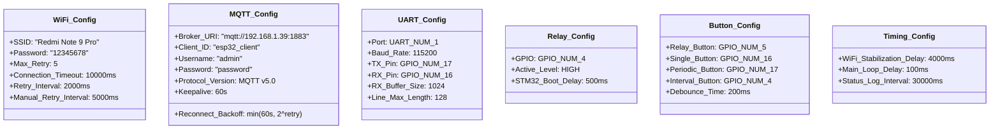

# ESP32 IoT Bridge - UML Class Diagram

This document provides the UML class diagrams showing the structure and relationships of the ESP32 firmware components.

## Complete System Class Diagram


## Component Dependencies

```mermaid
graph TB
    Main[main.c]
    WiFi[WiFi Manager]
    UART[STM32 UART]
    MQTT[MQTT Handler]
    Relay[Relay Control]
    Parser[JSON Sensor Parser]
    Utils[JSON Utils]
    Button[Button Handler]
    RingBuf[Ring Buffer]
    
    Main --> WiFi
    Main --> UART
    Main --> MQTT
    Main --> Relay
    Main --> Parser
    Main --> Button
    Main --> Utils
    
    UART --> RingBuf
    Parser ..> Utils
    
    WiFi -.-> Main : wifi_event_callback
    UART -.-> Main : stm32_data_callback
    MQTT -.-> Main : mqtt_data_callback
    Relay -.-> Main : relay_state_callback
    Parser -.-> Main : sensor_data_callback
    Button -.-> Main : button_press_callback
    
    style Main fill:#90EE90
    style WiFi fill:#87CEEB
    style MQTT fill:#87CEEB
    style Parser fill:#FFD700
    style Relay fill:#DDA0DD
```

## Object Lifecycle Diagram


## Data Flow Diagram


## MQTT Topic Architecture


## Hardware GPIO Configuration


## Configuration Constants



## State Synchronization Flow


## Error Handling and Retry Logic


## Summary

The ESP32 firmware architecture is built around a component-based design with clear separation of concerns:

- **Main Application**: Orchestrates all components and manages application state
- **WiFi Manager**: Handles WiFi connectivity with automatic retry logic
- **UART Handler**: Manages line-based communication with STM32 via ring buffer
- **MQTT Handler**: Provides MQTT client with exponential backoff retry
- **Relay Control**: Controls relay GPIO with state callbacks
- **JSON Parser**: Parses sensor data with mode-specific routing
- **JSON Utils**: Provides centralized JSON formatting utilities
- **Button Handler**: Monitors button presses with debouncing
- **Ring Buffer**: Circular buffer for UART data reception

All components use callback-based event handling for loose coupling and operate within the FreeRTOS task model. The architecture ensures reliable WiFi/MQTT connectivity, proper STM32 communication, and responsive user interaction through buttons and web interface.

**Key Features:**
- 4-second WiFi stabilization delay before MQTT start
- 500ms delay after relay toggle for STM32 boot time
- Exponential backoff retry for MQTT reconnection
- Device state protection (buttons disabled when relay OFF)
- State synchronization via MQTT retained messages
- Automatic WiFi reconnection with 5 retry attempts
