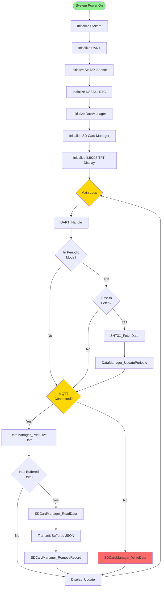
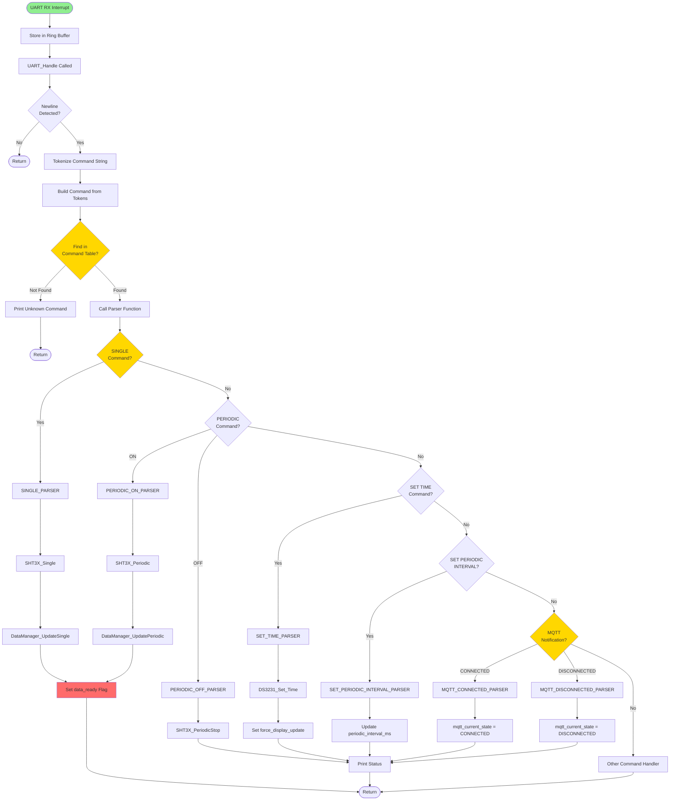
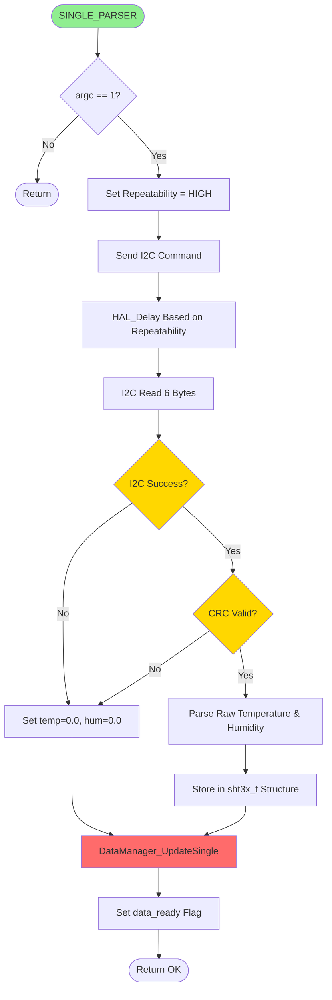
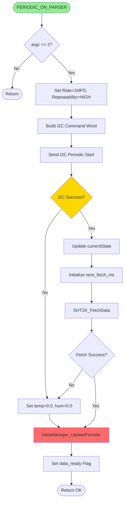
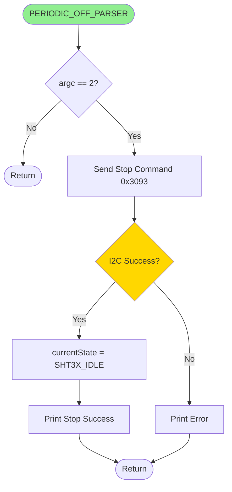
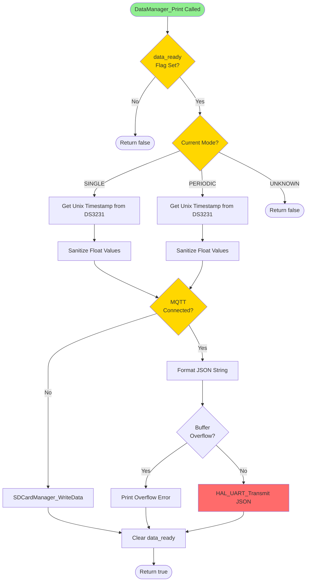
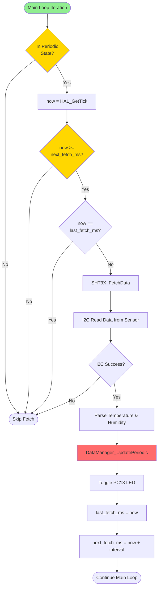
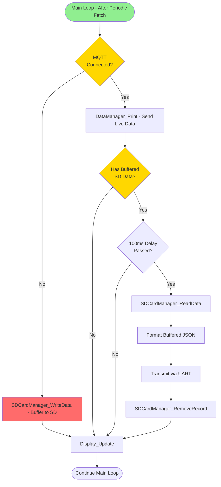
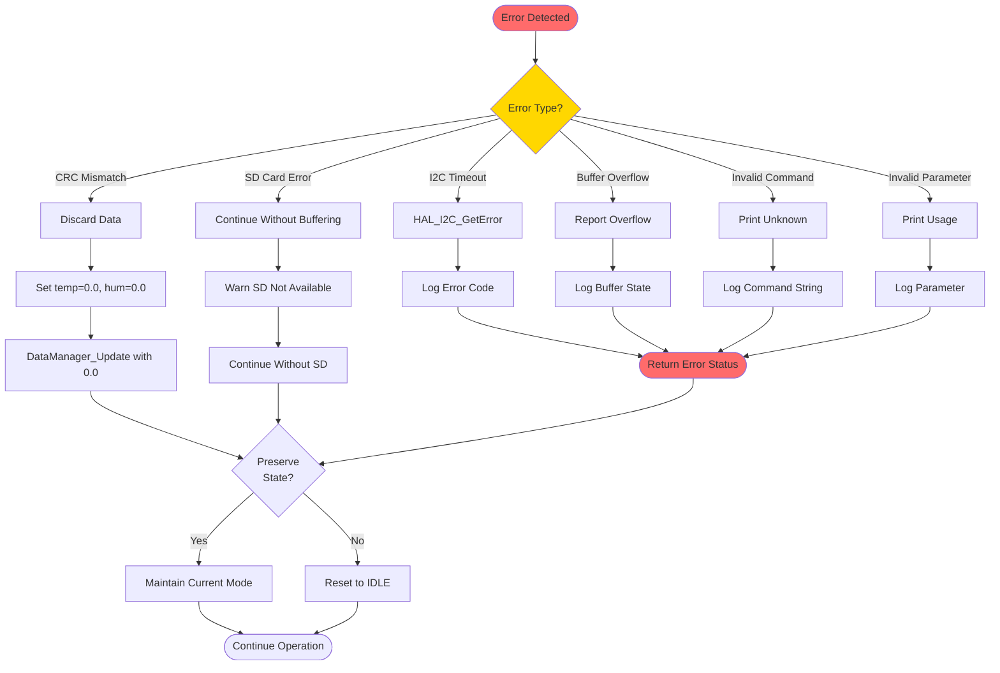
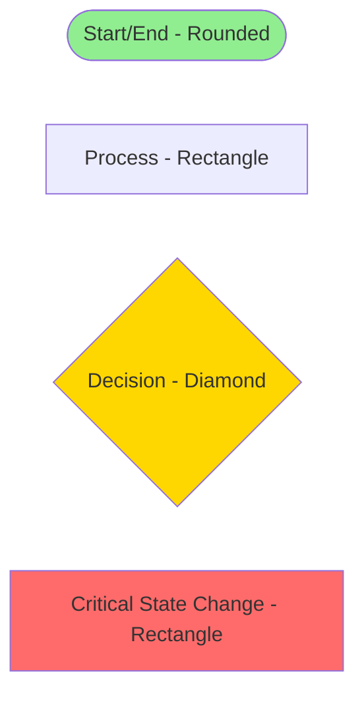

# STM32 Data Logger - Flow Diagram

This document describes the control flow and decision logic within the STM32 firmware.

## Main Application Flow

## Command Execution Flow

## SHT3X Single Measurement Flow

## SHT3X Periodic Measurement Flow

## Periodic Measurement Stop Flow

## Data Manager Print Decision Flow

## Periodic Data Fetch Decision Flow

## MQTT-Aware Data Routing Flow

## Error Handling Flow

## Legend

---

**Notes:**
- Green nodes: Entry/exit points
- Yellow nodes: Decision points
- Red nodes: State changes or critical operations
- Blue nodes: Wait states or returns
- All flows are non-blocking except I2C operations and delays
