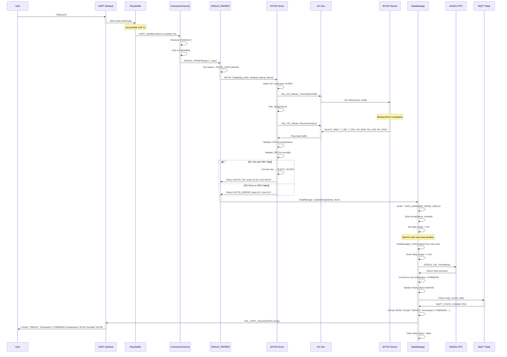
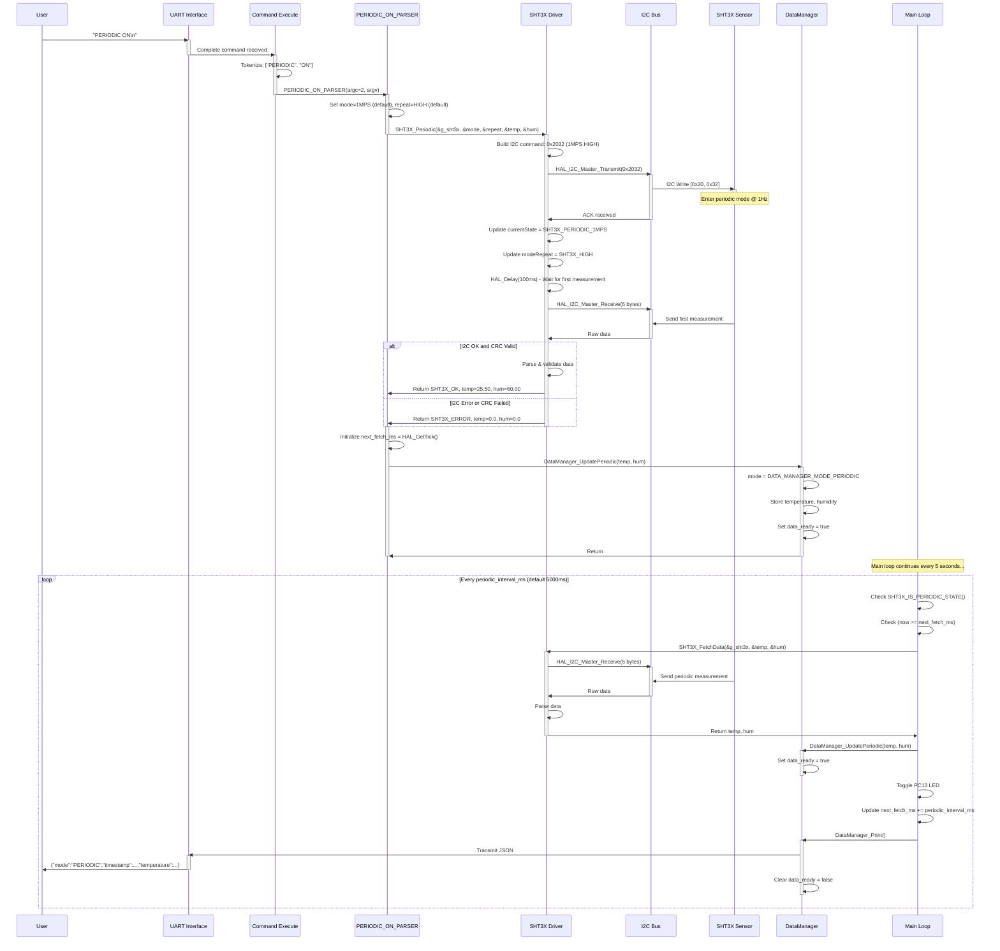
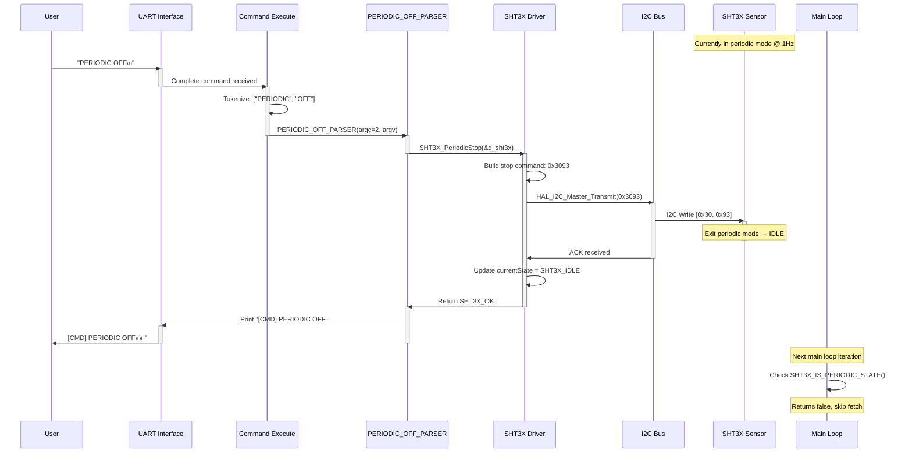
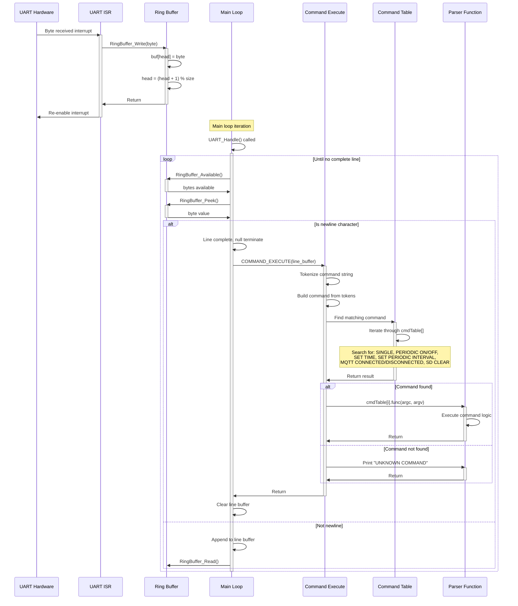
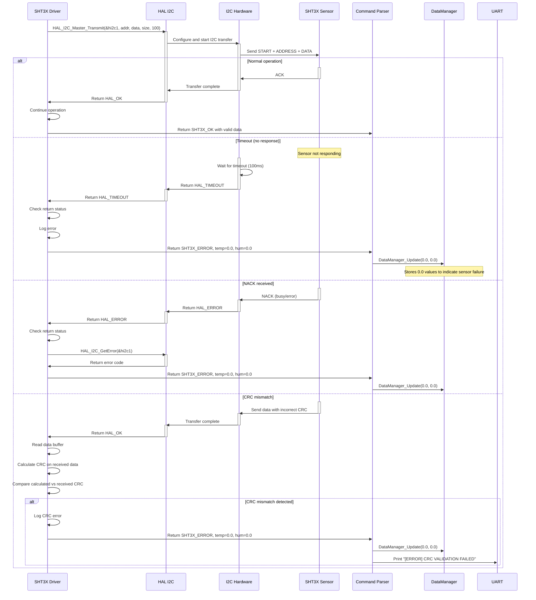
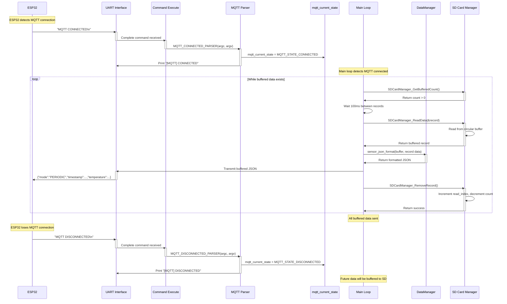
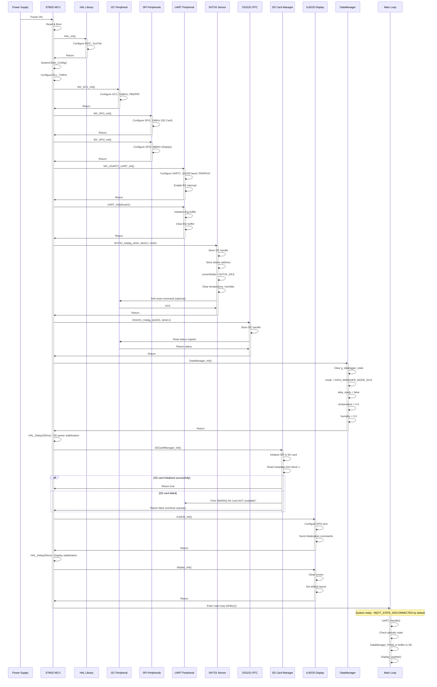

# STM32 Data Logger - Sequence Diagrams

This document illustrates the time-ordered interactions between components in the STM32 firmware.

## Single Shot Measurement Sequence



## Periodic Measurement Setup Sequence



## Periodic Measurement Stop Sequence



## UART Interrupt to Command Dispatch Sequence



## DataManager State Update and Print Sequence

```mermaid
sequenceDiagram
    participant Parser as Command Parser
    participant DM as DataManager
    participant State as Internal State
    participant MainLoop as Main Loop
    participant RTC as DS3231 RTC
    participant MQTT as MQTT State
    participant SD as SD Card Manager
    participant UART as UART TX
    participant User
    
    Parser->>DM: DataManager_UpdateSingle(temp, hum)
    activate DM
    DM->>State: g_datalogger_state.mode = SINGLE
    DM->>State: g_datalogger_state.sht3x.temperature = temp
    DM->>State: g_datalogger_state.sht3x.humidity = hum
    DM->>State: g_datalogger_state.data_ready = true
    DM->>Parser: Return
    deactivate DM
    
    Note over MainLoop: Main loop continues
    
    MainLoop->>DM: DataManager_Print() called
    activate DM
    DM->>State: Check g_datalogger_state.data_ready
    
    alt data_ready == false
        DM->>MainLoop: Return false
    else data_ready == true
        DM->>RTC: DS3231_Get_Time(&g_ds3231, &current_time)
        activate RTC
        RTC->>RTC: I2C read time registers
        RTC->>DM: Return tm structure
        deactivate RTC
        
        DM->>DM: Convert tm to Unix timestamp
        DM->>DM: timestamp = mktime(&current_time)
        
        DM->>State: Read temperature value
        State->>DM: Return temperature
        DM->>State: Read humidity value
        State->>DM: Return humidity
        
        DM->>DM: Sanitize temperature (check NaN/Inf)
        DM->>DM: Sanitize humidity (check NaN/Inf)
        
        DM->>MQTT: Check mqtt_current_state
        activate MQTT
        
        alt MQTT_STATE_CONNECTED
            MQTT->>DM: MQTT_STATE_CONNECTED
            deactivate MQTT
            
            DM->>DM: Format JSON: {"mode":"SINGLE","timestamp":...,"temperature":...}
            
            DM->>DM: Check buffer overflow
            
            alt Buffer OK
                DM->>UART: HAL_UART_Transmit(&huart1, JSON, len, timeout)
                activate UART
                UART->>User: Transmit JSON string
                deactivate UART
            else Buffer overflow
                DM->>UART: Print "JSON BUFFER OVERFLOW"
            end
            
        else MQTT_STATE_DISCONNECTED
            MQTT->>DM: MQTT_STATE_DISCONNECTED
            deactivate MQTT
            
            DM->>SD: SDCardManager_WriteData(timestamp, temp, hum, mode)
            activate SD
            SD->>SD: Write to circular buffer on SD card
            SD->>DM: Return success/failure
            deactivate SD
            
            Note over DM: Data buffered to SD card for later transmission
        end
        
        DM->>State: g_datalogger_state.data_ready = false
        DM->>MainLoop: Return true
    end
    deactivate DM
```

## I2C Communication Error Recovery Sequence



## MQTT State Change Notification Sequence



## System Initialization Sequence



---

**Key Points:**
- Sequences show time-ordered interactions between components
- Activation bars indicate when a component is active/processing
- Loops represent periodic or repeated operations
- Alt blocks show conditional execution paths
- Notes provide additional context
