# STM32 Data Logger - UML Class Diagram

This document provides the UML class diagrams showing the structure and relationships of the STM32 firmware components.

## Complete System Class Diagram

```mermaid
classDiagram
    class main {
        +I2C_HandleTypeDef hi2c1
        +SPI_HandleTypeDef hspi1
        +SPI_HandleTypeDef hspi2
        +UART_HandleTypeDef huart1
        +sht3x_t g_sht3x
        +ds3231_t g_ds3231
        +mqtt_state_t mqtt_current_state
        +uint32_t next_fetch_ms
        +uint32_t periodic_interval_ms
        +bool force_display_update
        -float outT
        -float outRH
        -uint32_t last_fetch_ms
        +main() int
        +SystemClock_Config() void
        -MX_GPIO_Init() void
        -MX_I2C1_Init() void
        -MX_SPI1_Init() void
        -MX_SPI2_Init() void
        -MX_USART1_UART_Init() void
    }
    
    class UART {
        -UART_HandleTypeDef* huart
        -ring_buffer_t rx_buffer
        -char line_buffer[128]
        -uint16_t line_index
        +UART_Init(UART_HandleTypeDef*) void
        +UART_Handle() void
        +UART_RxCallback(uint8_t) void
        -assemble_line() bool
    }
    
    class RingBuffer {
        -uint8_t* buffer
        -volatile uint16_t head
        -volatile uint16_t tail
        -uint16_t size
        +RingBuffer_Init(ring_buffer_t*, uint8_t*, uint16_t) void
        +RingBuffer_Write(ring_buffer_t*, uint8_t) bool
        +RingBuffer_Read(ring_buffer_t*, uint8_t*) bool
        +RingBuffer_Available(ring_buffer_t*) uint16_t
        +RingBuffer_Peek(ring_buffer_t*, uint8_t*) bool
        +RingBuffer_Clear(ring_buffer_t*) void
        +RingBuffer_IsFull(ring_buffer_t*) bool
        +RingBuffer_IsEmpty(ring_buffer_t*) bool
    }
    
    class CommandExecute {
        +COMMAND_EXECUTE(char*) void
        -tokenize_string(char*, char**, uint8_t) uint8_t
        -find_command(uint8_t, char**) command_function_t*
    }
    
    class CommandTable {
        +command_function_t cmdTable[]
        +GET_CMD_TABLE_SIZE() uint8_t
    }
    
    class CommandFunction {
        +const char* cmdString
        +void (*func)(uint8_t, char**)
    }
    
    class CommandParser {
        +SINGLE_PARSER(uint8_t, char**) void
        +PERIODIC_ON_PARSER(uint8_t, char**) void
        +PERIODIC_OFF_PARSER(uint8_t, char**) void
        +SET_TIME_PARSER(uint8_t, char**) void
        +SET_PERIODIC_INTERVAL_PARSER(uint8_t, char**) void
        +MQTT_CONNECTED_PARSER(uint8_t, char**) void
        +MQTT_DISCONNECTED_PARSER(uint8_t, char**) void
        +SD_CLEAR_PARSER(uint8_t, char**) void
        +SHT3X_Heater_Parser(uint8_t, char**) void
        +SHT3X_ART_Parser(uint8_t, char**) void
        +DS3231_Set_Time_Parser(uint8_t, char**) void
    }
    
    class SHT3XDriver {
        -I2C_HandleTypeDef* hi2c
        -uint8_t device_address
        -float temperature
        -float humidity
        -sht3x_mode_t currentState
        -sht3x_repeat_t modeRepeat
        +SHT3X_Init(sht3x_t*, I2C_HandleTypeDef*, uint8_t) void
        +SHT3X_Single(sht3x_t*, sht3x_repeat_t*, float*, float*) SHT3X_StatusTypeDef
        +SHT3X_Periodic(sht3x_t*, sht3x_mode_t*, sht3x_repeat_t*, float*, float*) SHT3X_StatusTypeDef
        +SHT3X_FetchData(sht3x_t*, float*, float*) SHT3X_StatusTypeDef
        +SHT3X_PeriodicStop(sht3x_t*) SHT3X_StatusTypeDef
        +SHT3X_Heater(sht3x_t*, sht3x_heater_mode_t*) SHT3X_StatusTypeDef
        +SHT3X_ART(sht3x_t*) SHT3X_StatusTypeDef
        +SHT3X_SoftReset(sht3x_t*) SHT3X_StatusTypeDef
        -calculate_crc(uint8_t*, uint8_t) uint8_t
        -parse_raw_data(uint8_t*, float*, float*) SHT3X_StatusTypeDef
    }
    
    class SHT3XEnums {
        <<enumeration>>
        SHT3X_OK
        SHT3X_ERROR
    }
    
    class SHT3XMode {
        <<enumeration>>
        SHT3X_IDLE
        SHT3X_SINGLE_SHOT
        SHT3X_PERIODIC_05MPS
        SHT3X_PERIODIC_1MPS
        SHT3X_PERIODIC_2MPS
        SHT3X_PERIODIC_4MPS
        SHT3X_PERIODIC_10MPS
    }
    
    class SHT3XRepeat {
        <<enumeration>>
        SHT3X_HIGH
        SHT3X_MEDIUM
        SHT3X_LOW
    }
    
    class SHT3XHeater {
        <<enumeration>>
        SHT3X_HEATER_ENABLE
        SHT3X_HEATER_DISABLE
    }
    
    class DS3231Driver {
        -I2C_HandleTypeDef* hi2c
        -uint8_t device_address
        +DS3231_Init(ds3231_t*, I2C_HandleTypeDef*) void
        +DS3231_Set_Time(ds3231_t*, struct tm*) DS3231_StatusTypeDef
        +DS3231_Get_Time(ds3231_t*, struct tm*) DS3231_StatusTypeDef
        -bcd_to_decimal(uint8_t) uint8_t
        -decimal_to_bcd(uint8_t) uint8_t
    }
    
    class DataManager {
        -data_manager_state_t g_datalogger_state
        +DataManager_Init() void
        +DataManager_UpdateSingle(float, float) void
        +DataManager_UpdatePeriodic(float, float) void
        +DataManager_Print() bool
        +DataManager_IsDataReady() bool
        +DataManager_ClearDataReady() void
        +DataManager_GetState() data_manager_state_t*
    }
    
    class DataManagerState {
        -data_manager_mode_t mode
        -uint32_t timestamp
        -sensor_data_sht3x_t sht3x
        -bool data_ready
    }
    
    class DataManagerMode {
        <<enumeration>>
        DATA_MANAGER_MODE_IDLE
        DATA_MANAGER_MODE_SINGLE
        DATA_MANAGER_MODE_PERIODIC
    }
    
    class SensorDataSHT3X {
        +float temperature
        +float humidity
        +bool valid
    }
    
    class WiFiManager {
        +mqtt_state_t mqtt_current_state
        +mqtt_manager_get_state() mqtt_state_t
    }
    
    class MQTTState {
        <<enumeration>>
        MQTT_STATE_DISCONNECTED
        MQTT_STATE_CONNECTED
    }
    
    class SDCardManager {
        -sd_buffer_metadata_t metadata
        -uint8_t last_error
        -bool initialized
        +SDCardManager_Init() bool
        +SDCardManager_WriteData(uint32_t, float, float, const char*) bool
        +SDCardManager_ReadData(sd_data_record_t*) bool
        +SDCardManager_GetBufferedCount() uint32_t
        +SDCardManager_RemoveRecord() bool
        +SDCardManager_ClearBuffer() bool
        +SDCardManager_IsReady() bool
        +SDCardManager_GetLastError() uint8_t
    }
    
    class SDDataRecord {
        +uint32_t timestamp
        +float temperature
        +float humidity
        +char mode[16]
        +uint32_t sequence_num
        +uint8_t padding[480]
    }
    
    class SDBufferMetadata {
        +uint32_t write_index
        +uint32_t read_index
        +uint32_t count
        +uint32_t sequence_num
    }
    
    class ILI9225Driver {
        -SPI_HandleTypeDef* hspi
        +ILI9225_Init() void
        +ILI9225_Clear(uint16_t) void
        +ILI9225_DrawPixel(uint16_t, uint16_t, uint16_t) void
        +ILI9225_FillRect(uint16_t, uint16_t, uint16_t, uint16_t, uint16_t) void
        +ILI9225_DrawString(uint16_t, uint16_t, const char*, uint16_t, uint16_t) void
        -ILI9225_WriteCommand(uint8_t) void
        -ILI9225_WriteData(uint16_t) void
    }
    
    class Display {
        +display_init() void
        +display_update(time_t, float, float, bool, bool, int) void
        +display_clear() void
    }
    
    class SensorJSONOutput {
        +sensor_json_format(char*, size_t, const char*, float, float, uint32_t) int
        -sanitize_float(float, float) float
    }
    
    class PrintCLI {
        -char stringBuffer[256]
        +PRINT_CLI(const char*, ...) void
    }
    
    %% Relationships
    main --> UART : uses
    main --> SHT3XDriver : uses g_sht3x
    main --> DS3231Driver : uses g_ds3231
    main --> DataManager : uses
    main --> WiFiManager : uses mqtt_current_state
    main --> SDCardManager : uses
    main --> Display : uses
    
    UART --> RingBuffer : contains rx_buffer
    UART --> CommandExecute : calls
    
    CommandExecute --> CommandTable : searches
    CommandTable --> CommandFunction : contains array of
    CommandExecute --> CommandParser : dispatches to
    
    CommandParser --> SHT3XDriver : calls
    CommandParser --> DS3231Driver : calls
    CommandParser --> DataManager : updates
    CommandParser --> WiFiManager : updates
    CommandParser --> SDCardManager : calls
    CommandParser --> PrintCLI : uses
    
    SHT3XDriver --> SHT3XEnums : returns
    SHT3XDriver --> SHT3XMode : uses
    SHT3XDriver --> SHT3XRepeat : uses
    SHT3XDriver --> SHT3XHeater : uses
    
    DataManager --> DataManagerState : contains
    DataManagerState --> DataManagerMode : uses
    DataManagerState --> SensorDataSHT3X : contains
    
    DataManager --> SensorJSONOutput : uses
    DataManager --> DS3231Driver : uses for timestamp
    DataManager --> WiFiManager : checks state
    DataManager --> SDCardManager : buffers when offline
    DataManager --> PrintCLI : uses
    
    WiFiManager --> MQTTState : uses
    
    SDCardManager --> SDDataRecord : manages
    SDCardManager --> SDBufferMetadata : maintains
    
    Display --> ILI9225Driver : uses
    
    SensorJSONOutput --> PrintCLI : uses
```

## Core Component Details

### UART and Ring Buffer Component

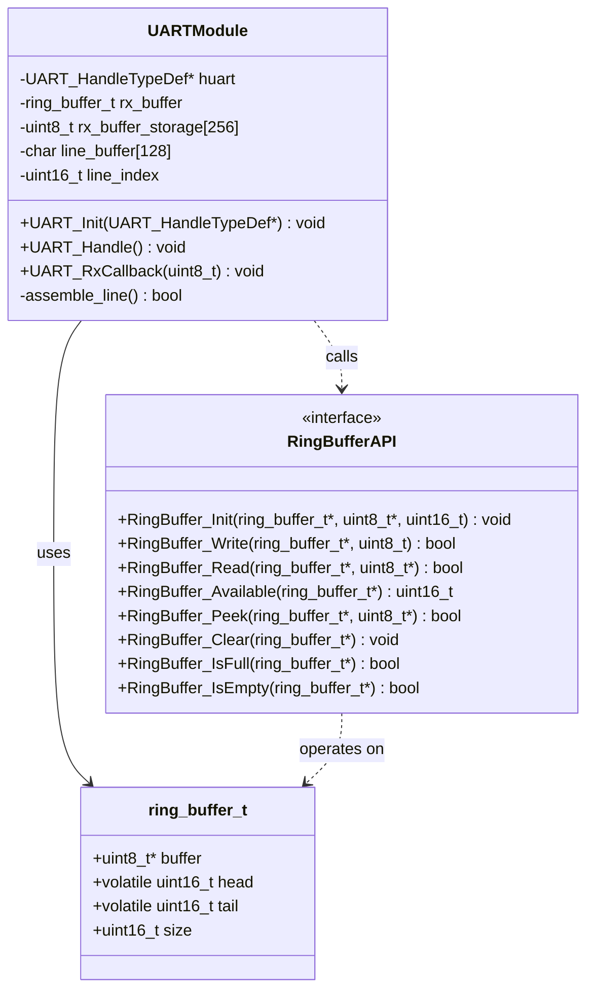

### Command Processing Component

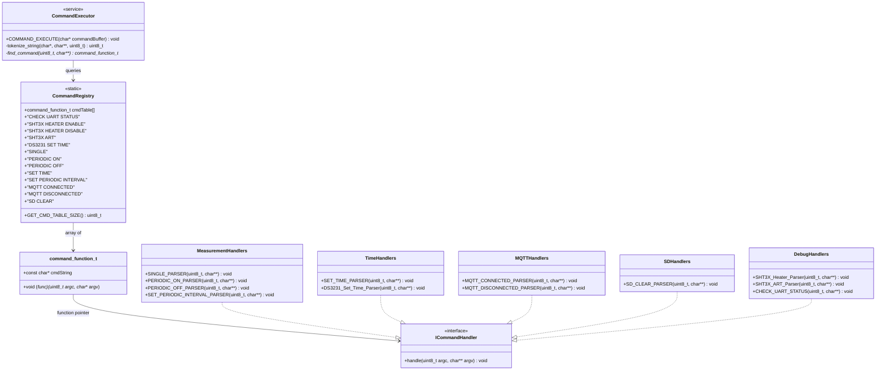

### SHT3X Sensor Driver Component

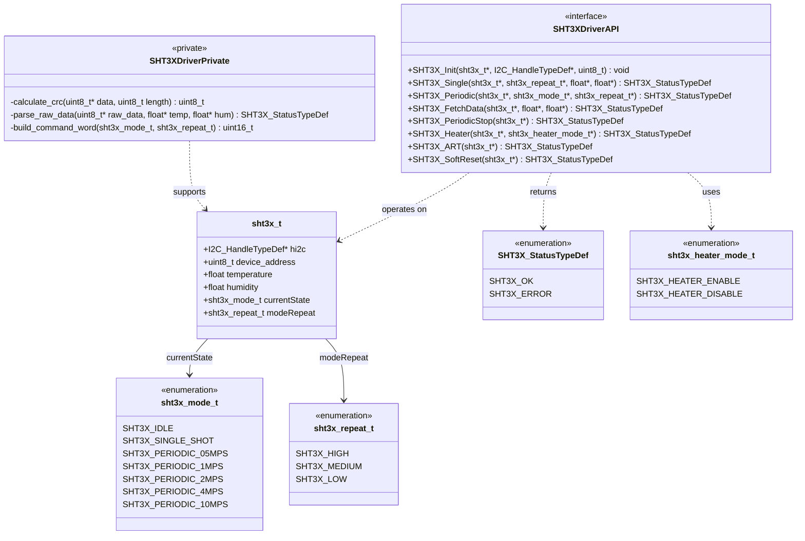

### Data Manager Component

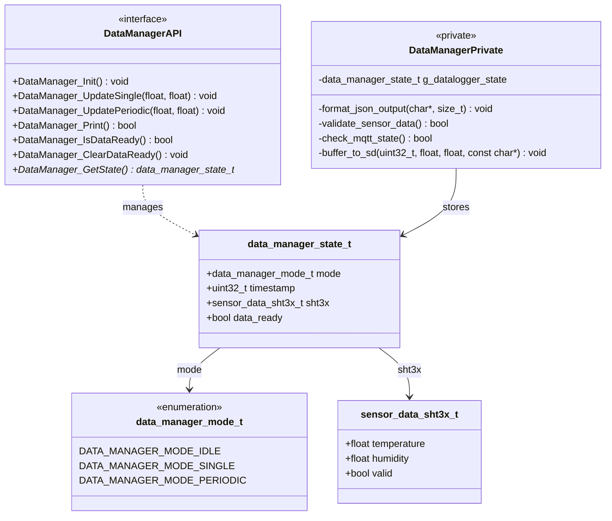

## WiFi/MQTT Manager Component

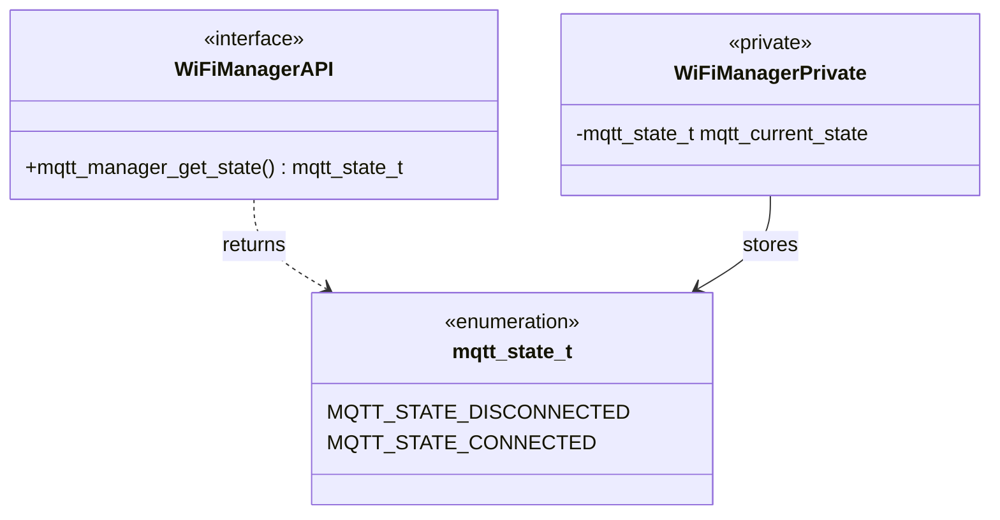

## SD Card Manager Component

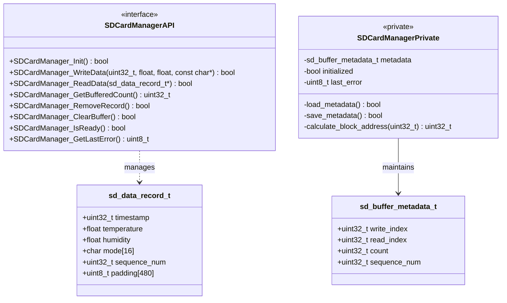

## Display Components

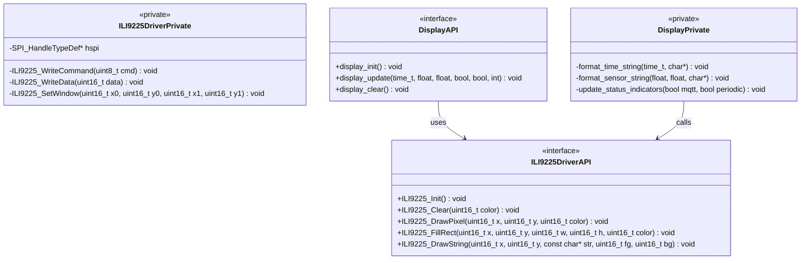

### DS3231 RTC Driver Component

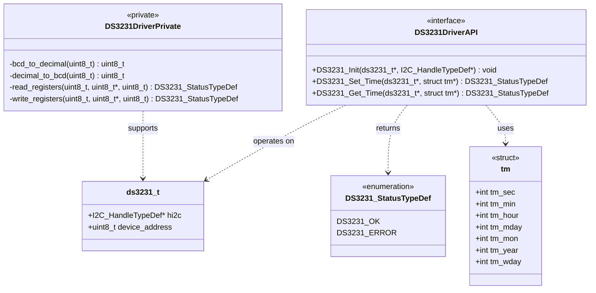

### Output and Formatting Component

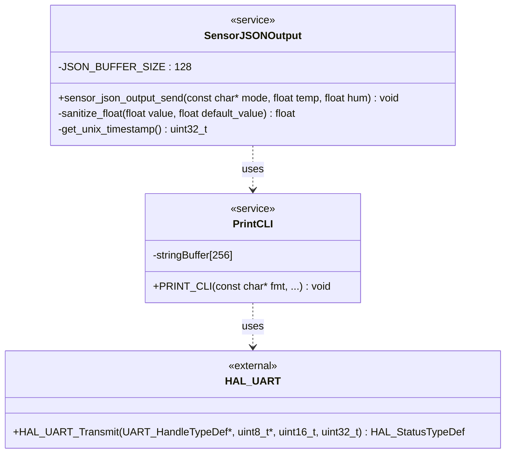

## Component Dependencies

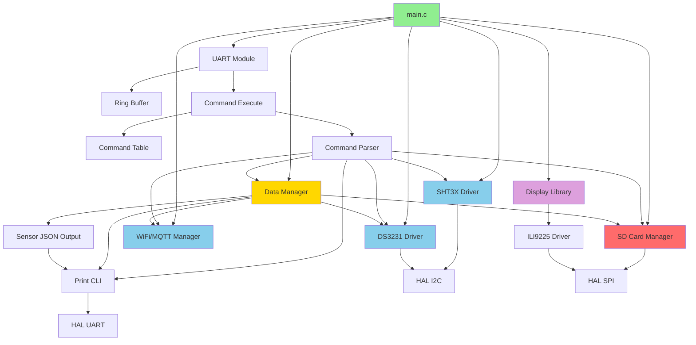

## Object Lifecycle Diagram

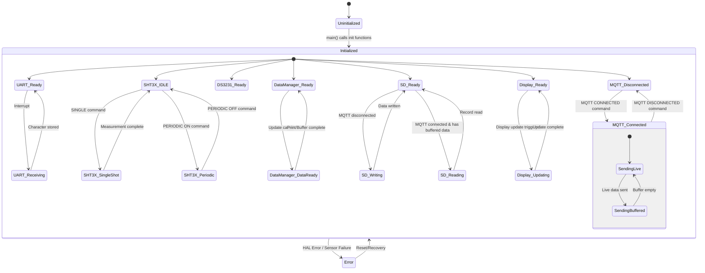

---

**Key Design Patterns:**

1. **Service Locator**: Command table acts as a registry of command handlers
2. **Strategy Pattern**: Different command parsers implement different handling strategies
3. **State Pattern**: SHT3X driver maintains state (IDLE, SINGLE_SHOT, PERIODIC_*); MQTT manager tracks connection state
4. **Singleton**: DataManager uses static internal state (g_datalogger_state); WiFi Manager uses global mqtt_current_state
5. **Observer**: UART interrupt observes hardware and notifies ring buffer
6. **Producer-Consumer**: Ring buffer mediates between interrupt (producer) and main loop (consumer); SD buffer mediates between STM32 (producer) and ESP32 (consumer)
7. **Circular Buffer**: SD card uses 204,800-record circular buffer for offline data storage
8. **Facade**: Display library provides simplified interface to ILI9225 driver
9. **Template Method**: DataManager_Print() uses template for JSON formatting regardless of MQTT state

**Key Relationships:**

- **Composition** (solid diamond): UART contains ring_buffer_t; SDCardManager contains metadata
- **Association** (solid line): main uses SHT3X driver, SD Manager, Display
- **Dependency** (dashed line): Parser depends on Driver; DataManager depends on WiFiManager state
- **Realization** (dashed line with triangle): Handlers implement ICommandHandler

**Critical State Management:**

- **mqtt_current_state**: Global variable shared between main loop and command parsers (default: MQTT_STATE_DISCONNECTED)
- **data_ready flag**: Controls when DataManager_Print() outputs data
- **SD circular buffer**: write_index, read_index, count maintain buffer state across power cycles
- **force_display_update**: Triggers immediate display refresh (e.g., after SET TIME command)

**Data Flow:**

1. **MQTT Connected**: Sensor data → DataManager → UART → ESP32 (+ send buffered SD data)
2. **MQTT Disconnected**: Sensor data → DataManager → SD Card Manager → SD card (circular buffer)
3. **MQTT Reconnected**: Buffered SD data → sensor_json_format() → UART → ESP32 (100ms interval between records)
