# SYSTEM - Flow Diagrams (Complete System)

Comprehensive flowcharts describing the complete DATALOGGER system operation including all 4 subsystems: STM32 Firmware, ESP32 Gateway, MQTT Broker, and Web Dashboard.

---

## 1. Complete System Initialization Flow


---

## 2. Complete Data Acquisition & Transmission Flow


---

## 3. Command Processing Flow (Web to STM32)


---

## 4. Offline Buffering & Sync Flow

```mermaid
flowchart TD
    Start([Data Ready for<br/>Transmission]) --> WiFi_Status{ESP32 WiFi<br/>Connected?}
    
    WiFi_Status -->|Yes| Direct_Send[Send Data via<br/>UART to ESP32]
    WiFi_Status -->|No| Buffer_Path[Offline Mode<br/>Activated]
    
    Direct_Send --> MQTT_Transmit[Transmit via MQTT<br/>to Cloud]
    MQTT_Transmit --> End_Direct([Normal Flow<br/>Complete])
    
    Buffer_Path --> SD_Manager[SD Card Manager<br/>sd_card_manager.c]
    SD_Manager --> Check_Space{SD Buffer<br/>Has Space?}
    
    Check_Space -->|No| Buffer_Full[Buffer Full<br/>204,800 records limit]
    Buffer_Full --> Overflow_Handle[Circular Overflow<br/>Overwrite Oldest]
    Check_Space -->|Yes| Write_Record[Write Data Record<br/>512 bytes per block]
    
    Overflow_Handle --> Write_Record
    Write_Record --> Record_Format[Format Record:<br/>Timestamp, Temp, Hum<br/>Mode, Sequence #]
    Record_Format --> SPI_Write[SPI Write to SD<br/>PA4-PA7 pins]
    
    SPI_Write --> Write_Success{Write<br/>Success?}
    Write_Success -->|No| Write_Error[Log Error<br/>Retry 3 times]
    Write_Error --> Write_Retry{Retry<br/>Count < 3?}
    Write_Retry -->|Yes| SPI_Write
    Write_Retry -->|No| Data_Lost[Data Lost<br/>Display Warning]
    
    Write_Success -->|Yes| Update_Index[Update Write Index<br/>Increment Counter]
    Update_Index --> Display_SD[Update LCD Display<br/>Show SD: WRITING]
    Display_SD --> Monitor_WiFi[Monitor WiFi Status<br/>Check Reconnection]
    
    Monitor_WiFi --> WiFi_Restored{WiFi<br/>Restored?}
    WiFi_Restored -->|No| Continue_Buffer[Continue Buffering<br/>New Data]
    Continue_Buffer --> Monitor_WiFi
    
    WiFi_Restored -->|Yes| MQTT_Reconnect[MQTT Reconnects<br/>to Broker]
    MQTT_Reconnect --> Notify_STM32[ESP32 Sends<br/>MQTT CONNECTED]
    Notify_STM32 --> STM32_Detect[STM32 Detects<br/>Reconnection]
    
    STM32_Detect --> Check_Buffered{Buffered Data<br/>Available?}
    Check_Buffered -->|No| Resume_Normal[Resume Normal<br/>Operation]
    Check_Buffered -->|Yes| Read_Oldest[Read Oldest Record<br/>from SD Card]
    
    Read_Oldest --> Parse_Record[Parse Record Data<br/>Extract Fields]
    Parse_Record --> Send_Buffered[Send via UART<br/>to ESP32]
    Send_Buffered --> ESP32_Fwd[ESP32 Forwards<br/>to MQTT]
    
    ESP32_Fwd --> Wait_ACK{Wait for<br/>ACK?}
    Wait_ACK -->|Timeout| Retry_Send[Retry Send<br/>Max 3 attempts]
    Retry_Send --> Wait_ACK
    Wait_ACK -->|Success| Remove_Record[Remove Record<br/>Decrement Counter]
    
    Remove_Record --> More_Data{More Buffered<br/>Data?}
    More_Data -->|Yes| Read_Oldest
    More_Data -->|No| Sync_Complete[Sync Complete<br/>Clear SD Buffer Flag]
    
    Sync_Complete --> Resume_Normal
    Resume_Normal --> End_Sync([Return to<br/>Normal Mode])
    
    style Start fill:#90EE90
    style End_Direct fill:#90EE90
    style End_Sync fill:#90EE90
    style WiFi_Status fill:#FFE4B5
    style Check_Space fill:#FFE4B5
    style Write_Success fill:#FFE4B5
    style WiFi_Restored fill:#FFE4B5
    style Check_Buffered fill:#FFE4B5
    style More_Data fill:#FFE4B5
    style Buffer_Full fill:#FFB6C6
    style Data_Lost fill:#FFB6C6
```



---

## 5. Error Detection & Recovery Flow


---

## 6. Periodic Mode Operation Flow


---

## 7. Relay Control Flow (End-to-End)

```mermaid
flowchart TD
    Start([User Clicks Relay<br/>Button on Web]) --> UI_Handler[UI Event Handler<br/>app.js]
    
    UI_Handler --> Get_State{Current<br/>State?}
    Get_State -->|OFF| Build_ON[Build Command<br/>state: ON]
    Get_State -->|ON| Build_OFF[Build Command<br/>state: OFF]
    
    Build_ON --> Publish_MQTT
    Build_OFF --> Publish_MQTT
    
    Publish_MQTT[Publish to MQTT<br/>Topic: datalogger/relay<br/>QoS: 1] --> Broker_Receive[MQTT Broker<br/>Receives Message]
    
    Broker_Receive --> ESP32_Sub[ESP32 Subscribed<br/>mqtt_handler.c]
    ESP32_Sub --> Event_Handler[MQTT Event Handler<br/>MQTT_EVENT_DATA]
    
    Event_Handler --> Parse_Topic{Topic<br/>Match?}
    Parse_Topic -->|datalogger/relay| Extract_Payload[Extract Payload<br/>JSON Parser]
    Parse_Topic -->|Other| Ignore[Ignore Message]
    
    Extract_Payload --> Parse_State[Parse state Field<br/>ON or OFF]
    Parse_State --> Validate{Valid<br/>State?}
    
    Validate -->|No| Invalid_Cmd[Invalid Command<br/>Log Error]
    Invalid_Cmd --> End_Error([Error Response])
    
    Validate -->|Yes| Call_Relay[Call relay_control_set<br/>relay_control.c]
    Call_Relay --> GPIO_Write[GPIO Write<br/>GPIO4 Pin]
    
    GPIO_Write --> State_Check{Desired<br/>State?}
    State_Check -->|ON| Set_HIGH[GPIO_SetBits<br/>GPIO4 = HIGH 3.3V]
    State_Check -->|OFF| Set_LOW[GPIO_ResetBits<br/>GPIO4 = LOW 0V]
    
    Set_HIGH --> Relay_Module
    Set_LOW --> Relay_Module
    
    Relay_Module[Relay Module<br/>Energizes Coil] --> Relay_Switch{Relay<br/>Switches}
    
    Relay_Switch --> Physical_ON[Contact Closes<br/>Device ON]
    Relay_Switch --> Physical_OFF[Contact Opens<br/>Device OFF]
    
    Physical_ON --> Log_State
    Physical_OFF --> Log_State
    
    Log_State[Log Relay State<br/>ESP32 Console] --> Build_Response[Build State Response<br/>JSON Format]
    
    Build_Response --> Pub_State[Publish State<br/>datalogger/state<br/>relay_state: ON/OFF]
    
    Pub_State --> Web_Receive[Web Dashboard<br/>Receives State]
    Web_Receive --> Update_UI[Update Button UI<br/>Change Color & Text]
    
    Update_UI --> Firebase_Update[Update Firebase<br/>relay_state field]
    Firebase_Update --> Show_Feedback[Show User Feedback<br/>Toast Notification]
    
    Show_Feedback --> End_Success([Relay Control<br/>Complete])
    
    style Start fill:#90EE90
    style End_Success fill:#90EE90
    style End_Error fill:#FFB6C6
    style Parse_Topic fill:#FFE4B5
    style Validate fill:#FFE4B5
    style State_Check fill:#FFE4B5
    style Get_State fill:#FFE4B5
    style Invalid_Cmd fill:#FFB6C6
```



---

## 8. Time Synchronization Flow

```mermaid
flowchart TD
    Start([Time Sync<br/>Requested]) --> Sync_Method{Sync<br/>Method?}
    
    Sync_Method -->|Internet NTP| NTP_Start[User Clicks<br/>Sync with Internet]
    Sync_Method -->|Manual| Manual_Start[User Sets Time<br/>Manually on Web]
    
    NTP_Start --> Web_GetTime[JavaScript<br/>Get Current Time<br/>new Date.getTime]
    Manual_Start --> Web_Input[User Inputs<br/>Date & Time<br/>Form Fields]
    
    Web_GetTime --> Convert_Unix[Convert to<br/>Unix Timestamp<br/>Seconds since 1970]
    Web_Input --> Convert_Unix
    
    Convert_Unix --> Build_JSON[Build JSON Command<br/>command: SET_TIME<br/>timestamp: value]
    
    Build_JSON --> Validate_Time{Timestamp<br/>Valid?}
    Validate_Time -->|No| Error_Invalid[Invalid Timestamp<br/>Show Error]
    Error_Invalid --> End_Error([Sync Failed])
    
    Validate_Time -->|Yes| Publish_Cmd[Publish to MQTT<br/>datalogger/time/sync<br/>QoS: 1]
    
    Publish_Cmd --> Broker_Route[MQTT Broker<br/>Routes Message]
    Broker_Route --> ESP32_Receive[ESP32 Receives<br/>Time Sync Command]
    
    ESP32_Receive --> Parse_JSON[Parse JSON<br/>Extract Timestamp]
    Parse_JSON --> Format_UART[Format UART Command<br/>SET TIME YYYY MM DD HH MM SS]
    
    Format_UART --> Convert_Components[Convert Unix to<br/>Date Components<br/>Year, Month, Day<br/>Hour, Minute, Second]
    
    Convert_Components --> UART_Send[Send via UART<br/>to STM32]
    UART_Send --> STM32_Receive[STM32 UART Interrupt<br/>Receives Command]
    
    STM32_Receive --> CMD_Parse[Command Parser<br/>Extracts Components]
    CMD_Parse --> Validate_Components{Components<br/>Valid?}
    
    Validate_Components -->|No| Reject_Time[Reject Invalid Time<br/>Send Error Response]
    Reject_Time --> End_Error
    
    Validate_Components -->|Yes| DS3231_Set[DS3231_Set_Time<br/>Write to RTC<br/>I2C Communication]
    
    DS3231_Set --> I2C_Write[I2C Write to 0x68<br/>Set Registers:<br/>Seconds, Minutes<br/>Hours, Day, Date<br/>Month, Year]
    
    I2C_Write --> Write_OK{I2C Write<br/>Success?}
    Write_OK -->|No| I2C_Error[I2C Error<br/>Retry 3 times]
    I2C_Error --> I2C_Retry{Retry<br/>Count < 3?}
    I2C_Retry -->|Yes| I2C_Write
    I2C_Retry -->|No| Set_Failed[Time Set Failed<br/>RTC Error]
    Set_Failed --> End_Error
    
    Write_OK -->|Yes| Verify_Read[Read Back Time<br/>Verify Setting]
    Verify_Read --> Compare{Time<br/>Matches?}
    
    Compare -->|No| Verify_Failed[Verification Failed<br/>Retry Set]
    Verify_Failed --> DS3231_Set
    
    Compare -->|Yes| Success_Log[Log Success<br/>STM32 Console]
    Success_Log --> Update_Display[Update LCD Display<br/>Show New Time]
    
    Update_Display --> Send_Confirm[Send Confirmation<br/>UART to ESP32]
    Send_Confirm --> ESP32_Forward[ESP32 Forwards<br/>to MQTT]
    
    ESP32_Forward --> Publish_State[Publish State<br/>datalogger/state<br/>time_updated: true<br/>timestamp: value]
    
    Publish_State --> Web_Confirm[Web Receives<br/>Confirmation]
    Web_Confirm --> Show_Success[Show Success Toast<br/>Time Synchronized]
    
    Show_Success --> Update_TimeDisplay[Update Time Display<br/>on Web Dashboard]
    Update_TimeDisplay --> End_Success([Time Sync<br/>Complete])
    
    style Start fill:#90EE90
    style End_Success fill:#90EE90
    style End_Error fill:#FFB6C6
    style Sync_Method fill:#FFE4B5
    style Validate_Time fill:#FFE4B5
    style Validate_Components fill:#FFE4B5
    style Write_OK fill:#FFE4B5
    style Compare fill:#FFE4B5
    style Error_Invalid fill:#FFB6C6
    style Set_Failed fill:#FFB6C6
```



---

## 9. Web Dashboard Initialization Flow

```mermaid
flowchart TD
    Start([User Opens<br/>Dashboard URL]) --> Load_HTML[Browser Loads<br/>index.html]
    
    Load_HTML --> Parse_HTML[Parse HTML<br/>Build DOM]
    Parse_HTML --> Load_CSS[Load style.css<br/>Apply Styles]
    Load_CSS --> Load_JS[Load app.js<br/>Execute Script]
    
    Load_JS --> Create_App[Create WebApplication<br/>Instance]
    Create_App --> Init_Managers[Initialize Managers<br/>12 Components]
    
    Init_Managers --> Init_MQTT[MQTTManager.init<br/>Create Client]
    Init_MQTT --> MQTT_Config[Load MQTT Config<br/>broker, username<br/>password, clientId]
    
    MQTT_Config --> Connect_WS[mqtt.connect<br/>ws://broker:8083/mqtt]
    Connect_WS --> WS_Handshake[WebSocket Handshake<br/>Upgrade HTTP]
    
    WS_Handshake --> WS_Success{WebSocket<br/>Connected?}
    WS_Success -->|No| WS_Error[Connection Error<br/>Show Error Page]
    WS_Error --> Retry_WS{Auto<br/>Retry?}
    Retry_WS -->|Yes| Wait_Retry[Wait 5 seconds]
    Wait_Retry --> Connect_WS
    Retry_WS -->|No| End_Error([Dashboard<br/>Offline])
    
    WS_Success -->|Yes| MQTT_Auth[MQTT Authentication<br/>CONNECT Packet]
    MQTT_Auth --> Auth_OK{Auth<br/>Success?}
    
    Auth_OK -->|No| Auth_Failed[Auth Failed<br/>Invalid Credentials]
    Auth_Failed --> End_Error
    
    Auth_OK -->|Yes| Subscribe_Topics[Subscribe to Topics<br/>datalogger/#<br/>QoS: 1]
    
    Subscribe_Topics --> Sub_Confirm{SUBACK<br/>Received?}
    Sub_Confirm -->|No| Sub_Error[Subscribe Error]
    Sub_Error --> End_Error
    
    Sub_Confirm -->|Yes| MQTT_Ready[MQTT Ready<br/>Set Connected Flag]
    
    MQTT_Ready --> Init_Firebase[FirebaseManager.init<br/>Initialize SDK]
    Init_Firebase --> Firebase_Config[Load Firebase Config<br/>apiKey, databaseURL<br/>projectId]
    
    Firebase_Config --> Firebase_Init[firebase.initializeApp<br/>Create App Instance]
    Firebase_Init --> Get_Database[Get Database Reference<br/>firebase.database]
    
    Get_Database --> DB_Connect{Database<br/>Connected?}
    DB_Connect -->|No| DB_Error[Firebase Error<br/>Network Issue]
    DB_Error --> Partial_Init[Continue without<br/>Firebase Features]
    
    DB_Connect -->|Yes| Setup_Listeners[Setup Realtime<br/>Listeners]
    Setup_Listeners --> Firebase_Ready[Firebase Ready<br/>Set Connected Flag]
    
    Firebase_Ready --> Init_Chart
    Partial_Init --> Init_Chart
    
    Init_Chart[ChartManager.init<br/>Initialize Chart.js] --> Create_Canvas[Get Canvas Context<br/>Create Chart Instance]
    
    Create_Canvas --> Chart_Config[Configure Chart<br/>Line Chart, 50 points<br/>Real-time Updates]
    
    Chart_Config --> Init_UI[UIController.init<br/>Setup UI Elements]
    Init_UI --> Bind_Events[Bind Event Listeners<br/>Buttons, Forms]
    
    Bind_Events --> Init_State[StateManager.init<br/>Load Saved State<br/>localStorage]
    
    Init_State --> Init_Health[ComponentHealthMonitor<br/>Start Monitoring]
    Init_Health --> Init_Logger[LoggingSystem.init<br/>Setup Console]
    
    Init_Logger --> Load_Page[Load Default Page<br/>Dashboard View]
    Load_Page --> Query_History[Query Firebase<br/>Last 100 Records]
    
    Query_History --> Populate_Data{Data<br/>Available?}
    Populate_Data -->|Yes| Fill_Table[Fill Historical<br/>Data Table]
    Populate_Data -->|No| Show_Empty[Show Empty State]
    
    Fill_Table --> Update_Charts[Update Charts<br/>with Historical Data]
    Update_Charts --> Show_Dashboard
    Show_Empty --> Show_Dashboard
    
    Show_Dashboard[Display Dashboard<br/>All Components Ready] --> Setup_MQTT_Handlers[Setup Message Handlers<br/>Listen for Data]
    
    Setup_MQTT_Handlers --> Wait_Data[Wait for Real-time<br/>MQTT Messages]
    Wait_Data --> End_Ready([Dashboard<br/>Fully Operational])
    
    style Start fill:#90EE90
    style End_Ready fill:#90EE90
    style End_Error fill:#FFB6C6
    style WS_Success fill:#FFE4B5
    style Auth_OK fill:#FFE4B5
    style Sub_Confirm fill:#FFE4B5
    style DB_Connect fill:#FFE4B5
    style Populate_Data fill:#FFE4B5
    style WS_Error fill:#FFB6C6
    style Auth_Failed fill:#FFB6C6
    style Sub_Error fill:#FFB6C6
```



---

## 10. Firebase Data Storage Flow

```mermaid
flowchart TD
    Start([Sensor Data<br/>Arrives at Web]) --> MQTT_Receive[MQTT Message Handler<br/>Receives Data]
    
    MQTT_Receive --> Parse_Topic{Topic<br/>Type?}
    
    Parse_Topic -->|datalogger/data/single| Single_Data[Single Read Data<br/>Extract JSON]
    Parse_Topic -->|datalogger/data/periodic| Periodic_Data[Periodic Data<br/>Extract JSON]
    Parse_Topic -->|Other| Process_Other[Process Other<br/>Messages]
    
    Single_Data --> Parse_JSON
    Periodic_Data --> Parse_JSON
    
    Parse_JSON[Parse JSON Payload<br/>Extract Fields:<br/>temperature<br/>humidity<br/>timestamp<br/>mode] --> Validate_Data{Data<br/>Valid?}
    
    Validate_Data -->|No| Invalid_Data[Invalid Data<br/>Log Error]
    Invalid_Data --> End_Error([Discard Data])
    
    Validate_Data -->|Yes| Build_Record[Build Data Record<br/>Add Metadata:<br/>receivedAt<br/>deviceId<br/>source]
    
    Build_Record --> Check_Mode{Storage<br/>Mode?}
    
    Check_Mode -->|Real-time Only| Update_UI[Update UI Only<br/>No Storage]
    Check_Mode -->|Store & Display| Store_Path[Storage Path]
    
    Store_Path --> Get_Ref[Get Firebase Reference<br/>database.ref]
    Get_Ref --> Build_Path[Build Storage Path<br/>/datalogger/readings/<br/>{timestamp}]
    
    Build_Path --> Check_Duplicate{Timestamp<br/>Exists?}
    Check_Duplicate -->|Yes| Append_Counter[Append Counter<br/>_1, _2, etc.]
    Check_Duplicate -->|No| Use_Timestamp[Use Timestamp<br/>as Key]
    
    Append_Counter --> Final_Path
    Use_Timestamp --> Final_Path
    
    Final_Path[Final Path Ready] --> Firebase_Set[firebase.ref.set<br/>Write to Database]
    
    Firebase_Set --> Write_Complete{Write<br/>Success?}
    
    Write_Complete -->|No| Write_Error[Firebase Error<br/>Network/Auth Issue]
    Write_Error --> Retry_Write{Retry<br/>Count < 3?}
    Retry_Write -->|Yes| Wait_Backoff[Exponential Backoff<br/>1s, 2s, 4s]
    Wait_Backoff --> Firebase_Set
    Retry_Write -->|No| Write_Failed[Write Failed<br/>Data Lost]
    Write_Failed --> Log_Failed[Log to Local<br/>Console]
    Log_Failed --> End_Error
    
    Write_Complete -->|Yes| Update_Index[Update Index<br/>/datalogger/latest]
    Update_Index --> Set_Latest[Set Latest Reading<br/>Pointer]
    
    Set_Latest --> Check_Limit{Record Count<br/>> Limit?}
    Check_Limit -->|Yes| Cleanup_Old[Remove Old Records<br/>Keep Last 10,000]
    Check_Limit -->|No| Skip_Cleanup
    
    Cleanup_Old --> Query_Old[Query Oldest<br/>orderByKey.limitToFirst]
    Query_Old --> Delete_Old[Delete Old Records<br/>remove]
    Delete_Old --> Update_UI
    
    Skip_Cleanup --> Update_UI
    Update_UI --> Update_Chart[Update Chart.js<br/>Add Data Point]
    
    Update_Chart --> Update_Table[Update Live Table<br/>Add Row]
    Update_Table --> Update_Stats[Update Statistics<br/>Min, Max, Avg]
    
    Update_Stats --> Notify_Components[Notify Other<br/>Components]
    Notify_Components --> Check_Export{Export<br/>Pending?}
    
    Check_Export -->|Yes| Add_Export[Add to Export<br/>Buffer]
    Check_Export -->|No| End_Success
    
    Add_Export --> End_Success([Data Stored<br/>& Displayed])
    
    Process_Other --> End_Other([Other Processing])
    
    style Start fill:#90EE90
    style End_Success fill:#90EE90
    style End_Error fill:#FFB6C6
    style End_Other fill:#87CEEB
    style Parse_Topic fill:#FFE4B5
    style Validate_Data fill:#FFE4B5
    style Check_Mode fill:#FFE4B5
    style Check_Duplicate fill:#FFE4B5
    style Write_Complete fill:#FFE4B5
    style Check_Limit fill:#FFE4B5
    style Check_Export fill:#FFE4B5
    style Invalid_Data fill:#FFB6C6
    style Write_Failed fill:#FFB6C6
```

---

## 11. Component Health Monitoring Flow

```mermaid
flowchart TD
    Start([Health Monitor<br/>Timer Triggers]) --> Check_Interval{Monitor<br/>Interval?}
    
    Check_Interval -->|Every 5s| Fast_Check[Fast Health Check]
    Check_Interval -->|Every 30s| Full_Check[Full Health Check]
    
    Fast_Check --> Check_MQTT
    Full_Check --> Check_MQTT
    
    Check_MQTT[Check MQTT Status] --> MQTT_Connected{MQTT<br/>Connected?}
    MQTT_Connected -->|Yes| MQTT_OK[Status: OK<br/>Last Seen: now]
    MQTT_Connected -->|No| MQTT_Down[Status: ERROR<br/>Connection Lost]
    
    MQTT_OK --> Check_LastMsg{Last Message<br/>< 60s ago?}
    Check_LastMsg -->|Yes| MQTT_Active[Mark MQTT<br/>Active]
    Check_LastMsg -->|No| MQTT_Stale[Mark MQTT<br/>Stale]
    
    MQTT_Down --> MQTT_Failed
    MQTT_Stale --> MQTT_Failed
    MQTT_Failed[MQTT Status:<br/>FAILED] --> Inc_MQTT_Errors[Increment Error<br/>Counter]
    
    MQTT_Active --> Check_Firebase
    Inc_MQTT_Errors --> Check_Firebase
    
    Check_Firebase[Check Firebase Status] --> FB_Connected{Firebase<br/>Connected?}
    FB_Connected -->|Yes| FB_OK[Status: OK]
    FB_Connected -->|No| FB_Down[Status: ERROR]
    
    FB_OK --> Check_FBWrite{Recent Write<br/>Success?}
    Check_FBWrite -->|Yes| FB_Active[Mark Firebase<br/>Active]
    Check_FBWrite -->|No| FB_WriteErr[Firebase Write<br/>Issues]
    
    FB_Active --> Check_STM32
    FB_Down --> Check_STM32
    FB_WriteErr --> Check_STM32
    
    Check_STM32[Check STM32 Status] --> STM32_Data{Data Received<br/>< 120s?}
    STM32_Data -->|Yes| STM32_OK[Status: OK<br/>Sensor Active]
    STM32_Data -->|No| STM32_Timeout[Status: TIMEOUT<br/>No Data]
    
    STM32_OK --> Parse_Values{Sensor Values<br/>Valid?}
    Parse_Values -->|Temp & Hum > 0| STM32_Healthy[Mark STM32<br/>Healthy]
    Parse_Values -->|Values = 0.0| STM32_SensorErr[STM32 Sensor<br/>Error]
    
    STM32_Healthy --> Check_ESP32
    STM32_Timeout --> Check_ESP32
    STM32_SensorErr --> Check_ESP32
    
    Check_ESP32[Check ESP32 Status] --> ESP32_State{State Message<br/>Received?}
    ESP32_State -->|Yes| ESP32_OK[Status: OK<br/>Gateway Active]
    ESP32_State -->|No| ESP32_Silent[Status: WARNING<br/>No State Updates]
    
    ESP32_OK --> Parse_State{Parse State<br/>Fields}
    Parse_State --> Check_WiFi_RSSI{WiFi RSSI<br/>Value?}
    Check_WiFi_RSSI -->|> -70dBm| WiFi_Good[WiFi: GOOD]
    Check_WiFi_RSSI -->|-70 to -85| WiFi_Fair[WiFi: FAIR]
    Check_WiFi_RSSI -->|< -85dBm| WiFi_Poor[WiFi: POOR]
    
    WiFi_Good --> Check_Uptime
    WiFi_Fair --> Check_Uptime
    WiFi_Poor --> Check_Uptime
    ESP32_Silent --> Check_Uptime
    
    Check_Uptime[Check Uptime] --> Uptime_Value{Uptime<br/>Available?}
    Uptime_Value -->|Yes| Calc_Uptime[Calculate Days<br/>Hours, Minutes]
    Uptime_Value -->|No| Unknown_Uptime[Uptime:<br/>Unknown]
    
    Calc_Uptime --> Aggregate_Status
    Unknown_Uptime --> Aggregate_Status
    
    Aggregate_Status[Aggregate All<br/>Component Status] --> Calc_Health{Overall<br/>Health?}
    
    Calc_Health -->|All OK| Health_Good[System: HEALTHY<br/>Green Icon]
    Calc_Health -->|Some Warnings| Health_Warning[System: WARNING<br/>Yellow Icon]
    Calc_Health -->|Any Errors| Health_Error[System: ERROR<br/>Red Icon]
    
    Health_Good --> Update_Display_Health
    Health_Warning --> Update_Display_Health
    Health_Error --> Update_Display_Health
    
    Update_Display_Health[Update Health<br/>Display Panel] --> Show_Components[Show Component<br/>Status Icons:<br/>✓ OK<br/>⚠ Warning<br/>✗ Error]
    
    Show_Components --> Check_Alerts{Error Count<br/>> Threshold?}
    Check_Alerts -->|Yes| Trigger_Alert[Trigger Alert<br/>Show Notification]
    Check_Alerts -->|No| Log_Status[Log Status to<br/>Console]
    
    Trigger_Alert --> Alert_User[Show Toast<br/>Alert Message]
    Alert_User --> Log_Status
    
    Log_Status --> Store_History[Store Health<br/>History<br/>Last 100 Checks]
    
    Store_History --> Full_Check_Only{Full Check<br/>Mode?}
    Full_Check_Only -->|Yes| Publish_Health[Publish Health<br/>Report to MQTT<br/>datalogger/health]
    Full_Check_Only -->|No| Schedule_Next
    
    Publish_Health --> Schedule_Next[Schedule Next<br/>Check]
    Schedule_Next --> End([Health Check<br/>Complete])
    
    style Start fill:#90EE90
    style End fill:#90EE90
    style Check_Interval fill:#FFE4B5
    style MQTT_Connected fill:#FFE4B5
    style FB_Connected fill:#FFE4B5
    style STM32_Data fill:#FFE4B5
    style ESP32_State fill:#FFE4B5
    style Check_WiFi_RSSI fill:#FFE4B5
    style Calc_Health fill:#FFE4B5
    style Check_Alerts fill:#FFE4B5
    style Check_LastMsg fill:#FFE4B5
    style Check_FBWrite fill:#FFE4B5
    style Parse_Values fill:#FFE4B5
    style Health_Good fill:#90EE90
    style Health_Warning fill:#FFD700
    style Health_Error fill:#FFB6C6
    style MQTT_Failed fill:#FFB6C6
    style STM32_SensorErr fill:#FFB6C6
```



---

## 12. Data Export & Download Flow

```mermaid
flowchart TD
    Start([User Requests<br/>Data Export]) --> Open_Page[Navigate to<br/>Data Management Page]
    
    Open_Page --> Select_Options[Select Export Options<br/>Date Range<br/>File Format<br/>Data Filter]
    
    Select_Options --> Date_Range{Date Range<br/>Selection?}
    Date_Range -->|Last 24 Hours| Set_24h[Set Start/End<br/>24h ago to now]
    Date_Range -->|Last 7 Days| Set_7d[Set Start/End<br/>7 days ago to now]
    Date_Range -->|Custom Range| Set_Custom[User Inputs<br/>Start & End Date]
    Date_Range -->|All Data| Set_All[Select All<br/>Available Data]
    
    Set_24h --> Validate_Range
    Set_7d --> Validate_Range
    Set_Custom --> Validate_Range
    Set_All --> Validate_Range
    
    Validate_Range[Validate Date Range] --> Range_Valid{Range<br/>Valid?}
    Range_Valid -->|No| Show_Error[Show Error<br/>Invalid Range]
    Show_Error --> Select_Options
    
    Range_Valid -->|Yes| Build_Query[Build Firebase Query<br/>orderByChild timestamp<br/>startAt, endAt]
    
    Build_Query --> Show_Progress[Show Progress Bar<br/>Fetching Data...]
    Show_Progress --> Execute_Query[firebase.ref<br/>.orderByChild<br/>.startAt.endAt<br/>.once value]
    
    Execute_Query --> Query_Complete{Query<br/>Success?}
    Query_Complete -->|No| Query_Error[Firebase Error<br/>Network Issue]
    Query_Error --> Retry_Query{Retry<br/>Count < 3?}
    Retry_Query -->|Yes| Execute_Query
    Retry_Query -->|No| Export_Failed[Export Failed<br/>Show Error]
    Export_Failed --> End_Error([Export<br/>Cancelled])
    
    Query_Complete -->|Yes| Get_Snapshot[Get Data Snapshot<br/>Extract Records]
    Get_Snapshot --> Count_Records{Record<br/>Count?}
    
    Count_Records -->|= 0| No_Data[No Data Available<br/>Show Message]
    No_Data --> End_Error
    
    Count_Records -->|> 0| Process_Records[Process Records<br/>Loop Through Data]
    Process_Records --> Apply_Filter{Apply<br/>Filter?}
    
    Apply_Filter -->|Yes| Filter_Data[Filter by Mode<br/>SINGLE/PERIODIC<br/>Temperature Range<br/>Humidity Range]
    Apply_Filter -->|No| Keep_All[Keep All Records]
    
    Filter_Data --> Filtered_Set
    Keep_All --> Filtered_Set
    
    Filtered_Set[Filtered Dataset<br/>Ready] --> Check_Format{Export<br/>Format?}
    
    Check_Format -->|CSV| Build_CSV[Build CSV File<br/>Header Row:<br/>Timestamp, Temp<br/>Humidity, Mode]
    Check_Format -->|JSON| Build_JSON[Build JSON Array<br/>Array of Objects]
    Check_Format -->|Excel| Build_Excel[Build Excel File<br/>Using XLSX Library]
    
    Build_CSV --> Add_Header[Add Header Row<br/>Column Names]
    Add_Header --> Loop_Records[Loop Through<br/>Records]
    Loop_Records --> Format_Row[Format Each Row<br/>Comma-separated]
    Format_Row --> Append_Row[Append to CSV<br/>String]
    Append_Row --> More_Rows{More<br/>Records?}
    More_Rows -->|Yes| Loop_Records
    More_Rows -->|No| CSV_Complete[CSV Complete]
    
    Build_JSON --> JSON_Stringify[JSON.stringify<br/>Pretty Print]
    JSON_Stringify --> JSON_Complete[JSON Complete]
    
    Build_Excel --> Create_Workbook[Create Workbook<br/>Create Worksheet]
    Create_Workbook --> Add_Excel_Rows[Add Data Rows<br/>Format Cells]
    Add_Excel_Rows --> Excel_Complete[Excel Complete]
    
    CSV_Complete --> Create_Blob
    JSON_Complete --> Create_Blob
    Excel_Complete --> Create_Blob
    
    Create_Blob[Create Blob Object<br/>Set MIME Type] --> Create_URL[Create Object URL<br/>URL.createObjectURL]
    
    Create_URL --> Create_Link[Create Download Link<br/><a> Element]
    Create_Link --> Set_Filename[Set Filename<br/>datalogger_<br/>YYYYMMDD_HHMMSS<br/>.csv/.json/.xlsx]
    
    Set_Filename --> Trigger_Download[Trigger Download<br/>link.click]
    Trigger_Download --> Download_Start[Browser Download<br/>Starts]
    
    Download_Start --> Cleanup[Cleanup Resources<br/>Revoke Object URL]
    Cleanup --> Update_Stats[Update Export Stats<br/>Increment Counter]
    
    Update_Stats --> Show_Success[Show Success Toast<br/>X records exported]
    Show_Success --> Log_Export[Log Export Event<br/>Timestamp, Count<br/>Format]
    
    Log_Export --> End_Success([Export<br/>Complete])
    
    style Start fill:#90EE90
    style End_Success fill:#90EE90
    style End_Error fill:#FFB6C6
    style Date_Range fill:#FFE4B5
    style Range_Valid fill:#FFE4B5
    style Query_Complete fill:#FFE4B5
    style Count_Records fill:#FFE4B5
    style Apply_Filter fill:#FFE4B5
    style Check_Format fill:#FFE4B5
    style More_Rows fill:#FFE4B5
    style Show_Error fill:#FFB6C6
    style Export_Failed fill:#FFB6C6
```



---

*End of FLOW_DIAGRAM_SYSTEM.md - Total: 12 comprehensive flowcharts*

