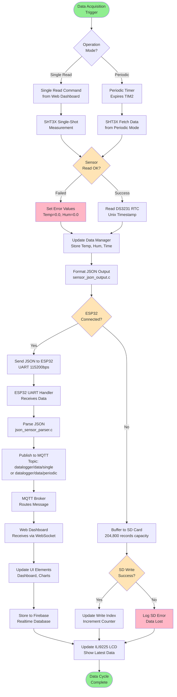
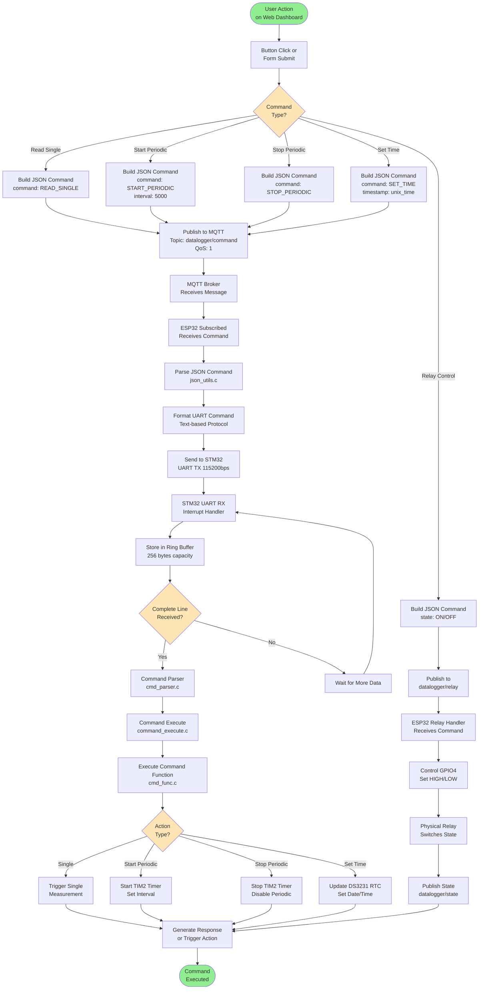
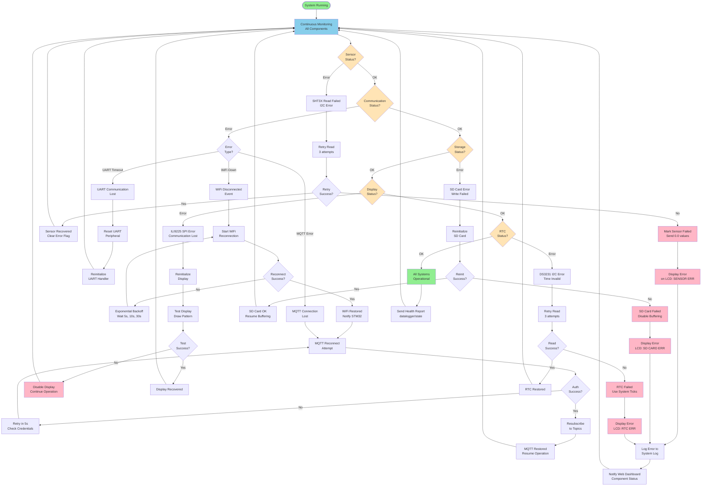

# SYSTEM - Flow Diagrams (Complete System)

Comprehensive flowcharts describing the complete DATALOGGER system operation including all 4 subsystems: STM32 Firmware, ESP32 Gateway, MQTT Broker, and Web Dashboard.

---

## 1. Complete System Initialization Flow

```mermaid
flowchart TD
    Start([System Power On]) --> STM32_Init[STM32 Initialization]
    
    STM32_Init --> STM32_HAL[Initialize HAL & Clock<br/>72MHz System Clock]
    STM32_HAL --> STM32_Periph[Initialize Peripherals<br/>I2C1, SPI1, UART1, TIM2]
    STM32_Periph --> STM32_Drivers[Initialize Drivers<br/>SHT3X, DS3231, SD Card<br/>ILI9225 Display]
    STM32_Drivers --> STM32_Buffers[Setup Buffers<br/>Ring Buffer 256B<br/>SD Buffer Init]
    STM32_Buffers --> STM32_Ready{STM32<br/>Ready?}
    
    STM32_Ready -->|No| STM32_Error[Display Error<br/>on LCD]
    STM32_Ready -->|Yes| STM32_Display[Show Startup<br/>Message on Display]
    
    STM32_Display --> ESP32_Init[ESP32 Initialization]
    
    ESP32_Init --> ESP32_FreeRTOS[Initialize FreeRTOS<br/>Create Tasks]
    ESP32_FreeRTOS --> ESP32_Periph[Initialize Peripherals<br/>UART2, GPIO4 Relay]
    ESP32_Periph --> ESP32_WiFi[WiFi Manager Init<br/>Connect to AP]
    
    ESP32_WiFi --> WiFi_Connect{WiFi<br/>Connected?}
    WiFi_Connect -->|No| WiFi_Retry[Retry Connection<br/>Max 10 attempts]
    WiFi_Retry --> WiFi_Connect
    WiFi_Connect -->|Yes| MQTT_Init[MQTT Handler Init]
    
    MQTT_Init --> MQTT_Connect[Connect to Broker<br/>ws://broker:8083]
    MQTT_Connect --> MQTT_Auth{Authentication<br/>Success?}
    MQTT_Auth -->|No| MQTT_Error[Log Error<br/>Retry in 5s]
    MQTT_Error --> MQTT_Connect
    MQTT_Auth -->|Yes| MQTT_Sub[Subscribe to Topics<br/>datalogger/command<br/>datalogger/relay<br/>datalogger/time/sync]
    
    MQTT_Sub --> ESP32_Notify[Send MQTT CONNECTED<br/>to STM32 via UART]
    ESP32_Notify --> STM32_Update[STM32 Updates Status<br/>WiFi Connected]
    STM32_Update --> Display_Update[Update LCD Display<br/>Show WiFi Status]
    
    Display_Update --> Web_Init[Web Dashboard Load]
    Web_Init --> Web_Connect[Connect MQTT WebSocket<br/>ws://broker:8083/mqtt]
    Web_Connect --> Firebase_Init[Initialize Firebase<br/>Realtime Database]
    Firebase_Init --> System_Ready([System Fully<br/>Operational])
    
    style Start fill:#90EE90
    style System_Ready fill:#90EE90
    style STM32_Error fill:#FFB6C6
    style MQTT_Error fill:#FFB6C6
    style WiFi_Connect fill:#FFE4B5
    style MQTT_Auth fill:#FFE4B5
    style STM32_Ready fill:#FFE4B5
```

---

## 2. Complete Data Acquisition & Transmission Flow

---

## 3. Command Processing Flow (Web to STM32)

---

## 4. Offline Buffering & Sync Flow

---

## 5. Error Detection & Recovery Flow

---

## 6. Periodic Mode Operation Flow

```mermaid
flowchart TD
    Start([Periodic Mode<br/>START Command]) --> Validate_Interval{Interval<br/>Valid?}
    
    Validate_Interval -->|No| Invalid[Invalid Interval<br/>500ms - 60000ms]
    Validate_Interval -->|Yes| Config_TIM2[Configure TIM2<br/>Set Prescaler & Period]
    
    Invalid --> Send_Error[Send Error Response<br/>to Web Dashboard]
    Send_Error --> End_Error([Mode Not Started])
    
    Config_TIM2 --> Start_SHT3X[Start SHT3X<br/>Periodic Mode]
    Start_SHT3X --> SHT3X_Mode{Select<br/>Mode?}
    
    SHT3X_Mode -->|Interval >= 10s| Mode_05MPS[SHT3X_PERIODIC_05MPS<br/>0.5 measurements/sec]
    SHT3X_Mode -->|5s <= Interval < 10s| Mode_1MPS[SHT3X_PERIODIC_1MPS<br/>1 measurement/sec]
    SHT3X_Mode -->|2s <= Interval < 5s| Mode_2MPS[SHT3X_PERIODIC_2MPS<br/>2 measurements/sec]
    SHT3X_Mode -->|1s <= Interval < 2s| Mode_4MPS[SHT3X_PERIODIC_4MPS<br/>4 measurements/sec]
    SHT3X_Mode -->|Interval < 1s| Mode_10MPS[SHT3X_PERIODIC_10MPS<br/>10 measurements/sec]
    
    Mode_05MPS --> Init_Sensor
    Mode_1MPS --> Init_Sensor
    Mode_2MPS --> Init_Sensor
    Mode_4MPS --> Init_Sensor
    Mode_10MPS --> Init_Sensor
    
    Init_Sensor[Initialize Sensor<br/>Periodic Measurement] --> Sensor_Init_OK{Init<br/>Success?}
    
    Sensor_Init_OK -->|No| Init_Failed[Sensor Init Failed<br/>I2C Error]
    Init_Failed --> Retry_Init[Retry Initialization<br/>3 attempts]
    Retry_Init --> Sensor_Init_OK
    
    Sensor_Init_OK -->|Yes| Enable_Timer[Enable TIM2<br/>Start Interrupt]
    Enable_Timer --> Set_Flag[Set Periodic<br/>Active Flag]
    Set_Flag --> Update_Display[Update LCD Display<br/>Show PERIODIC: ON<br/>Interval: Xs]
    
    Update_Display --> Notify_Started[Send Status to Web<br/>datalogger/state]
    Notify_Started --> Wait_Timer([Wait for Timer<br/>Interrupt])
    
    Wait_Timer --> TIM2_ISR[TIM2 IRQ Handler<br/>Triggers]
    TIM2_ISR --> Set_Measure_Flag[Set Measurement<br/>Required Flag]
    Set_Measure_Flag --> Main_Loop[Return to Main Loop]
    
    Main_Loop --> Check_Flag{Measurement<br/>Flag Set?}
    Check_Flag -->|No| Other_Tasks[Process Other Tasks<br/>Commands, Display]
    Other_Tasks --> Check_Flag
    
    Check_Flag -->|Yes| Clear_Flag[Clear Measurement<br/>Flag]
    Clear_Flag --> Fetch_Data[SHT3X Fetch Data<br/>Read from Sensor Buffer]
    
    Fetch_Data --> Data_Valid{Data<br/>Valid?}
    Data_Valid -->|No| Error_Count[Increment Error<br/>Counter]
    Error_Count --> Error_Threshold{Errors<br/>> 5?}
    Error_Threshold -->|Yes| Stop_Periodic[Auto-Stop Periodic<br/>Sensor Problem]
    Error_Threshold -->|No| Use_Last[Use Last Valid<br/>Data]
    
    Data_Valid -->|Yes| Get_Timestamp[Read DS3231<br/>Unix Timestamp]
    Use_Last --> Get_Timestamp
    
    Get_Timestamp --> Update_Manager[Update Data Manager<br/>data_manager.c]
    Update_Manager --> Format_JSON[Format JSON Output<br/>Mode: PERIODIC]
    
    Format_JSON --> Check_WiFi{WiFi<br/>Connected?}
    Check_WiFi -->|Yes| Send_UART[Send to ESP32<br/>UART TX]
    Check_WiFi -->|No| Buffer_SD[Buffer to SD Card<br/>Offline Storage]
    
    Send_UART --> ESP32_Process[ESP32 Processes<br/>Publishes MQTT]
    ESP32_Process --> Web_Update[Web Dashboard<br/>Updates Chart]
    Web_Update --> Firebase_Log[Firebase Stores<br/>Historical Data]
    
    Buffer_SD --> SD_Write[Write to SD<br/>Increment Counter]
    SD_Write --> Display_Update
    Firebase_Log --> Display_Update
    
    Display_Update[Update LCD Display<br/>Temp, Hum, Time] --> Check_Stop{Stop Command<br/>Received?}
    
    Check_Stop -->|No| Wait_Timer
    Check_Stop -->|Yes| Stop_Timer[Disable TIM2<br/>Stop Interrupt]
    
    Stop_Periodic --> Stop_Timer
    Stop_Timer --> Stop_SHT3X[Stop SHT3X<br/>Periodic Mode]
    Stop_SHT3X --> Clear_Periodic_Flag[Clear Periodic<br/>Active Flag]
    Clear_Periodic_Flag --> Final_Display[Update Display<br/>Show PERIODIC: OFF]
    Final_Display --> Notify_Stopped[Send Status<br/>Mode Stopped]
    Notify_Stopped --> End_Stop([Periodic Mode<br/>Stopped])
    
    style Start fill:#90EE90
    style End_Error fill:#FFB6C6
    style End_Stop fill:#90EE90
    style Validate_Interval fill:#FFE4B5
    style SHT3X_Mode fill:#FFE4B5
    style Sensor_Init_OK fill:#FFE4B5
    style Data_Valid fill:#FFE4B5
    style Check_WiFi fill:#FFE4B5
    style Error_Threshold fill:#FFE4B5
    style Check_Stop fill:#FFE4B5
    style Check_Flag fill:#FFE4B5
    style Invalid fill:#FFB6C6
    style Init_Failed fill:#FFB6C6
    style Stop_Periodic fill:#FFB6C6
```

---

*Continued in next section...*
