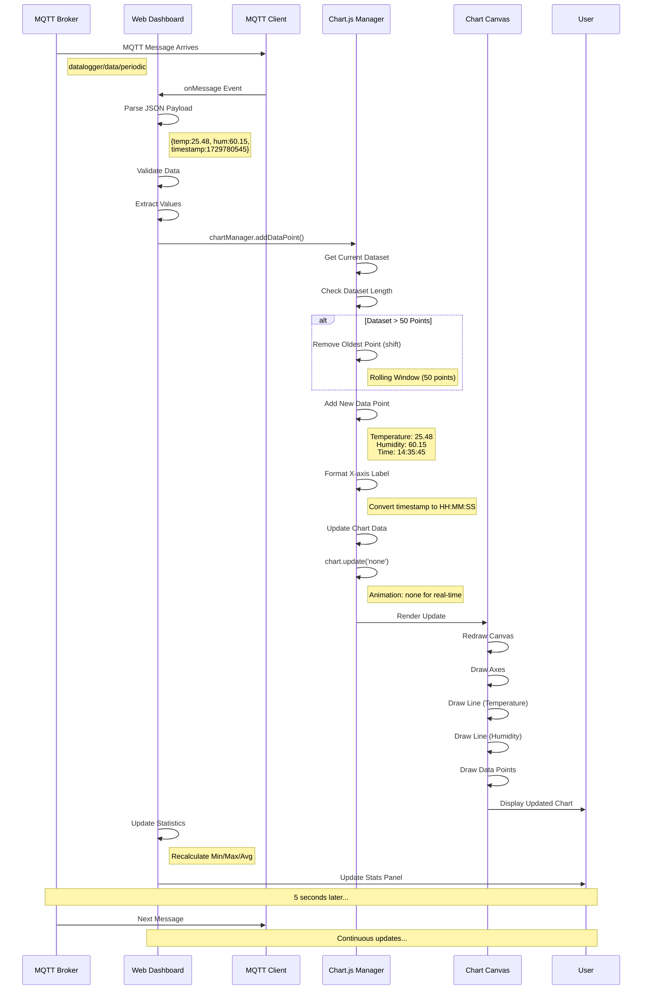
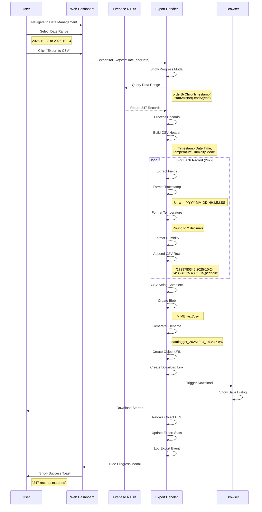
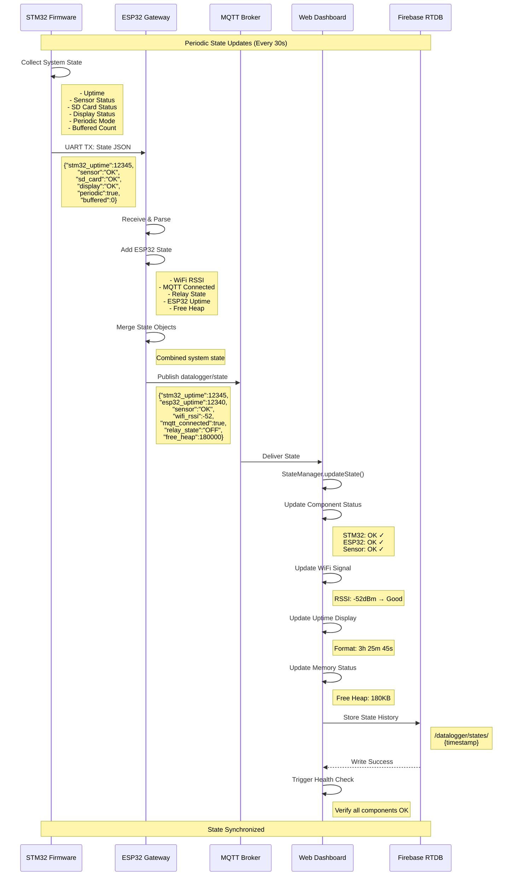
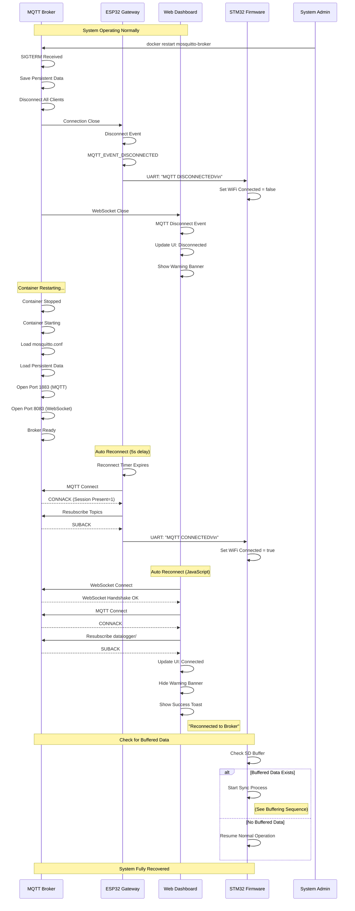
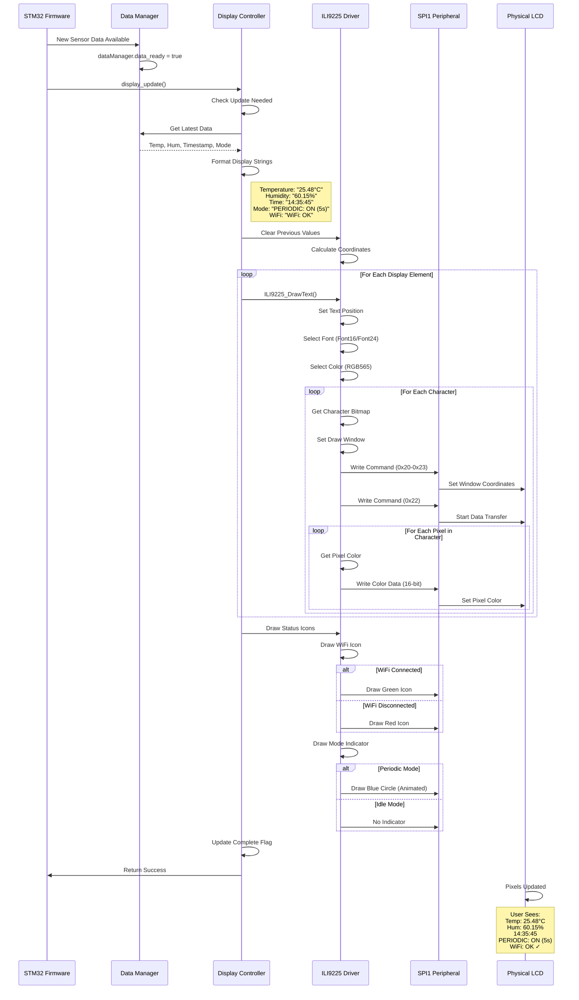
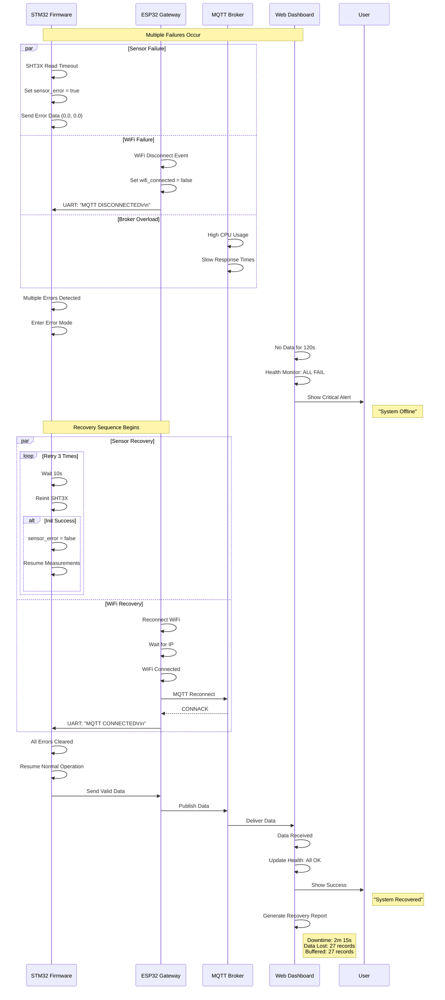

# SYSTEM - Sequence Diagrams (Complete System Interactions)

Comprehensive sequence diagrams showing interactions between all 4 subsystems: STM32 Firmware, ESP32 Gateway, MQTT Broker, and Web Dashboard.

---

## 1. Complete System Startup Sequence

---

## 2. Single Read Command Flow (End-to-End)

---

## 3. Periodic Monitoring Session

---

## 4. Offline Buffering & Synchronization Sequence

---

## 5. Relay Control Sequence

---

## 6. Time Synchronization Sequence (NTP)

---

## 7. Sensor Error Recovery Sequence

---

## 8. Firebase Data Query & Display Sequence

---

## 9. System Health Monitoring Sequence

---

## 10. Chart Real-Time Update Sequence

---

## 11. Data Export to CSV Sequence

---

## 12. System State Synchronization Sequence

---

## 13. MQTT Broker Restart & Recovery Sequence

---

## 14. Display Update Sequence (LCD)

---

## 15. Complete Error Cascade & Recovery Sequence

---

*End of SEQUENCE_DIAGRAM_SYSTEM.md - Total: 15 comprehensive sequences*

