# SYSTEM - UML & Architecture Diagrams (Complete System Architecture)

Comprehensive UML and architecture diagrams showing the complete DATALOGGER system structure including all 4 subsystems, their interactions, deployment, and data flows.

---

## 1. Complete System Architecture (C4 Level 1 - Context)

```mermaid
graph TB
    subgraph External["External Systems"]
        User[("👤 User<br/>(Dashboard Access)")]
        Internet[("🌐 Internet<br/>(NTP Time)")]
        Cloud["☁️ Firebase<br/>(Cloud Storage)"]
    end
    
    subgraph DataloggerSystem["DATALOGGER System"]
        WebApp["🖥️ Web Dashboard<br/>(Browser Application)"]
        MQTTBroker["📡 MQTT Broker<br/>(Mosquitto)"]
        Gateway["📱 ESP32 Gateway<br/>(WiFi Bridge)"]
        Firmware["🎛️ STM32 Firmware<br/>(Data Acquisition)"]
    end
    
    subgraph Physical["Physical World"]
        Sensor["🌡️ SHT3X Sensor<br/>(Temperature/Humidity)"]
        Relay["⚡ Relay Module<br/>(Device Control)"]
        Device["🔌 Connected Device"]
    end
    
    User -->|HTTPS/WSS| WebApp
    WebApp -->|MQTT over WebSocket| MQTTBroker
    WebApp -->|Store/Query| Cloud
    WebApp -->|Get Time| Internet
    
    Gateway -->|MQTT TCP| MQTTBroker
    Gateway -->|UART 115200| Firmware
    Gateway -->|GPIO Control| Relay
    Relay -->|Power| Device
    
    Firmware -->|I2C Read| Sensor
    Sensor -->|Temp & Hum| Firmware
    
    style User fill:#90EE90
    style WebApp fill:#87CEEB
    style MQTTBroker fill:#FFD700
    style Gateway fill:#FFA07A
    style Firmware fill:#DDA0DD
    style Sensor fill:#F0E68C
    style Cloud fill:#B0C4DE
```

---

## 2. System Component Diagram

---

## 3. Deployment Diagram

---

## 4. Network Topology Diagram

---

## 5. Data Flow Architecture

```mermaid
graph LR
    subgraph Sources["Data Sources"]
        Sensor["🌡️ SHT3X Sensor<br/>±0.2°C, ±2% RH"]
        RTC["⏰ DS3231 RTC<br/>Unix Timestamp"]
    end
    
    subgraph Acquisition["Data Acquisition"]
        STM32["STM32 Firmware<br/>- I2C Read<br/>- JSON Format<br/>- Validation"]
    end
    
    subgraph Buffering["Offline Buffering"]
        SD["SD Card<br/>204,800 records<br/>512B blocks"]
        Memory["RAM Buffer<br/>256B Ring<br/>UART RX"]
    end
    
    subgraph Transport["Data Transport"]
        UART["UART Link<br/>115200 bps<br/>8N1"]
        ESP32["ESP32 Gateway<br/>- Parse JSON<br/>- WiFi Bridge"]
    end
    
    subgraph Distribution["Data Distribution"]
        MQTT["MQTT Broker<br/>- Topic Routing<br/>- QoS 0/1<br/>- Persistence"]
    end
    
    subgraph Storage["Data Storage"]
        Firebase["Firebase RTDB<br/>- Historical<br/>- Queryable<br/>- Cloud Backup"]
    end
    
    subgraph Visualization["Data Visualization"]
        Chart["Chart.js<br/>Real-time Line<br/>50-point window"]
        Table["Data Table<br/>Live Updates<br/>Filtering"]
        Display["ILI9225 LCD<br/>Local Display<br/>176×220 px"]
    end
    
    Sensor -->|I2C 100kHz| STM32
    RTC -->|I2C 100kHz| STM32
    
    STM32 -->|Online| UART
    STM32 -->|Offline| SD
    SD -->|Sync| UART
    
    UART --> Memory
    Memory --> ESP32
    
    ESP32 -->|WiFi| MQTT
    MQTT -->|WebSocket| Chart
    MQTT -->|WebSocket| Table
    MQTT -.Store.-> Firebase
    
    STM32 -->|SPI| Display
    
    style Sources fill:#F0E68C
    style Acquisition fill:#DDA0DD
    style Buffering fill:#FFB6C1
    style Transport fill:#FFA07A
    style Distribution fill:#FFD700
    style Storage fill:#B0C4DE
    style Visualization fill:#87CEEB
```

---

## 6. STM32 State Machine Diagram

---

## 7. ESP32 State Machine Diagram

---

## 8. Web Dashboard State Machine

---

*Continued in next section...*
