# System - UML Diagrams

This document contains all UML diagrams for the complete DATALOGGER system architecture, including class diagrams, component diagrams, and structural relationships between all subsystems.

## Complete System Class Diagram

```mermaid
classDiagram
    %% Web Dashboard Classes
    class WebApplication {
        -mqttManager: MQTTManager
        -firebaseManager: FirebaseManager
        -chartManager: ChartManager
        -uiController: UIController
        -stateManager: StateManager
        -healthMonitor: ComponentHealthMonitor
        +initialize() void
        +connectServices() void
        +shutdown() void
    }
    
    class MQTTManager {
        -client: mqtt.Client
        -connectionState: ConnectionState
        -subscriptions: String[]
        -messageHandlers: Map<String, Function>
        +connect(brokerUrl, credentials) boolean
        +subscribe(topic, qos) boolean
        +publish(topic, message, qos) boolean
        +disconnect() void
    }
    
    class FirebaseManager {
        -database: firebase.Database
        -config: FirebaseConfig
        -authState: AuthState
        +initializeApp(config) boolean
        +writeData(path, data) boolean
        +queryData(path, filters) Object[]
        +updateConfig(config) void
    }
    
    class ChartManager {
        -chart: Chart.js
        -datasets: Dataset[]
        -configuration: ChartConfig
        -updateInterval: number
        +createChart(canvas, config) Chart
        +addDataPoint(value, timestamp) void
        +updateChart(data) void
        +exportImage() Blob
    }
    
    class UIController {
        -pages: Page[]
        -components: UIComponent[]
        -eventHandlers: EventHandler[]
        +renderPage(pageId) void
        +updateComponent(id, data) void
        +handleUserEvent(event) void
        +updateDisplay(data) void
    }
    
    class StateManager {
        -deviceState: DeviceState
        -systemState: SystemState
        -configState: ConfigState
        +updateState(key, value) void
        +getState(key) Object
        +persistState() void
        +restoreState() void
    }
    
    class ComponentHealthMonitor {
        -components: HealthComponent[]
        -healthStatus: HealthStatus
        -alertThresholds: Threshold[]
        +monitorComponents() void
        +checkHealth() HealthStatus
        +triggerAlert(component, issue) void
        +getOverallHealth() HealthLevel
    }
    
    %% ESP32 Gateway Classes
    class ESP32_Gateway {
        -wifiManager: WiFiManager
        -mqttHandler: MQTTHandler
        -uartBridge: UARTBridge
        -relayController: RelayController
        -jsonParser: JSONParser
        -systemState: SystemState
        +initialize() esp_err_t
        +startTasks() void
        +handleCommand(command) void
        +forwardData(data) void
        +updateSystemState() void
    }
    
    class WiFiManager {
        -config: wifi_config_t
        -connectionState: wifi_state_t
        -retryCount: uint8_t
        -eventHandler: wifi_event_handler_t
        +init(config) esp_err_t
        +connect() esp_err_t
        +disconnect() esp_err_t
        +getConnectionInfo() wifi_ap_record_t
        +handleEvents(event) void
    }
    
    class MQTTHandler {
        -client: esp_mqtt_client_handle_t
        -config: esp_mqtt_client_config_t
        -eventHandler: mqtt_event_handler_t
        -subscriptions: String[]
        +init(config) esp_err_t
        +start() esp_err_t
        +publish(topic, data, qos) esp_err_t
        +subscribe(topic, qos) esp_err_t
        +handleEvents(event) void
    }
    
    class UARTBridge {
        -uartNum: uart_port_t
        -config: uart_config_t
        -rxBuffer: QueueHandle_t
        -txBuffer: QueueHandle_t
        +init(config) esp_err_t
        +sendCommand(command) esp_err_t
        +readData() String
        +processIncomingData() void
    }
    
    class RelayController {
        -gpioPin: gpio_num_t
        -currentState: boolean
        -stateChangeCallback: relay_callback_t
        +init(gpioPin) esp_err_t
        +setState(state) esp_err_t
        +getState() boolean
        +toggle() esp_err_t
    }
    
    class JSONParser {
        -buffer: char[]
        -parseState: ParseState
        +parseMessage(jsonString) ParseResult
        +extractSensorData(json) SensorData
        +validateFormat(json) boolean
        +createResponse(data) String
    }
    
    %% STM32 Firmware Classes
    class STM32_Firmware {
        -peripheralHandlers: PeripheralHandler[]
        -dataManager: DataManager
        -commandProcessor: CommandProcessor
        -systemState: SystemState
        +initialize() HAL_StatusTypeDef
        +processCommand(command) void
        +collectSensorData() SensorData
        +manageDataFlow() void
        +updateDisplay() void
    }
    
    class SensorManager {
        -sht3x: SHT3X_HandleTypeDef
        -rtc: DS3231_HandleTypeDef
        -i2cHandle: I2C_HandleTypeDef
        +initSensors() HAL_StatusTypeDef
        +readTemperatureHumidity() SensorReading
        +getCurrentTime() time_t
        +validateSensorData(data) boolean
    }
    
    class DataManager {
        -currentData: SensorData
        -operationMode: OperationMode
        -dataReadyFlag: boolean
        +updateSingleData(temp, hum) void
        +updatePeriodicData(temp, hum) void
        +isDataReady() boolean
        +formatDataForTransmission() String
        +clearDataReady() void
    }
    
    class CommunicationManager {
        -uartHandle: UART_HandleTypeDef
        -rxBuffer: RingBuffer
        -txBuffer: uint8_t[]
        -commandProcessor: CommandProcessor
        +initUART() HAL_StatusTypeDef
        +sendData(data) HAL_StatusTypeDef
        +receiveData() String
        +processCommands() void
    }
    
    class SDCardManager {
        -spiHandle: SPI_HandleTypeDef
        -fileSystem: FATFS
        -bufferState: BufferState
        -recordCount: uint32_t
        +initSDCard() HAL_StatusTypeDef
        +writeData(data) HAL_StatusTypeDef
        +readBufferedData() String
        +clearBuffer() HAL_StatusTypeDef
        +getBufferInfo() BufferInfo
    }
    
    class DisplayManager {
        -spiHandle: SPI_HandleTypeDef
        -displayState: DisplayState
        -currentScreen: ScreenType
        +initDisplay() HAL_StatusTypeDef
        +updateSensorDisplay(data) void
        +updateStatusDisplay(status) void
        +showMessage(message) void
        +setBacklight(level) void
    }
    
    class CommandProcessor {
        -commandTable: CommandEntry[]
        -currentCommand: String
        +parseCommand(input) Command
        +executeCommand(command) CommandResult
        +registerCommand(name, handler) void
        +validateCommand(command) boolean
    }
    
    %% MQTT Broker Classes
    class MQTTBroker {
        -config: BrokerConfig
        -clients: ClientSession[]
        -topics: TopicTree
        -persistence: MessageStore
        -authentication: AuthManager
        +start(config) boolean
        +handleClientConnect(client) void
        +routeMessage(topic, message) void
        +manageSubscriptions() void
        +persistMessage(message) void
    }
    
    class ClientSession {
        -clientId: String
        -connectionState: ConnectionState
        -subscriptions: Subscription[]
        -messageQueue: Message[]
        +authenticate(credentials) boolean
        +subscribe(topic, qos) void
        +unsubscribe(topic) void
        +publishMessage(message) void
        +handleDisconnect() void
    }
    
    class TopicManager {
        -topicTree: TopicNode
        -wildcardSubscriptions: WildcardSub[]
        +addTopic(topic) void
        +findSubscribers(topic) ClientSession[]
        +validateTopicFormat(topic) boolean
        +handleWildcards(pattern) ClientSession[]
    }
    
    class MessageStore {
        -retainedMessages: Map<String, Message>
        -qosMessages: Map<String, QoSMessage>
        -storageBackend: StorageBackend
        +storeRetainedMessage(topic, message) void
        +getRetainedMessage(topic) Message
        +storeQoSMessage(message) void
        +acknowledgeMessage(messageId) void
    }
    
    %% Data Transfer Objects
    class SensorData {
        +mode: String
        +timestamp: time_t
        +temperature: float
        +humidity: float
        +isValid: boolean
        +toJSON() String
        +fromJSON(json) SensorData
    }
    
    class SystemState {
        +deviceOn: boolean
        +periodicActive: boolean
        +wifiConnected: boolean
        +mqttConnected: boolean
        +lastUpdate: time_t
        +toJSON() String
        +fromJSON(json) SystemState
    }
    
    class Command {
        +type: CommandType
        +parameters: Map<String, Object>
        +timestamp: time_t
        +source: String
        +isValid() boolean
    }
    
    class Message {
        +topic: String
        +payload: byte[]
        +qos: QoSLevel
        +retain: boolean
        +timestamp: time_t
    }
    
    %% Enumerations
    class ConnectionState {
        <<enumeration>>
        DISCONNECTED
        CONNECTING
        CONNECTED
        ERROR
    }
    
    class OperationMode {
        <<enumeration>>
        IDLE
        SINGLE_READ
        PERIODIC_READ
        CONFIGURATION
    }
    
    class CommandType {
        <<enumeration>>
        READ_SINGLE
        START_PERIODIC
        STOP_PERIODIC
        SET_TIME
        SET_CONFIG
        RELAY_CONTROL
    }
    
    class QoSLevel {
        <<enumeration>>
        AT_MOST_ONCE
        AT_LEAST_ONCE
        EXACTLY_ONCE
    }
    
    %% Relationships - Web Dashboard
    WebApplication *-- MQTTManager : contains
    WebApplication *-- FirebaseManager : contains
    WebApplication *-- ChartManager : contains
    WebApplication *-- UIController : contains
    WebApplication *-- StateManager : contains
    WebApplication *-- ComponentHealthMonitor : contains
    
    MQTTManager ..> Message : handles
    FirebaseManager ..> SensorData : stores
    ChartManager ..> SensorData : visualizes
    StateManager *-- SystemState : manages
    
    %% Relationships - ESP32 Gateway
    ESP32_Gateway *-- WiFiManager : contains
    ESP32_Gateway *-- MQTTHandler : contains
    ESP32_Gateway *-- UARTBridge : contains
    ESP32_Gateway *-- RelayController : contains
    ESP32_Gateway *-- JSONParser : contains
    ESP32_Gateway *-- SystemState : maintains
    
    WiFiManager ..> ConnectionState : uses
    MQTTHandler ..> Message : processes
    JSONParser ..> SensorData : creates
    JSONParser ..> Command : parses
    
    %% Relationships - STM32 Firmware
    STM32_Firmware *-- SensorManager : contains
    STM32_Firmware *-- DataManager : contains
    STM32_Firmware *-- CommunicationManager : contains
    STM32_Firmware *-- SDCardManager : contains
    STM32_Firmware *-- DisplayManager : contains
    STM32_Firmware *-- CommandProcessor : contains
    
    SensorManager ..> SensorData : produces
    DataManager *-- SensorData : manages
    DataManager ..> OperationMode : uses
    CommunicationManager *-- CommandProcessor : uses
    CommandProcessor ..> Command : processes
    CommandProcessor ..> CommandType : handles
    
    %% Relationships - MQTT Broker
    MQTTBroker *-- ClientSession : manages
    MQTTBroker *-- TopicManager : uses
    MQTTBroker *-- MessageStore : uses
    
    ClientSession ..> Message : handles
    TopicManager ..> Message : routes
    MessageStore *-- Message : stores
    Message ..> QoSLevel : has
    
    %% Inter-system Communication
    WebApplication ..> MQTTBroker : connects to
    ESP32_Gateway ..> MQTTBroker : connects to
    ESP32_Gateway -.-> STM32_Firmware : UART communication
    
    %% Data Flow Dependencies
    STM32_Firmware --> ESP32_Gateway : sends data
    ESP32_Gateway --> MQTTBroker : publishes data
    MQTTBroker --> WebApplication : delivers data
    WebApplication --> FirebaseManager : stores data
```

## Component Interaction UML Diagram

```mermaid
classDiagram
    %% Component Interfaces
    class ISensorReader {
        <<interface>>
        +readTemperature() float
        +readHumidity() float
        +isAvailable() boolean
        +calibrate() boolean
    }
    
    class IDataStorage {
        <<interface>>
        +store(data) boolean
        +retrieve(criteria) Object[]
        +delete(criteria) boolean
        +getCapacity() long
    }
    
    class ICommunicationBridge {
        <<interface>>
        +send(message) boolean
        +receive() Message
        +isConnected() boolean
        +setCallback(callback) void
    }
    
    class IDisplayController {
        <<interface>>
        +updateDisplay(data) void
        +showMessage(message) void
        +setBacklight(level) void
        +clear() void
    }
    
    class IRelayController {
        <<interface>>
        +turnOn() boolean
        +turnOff() boolean
        +getState() boolean
        +toggle() boolean
    }
    
    %% Implementation Classes
    class SHT3X_Sensor {
        -i2cAddress: uint8_t
        -i2cHandle: I2C_HandleTypeDef*
        -lastReading: SensorReading
        +init(i2cHandle) HAL_StatusTypeDef
        +readTemperature() float
        +readHumidity() float
        +isAvailable() boolean
        +calibrate() boolean
    }
    
    class FirebaseStorage {
        -apiKey: String
        -databaseURL: String
        -projectId: String
        -authToken: String
        +init(config) boolean
        +store(data) boolean
        +retrieve(criteria) Object[]
        +delete(criteria) boolean
        +getCapacity() long
    }
    
    class SDCardStorage {
        -spiHandle: SPI_HandleTypeDef*
        -fileSystem: FATFS
        -currentFile: FIL
        -bufferSize: uint32_t
        +init(spiHandle) HAL_StatusTypeDef
        +store(data) boolean
        +retrieve(criteria) Object[]
        +delete(criteria) boolean
        +getCapacity() long
    }
    
    class MQTTCommunication {
        -brokerAddress: String
        -clientId: String
        -client: esp_mqtt_client_handle_t
        -messageCallback: mqtt_callback_t
        +init(config) esp_err_t
        +send(message) boolean
        +receive() Message
        +isConnected() boolean
        +setCallback(callback) void
    }
    
    class UARTCommunication {
        -uartHandle: UART_HandleTypeDef*
        -baudRate: uint32_t
        -rxBuffer: RingBuffer
        -dataCallback: uart_callback_t
        +init(config) HAL_StatusTypeDef
        +send(message) boolean
        +receive() Message
        +isConnected() boolean
        +setCallback(callback) void
    }
    
    class ILI9225_Display {
        -spiHandle: SPI_HandleTypeDef*
        -width: uint16_t
        -height: uint16_t
        -currentScreen: ScreenBuffer
        +init(spiHandle) HAL_StatusTypeDef
        +updateDisplay(data) void
        +showMessage(message) void
        +setBacklight(level) void
        +clear() void
    }
    
    class WebDisplay {
        -canvas: HTMLCanvasElement
        -chart: Chart.js
        -uiElements: HTMLElement[]
        -updateInterval: number
        +init(containerId) boolean
        +updateDisplay(data) void
        +showMessage(message) void
        +setTheme(theme) void
        +clear() void
    }
    
    class HardwareRelay {
        -gpioPin: gpio_num_t
        -currentState: boolean
        -stateChangeCallback: relay_callback_t
        +init(pin) esp_err_t
        +turnOn() boolean
        +turnOff() boolean
        +getState() boolean
        +toggle() boolean
    }
    
    %% Interface Implementations
    SHT3X_Sensor --|> ISensorReader : implements
    FirebaseStorage --|> IDataStorage : implements
    SDCardStorage --|> IDataStorage : implements
    MQTTCommunication --|> ICommunicationBridge : implements
    UARTCommunication --|> ICommunicationBridge : implements
    ILI9225_Display --|> IDisplayController : implements
    WebDisplay --|> IDisplayController : implements
    HardwareRelay --|> IRelayController : implements
    
    %% Component Dependencies
    STM32_Firmware --> ISensorReader : uses
    STM32_Firmware --> IDataStorage : uses
    STM32_Firmware --> ICommunicationBridge : uses
    STM32_Firmware --> IDisplayController : uses
    
    ESP32_Gateway --> ICommunicationBridge : uses
    ESP32_Gateway --> IRelayController : uses
    
    WebApplication --> IDataStorage : uses
    WebApplication --> ICommunicationBridge : uses
    WebApplication --> IDisplayController : uses
```



## State Machine UML Diagram


## Package Structure UML Diagram

```mermaid
classDiagram
    namespace WebDashboard {
        class WebApplication
        class MQTTManager
        class FirebaseManager
        class ChartManager
        class UIController
    }
    
    namespace ESP32Gateway {
        class ESP32_Gateway
        class WiFiManager
        class MQTTHandler
        class UARTBridge
        class RelayController
        class JSONParser
    }
    
    namespace STM32Firmware {
        class STM32_Firmware
        class SensorManager
        class DataManager
        class CommunicationManager
        class SDCardManager
        class DisplayManager
        class CommandProcessor
    }
    
    namespace MQTTBroker {
        class MQTTBroker
        class ClientSession
        class TopicManager
        class MessageStore
    }
    
    namespace SharedTypes {
        class SensorData
        class SystemState
        class Command
        class Message
        class ConnectionState
        class OperationMode
    }
    
    namespace HardwareAbstraction {
        class ISensorReader
        class IDataStorage
        class ICommunicationBridge
        class IDisplayController
        class IRelayController
    }
    
    %% Package Dependencies
    WebDashboard --> SharedTypes : uses
    WebDashboard --> MQTTBroker : connects to
    WebDashboard --> HardwareAbstraction : implements
    
    ESP32Gateway --> SharedTypes : uses
    ESP32Gateway --> MQTTBroker : connects to
    ESP32Gateway --> STM32Firmware : communicates with
    ESP32Gateway --> HardwareAbstraction : implements
    
    STM32Firmware --> SharedTypes : uses
    STM32Firmware --> HardwareAbstraction : implements
    
    MQTTBroker --> SharedTypes : uses
    
    %% Internal Package Dependencies
    WebApplication --> MQTTManager : uses
    WebApplication --> FirebaseManager : uses
    WebApplication --> ChartManager : uses
    WebApplication --> UIController : uses
    
    ESP32_Gateway --> WiFiManager : uses
    ESP32_Gateway --> MQTTHandler : uses
    ESP32_Gateway --> UARTBridge : uses
    ESP32_Gateway --> RelayController : uses
    ESP32_Gateway --> JSONParser : uses
    
    STM32_Firmware --> SensorManager : uses
    STM32_Firmware --> DataManager : uses
    STM32_Firmware --> CommunicationManager : uses
    STM32_Firmware --> SDCardManager : uses
    STM32_Firmware --> DisplayManager : uses
    STM32_Firmware --> CommandProcessor : uses
    
    MQTTBroker --> ClientSession : manages
    MQTTBroker --> TopicManager : uses
    MQTTBroker --> MessageStore : uses
```

## Object Collaboration UML Diagram

```mermaid
classDiagram
    %% Runtime Object Instances
    class webApp["webApp : WebApplication"] {
        +mqttManager : MQTTManager
        +firebaseManager : FirebaseManager
        +chartManager : ChartManager
        +state : "CONNECTED"
    }
    
    class mqttClient["mqttClient : MQTTManager"] {
        +brokerUrl : "ws://192.168.1.100:8083"
        +clientId : "web_dashboard_001"
        +connectionState : "CONNECTED"
        +subscriptions : ["datalogger/#"]
    }
    
    class esp32Gateway["esp32Gateway : ESP32_Gateway"] {
        +deviceId : "ESP32_GATEWAY_001"
        +wifiConnected : true
        +mqttConnected : true
        +systemState : SystemState
    }
    
    class stm32Firmware["stm32Firmware : STM32_Firmware"] {
        +deviceId : "STM32_LOGGER_001"
        +operationMode : "PERIODIC"
        +sensorData : SensorData
        +dataReady : true
    }
    
    class mqttBroker["mqttBroker : MQTTBroker"] {
        +brokerUrl : "192.168.1.100:1883"
        +clientSessions : ClientSession[]
        +activeTopics : ["datalogger/data", "datalogger/command"]
    }
    
    class sensorData1["sensorReading : SensorData"] {
        +mode : "PERIODIC"
        +timestamp : 1729780345
        +temperature : 25.48
        +humidity : 60.15
        +isValid : true
    }
    
    class command1["relayCommand : Command"] {
        +type : "RELAY_CONTROL"
        +parameters : {"state": "ON"}
        +timestamp : 1729780350
        +source : "web_dashboard"
    }
    
    class systemState1["currentState : SystemState"] {
        +deviceOn : true
        +periodicActive : true
        +wifiConnected : true
        +mqttConnected : true
        +lastUpdate : 1729780345
    }
    
    %% Object Relationships
    webApp *-- mqttClient : manages
    webApp ..> command1 : creates
    webApp ..> sensorData1 : processes
    
    mqttClient --> mqttBroker : connects to
    mqttClient ..> command1 : publishes
    mqttClient ..> sensorData1 : receives
    
    esp32Gateway --> mqttBroker : connects to
    esp32Gateway *-- systemState1 : maintains
    esp32Gateway ..> command1 : receives
    esp32Gateway ..> sensorData1 : forwards
    
    stm32Firmware ..> sensorData1 : generates
    stm32Firmware ..> command1 : processes
    
    mqttBroker ..> command1 : routes
    mqttBroker ..> sensorData1 : routes
    
    %% Message Flow Collaboration
    webApp --> mqttClient : send command
    mqttClient --> mqttBroker : publish message
    mqttBroker --> esp32Gateway : deliver command
    esp32Gateway --> stm32Firmware : forward via UART
    stm32Firmware --> esp32Gateway : send sensor data
    esp32Gateway --> mqttBroker : publish data
    mqttBroker --> mqttClient : deliver data
    mqttClient --> webApp : notify data received
```

---

## UML Diagram Conventions

### Class Diagram Elements
- **Classes**: Represented with class name, attributes, and methods
- **Interfaces**: Marked with `<<interface>>` stereotype
- **Enumerations**: Marked with `<<enumeration>>` stereotype
- **Abstract Classes**: Marked with `<<abstract>>` stereotype

### Relationship Types
- **Association** (`-->`) : "uses" or "depends on" relationship
- **Composition** (`*--`) : "owns" or "contains" relationship (strong ownership)
- **Aggregation** (`o--`) : "has" or "references" relationship (weak ownership)
- **Inheritance** (`<|--`) : "extends" or "inherits from" relationship
- **Realization** (`--|>`) : "implements" relationship for interfaces
- **Dependency** (`..>`) : Temporary usage relationship

### Visibility Modifiers
- **Public** (`+`) : Accessible from outside the class
- **Private** (`-`) : Accessible only within the class
- **Protected** (`#`) : Accessible within class and subclasses
- **Package** (`~`) : Accessible within the same package

### Stereotypes Used
- `<<interface>>` : Interface definition
- `<<enumeration>>` : Enumerated type
- `<<abstract>>` : Abstract class
- `<<singleton>>` : Singleton pattern implementation

### Package Organization
- **WebDashboard**: Browser-based user interface components
- **ESP32Gateway**: WiFi bridge and IoT gateway functionality
- **STM32Firmware**: Embedded data acquisition system
- **MQTTBroker**: Message broker and communication hub
- **SharedTypes**: Common data structures and enumerations
- **HardwareAbstraction**: Interface definitions for hardware components

### Design Patterns Represented
- **Observer Pattern**: Event handling and callbacks
- **Bridge Pattern**: Hardware abstraction layers
- **Facade Pattern**: Simplified interfaces for complex subsystems
- **State Pattern**: System state management
- **Command Pattern**: Command processing and execution
- **Factory Pattern**: Object creation and initialization