# SYSTEM - UML & Architecture Diagrams (Complete System Architecture)

Comprehensive UML and architecture diagrams showing the complete DATALOGGER system structure including all 4 subsystems, their interactions, deployment, and data flows.

---

## 1. Complete System Architecture (C4 Level 1 - Context)

```mermaid
graph TB
    subgraph External["External Systems"]
        User[("👤 User<br/>(Dashboard Access)")]
        Internet[("🌐 Internet<br/>(NTP Time)")]
        Cloud["☁️ Firebase<br/>(Cloud Storage)"]
    end
    
    subgraph DataloggerSystem["DATALOGGER System"]
        WebApp["🖥️ Web Dashboard<br/>(Browser Application)"]
        MQTTBroker["📡 MQTT Broker<br/>(Mosquitto)"]
        Gateway["📱 ESP32 Gateway<br/>(WiFi Bridge)"]
        Firmware["🎛️ STM32 Firmware<br/>(Data Acquisition)"]
    end
    
    subgraph Physical["Physical World"]
        Sensor["🌡️ SHT3X Sensor<br/>(Temperature/Humidity)"]
        Relay["⚡ Relay Module<br/>(Device Control)"]
        Device["🔌 Connected Device"]
    end
    
    User -->|HTTPS/WSS| WebApp
    WebApp -->|MQTT over WebSocket| MQTTBroker
    WebApp -->|Store/Query| Cloud
    WebApp -->|Get Time| Internet
    
    Gateway -->|MQTT TCP| MQTTBroker
    Gateway -->|UART 115200| Firmware
    Gateway -->|GPIO Control| Relay
    Relay -->|Power| Device
    
    Firmware -->|I2C Read| Sensor
    Sensor -->|Temp & Hum| Firmware
    
    style User fill:#90EE90
    style WebApp fill:#87CEEB
    style MQTTBroker fill:#FFD700
    style Gateway fill:#FFA07A
    style Firmware fill:#DDA0DD
    style Sensor fill:#F0E68C
    style Cloud fill:#B0C4DE
```

---

## 2. System Component Diagram

---

## 3. Deployment Diagram

---

## 4. Network Topology Diagram

---

## 5. Data Flow Architecture

```mermaid
graph LR
    subgraph Sources["Data Sources"]
        Sensor["🌡️ SHT3X Sensor<br/>±0.2°C, ±2% RH"]
        RTC["⏰ DS3231 RTC<br/>Unix Timestamp"]
    end
    
    subgraph Acquisition["Data Acquisition"]
        STM32["STM32 Firmware<br/>- I2C Read<br/>- JSON Format<br/>- Validation"]
    end
    
    subgraph Buffering["Offline Buffering"]
        SD["SD Card<br/>204,800 records<br/>512B blocks"]
        Memory["RAM Buffer<br/>256B Ring<br/>UART RX"]
    end
    
    subgraph Transport["Data Transport"]
        UART["UART Link<br/>115200 bps<br/>8N1"]
        ESP32["ESP32 Gateway<br/>- Parse JSON<br/>- WiFi Bridge"]
    end
    
    subgraph Distribution["Data Distribution"]
        MQTT["MQTT Broker<br/>- Topic Routing<br/>- QoS 0/1<br/>- Persistence"]
    end
    
    subgraph Storage["Data Storage"]
        Firebase["Firebase RTDB<br/>- Historical<br/>- Queryable<br/>- Cloud Backup"]
    end
    
    subgraph Visualization["Data Visualization"]
        Chart["Chart.js<br/>Real-time Line<br/>50-point window"]
        Table["Data Table<br/>Live Updates<br/>Filtering"]
        Display["ILI9225 LCD<br/>Local Display<br/>176×220 px"]
    end
    
    Sensor -->|I2C 100kHz| STM32
    RTC -->|I2C 100kHz| STM32
    
    STM32 -->|Online| UART
    STM32 -->|Offline| SD
    SD -->|Sync| UART
    
    UART --> Memory
    Memory --> ESP32
    
    ESP32 -->|WiFi| MQTT
    MQTT -->|WebSocket| Chart
    MQTT -->|WebSocket| Table
    MQTT -.Store.-> Firebase
    
    STM32 -->|SPI| Display
    
    style Sources fill:#F0E68C
    style Acquisition fill:#DDA0DD
    style Buffering fill:#FFB6C1
    style Transport fill:#FFA07A
    style Distribution fill:#FFD700
    style Storage fill:#B0C4DE
    style Visualization fill:#87CEEB
```

---

## 6. STM32 State Machine Diagram

---

## 7. ESP32 State Machine Diagram

---

## 8. Web Dashboard State Machine

---

## 9. MQTT Topic Hierarchy

```mermaid
graph TB
    Root["datalogger/ (Root Topic)"]
    
    Root --> Command["command<br/>(QoS 1)<br/>Web → STM32"]
    Root --> Relay["relay<br/>(QoS 1)<br/>Web → ESP32"]
    Root --> TimeSync["time/sync<br/>(QoS 1)<br/>Web → STM32"]
    Root --> State["state<br/>(QoS 0)<br/>ESP32 → Web"]
    Root --> Data["data/<br/>(Data Topics)"]
    
    Data --> Single["single<br/>(QoS 0)<br/>STM32 → Web"]
    Data --> Periodic["periodic<br/>(QoS 0)<br/>STM32 → Web"]
    
    Command -.->|Payload| CMD_Schema["Command Schema:<br/>{<br/>  command: string,<br/>  interval?: number<br/>}"]
    
    Relay -.->|Payload| Relay_Schema["Relay Schema:<br/>{<br/>  state: 'ON'|'OFF'<br/>}"]
    
    TimeSync -.->|Payload| Time_Schema["Time Schema:<br/>{<br/>  command: 'SET_TIME',<br/>  timestamp: number<br/>}"]
    
    State -.->|Payload| State_Schema["State Schema:<br/>{<br/>  status: string,<br/>  uptime: number,<br/>  wifi_rssi: number,<br/>  relay_state: string,<br/>  sensor: string,<br/>  periodic_mode: boolean<br/>}"]
    
    Single -.->|Payload| Data_Schema["Data Schema:<br/>{<br/>  mode: string,<br/>  timestamp: number,<br/>  temperature: number,<br/>  humidity: number<br/>}"]
    
    Periodic -.->|Payload| Data_Schema
    
    style Root fill:#FFD700
    style Command fill:#FFB6C1
    style Relay fill:#FFA07A
    style TimeSync fill:#87CEEB
    style State fill:#98FB98
    style Single fill:#DDA0DD
    style Periodic fill:#DDA0DD
```

---

## 10. Firebase Database Schema

---

## 11. Hardware Pin Mapping Diagram

---

## 12. Power Distribution Diagram

---

## 13. Complete System Class Diagram

---

## 14. Message Sequence Flow (Complete Lifecycle)

---

## 15. Security Architecture Diagram

```mermaid
graph TB
    subgraph Internet["Internet (Untrusted)"]
        Attacker["🔴 Potential Attacker"]
        Public_Net["Public Network"]
    end
    
    subgraph Firewall["Firewall / Router"]
        NAT["NAT Gateway"]
        Port_Filter["Port Filtering"]
    end
    
    subgraph DMZ["DMZ / Broker Zone"]
        Broker["MQTT Broker"]
        
        subgraph Auth_Layer["Authentication Layer"]
            User_Auth["Username/Password<br/>(bcrypt)"]
            ACL["Access Control Lists"]
        end
        
        subgraph Encryption_Layer["Encryption (Optional)"]
            TLS["TLS 1.2/1.3<br/>(Certificates)"]
        end
    end
    
    subgraph Trusted_Zone["Trusted Local Network"]
        ESP32_Dev["ESP32 Gateway<br/>(Authenticated)"]
        Web_Client["Web Dashboard<br/>(Authenticated)"]
    end
    
    subgraph Cloud["Cloud Services"]
        Firebase_Auth["Firebase<br/>(OAuth 2.0)"]
    end
    
    Attacker -->|Blocked| NAT
    Public_Net -->|Port 8883<br/>TLS only| Port_Filter
    
    Port_Filter --> TLS
    TLS --> User_Auth
    User_Auth --> ACL
    ACL --> Broker
    
    ESP32_Dev -->|Authenticated<br/>Connection| User_Auth
    Web_Client -->|WebSocket<br/>+ Auth| User_Auth
    
    Web_Client -->|HTTPS<br/>OAuth| Firebase_Auth
    
    Broker -->|Publish/Subscribe<br/>Verified| ESP32_Dev
    Broker -->|Publish/Subscribe<br/>Verified| Web_Client
    
    subgraph Security_Measures["Security Measures"]
        SM1["✓ Password Authentication"]
        SM2["✓ bcrypt Password Hash"]
        SM3["✓ Port Filtering"]
        SM4["✓ NAT Protection"]
        SM5["✓ WebSocket WSS (Optional)"]
        SM6["✓ Firebase OAuth"]
        SM7["✓ No Default Credentials"]
        SM8["✓ Regular Updates"]
    end
    
    style Attacker fill:#FF6B6B
    style NAT fill:#FFD700
    style Broker fill:#FFD700
    style Auth_Layer fill:#98FB98
    style Encryption_Layer fill:#87CEEB
    style Security_Measures fill:#E0FFFF
```

---

## 16. Performance Monitoring Architecture

```mermaid
graph TB
    subgraph Metrics_Sources["Metrics Collection Points"]
        STM32_Metrics["STM32 Metrics<br/>- Sensor Read Time<br/>- UART TX Time<br/>- SD Write Time<br/>- Display Update Time"]
        
        ESP32_Metrics["ESP32 Metrics<br/>- WiFi RSSI<br/>- MQTT Round-trip<br/>- Free Heap<br/>- Task Stack Usage"]
        
        Broker_Metrics["Broker Metrics<br/>- Message Rate<br/>- Client Count<br/>- Queue Depth<br/>- CPU Usage"]
        
        Web_Metrics["Web Metrics<br/>- Chart Render Time<br/>- Firebase Query Time<br/>- UI Response Time<br/>- Memory Usage"]
    end
    
    subgraph Monitoring_Layer["Monitoring & Aggregation"]
        Health_Monitor["Component Health<br/>Monitor"]
        
        Performance_Tracker["Performance<br/>Tracker"]
        
        Alert_Manager["Alert Manager<br/>Threshold Detection"]
    end
    
    subgraph Visualization["Performance Visualization"]
        Dashboard_Perf["Performance<br/>Dashboard"]
        
        Graphs["Real-time Graphs<br/>- Latency<br/>- Throughput<br/>- Error Rate"]
        
        Logs["System Logs<br/>- Console<br/>- File<br/>- Remote"]
    end
    
    STM32_Metrics --> Health_Monitor
    ESP32_Metrics --> Health_Monitor
    Broker_Metrics --> Health_Monitor
    Web_Metrics --> Health_Monitor
    
    Health_Monitor --> Performance_Tracker
    Performance_Tracker --> Alert_Manager
    
    Alert_Manager --> Dashboard_Perf
    Performance_Tracker --> Graphs
    Health_Monitor --> Logs
    
    Dashboard_Perf --> User_View["👤 System Admin<br/>Performance View"]
    
    subgraph KPIs["Key Performance Indicators"]
        KPI1["End-to-End Latency<br/>Target: < 150ms"]
        KPI2["Data Loss Rate<br/>Target: < 0.01%"]
        KPI3["System Uptime<br/>Target: > 99.5%"]
        KPI4["WiFi Signal<br/>Target: > -70dBm"]
        KPI5["Free Memory<br/>Target: > 100KB"]
    end
    
    style Metrics_Sources fill:#FFE4E1
    style Monitoring_Layer fill:#E0FFFF
    style Visualization fill:#F0FFF0
    style KPIs fill:#FFD700
```

---

*End of UML_DIAGRAM_SYSTEM.md - Total: 16 comprehensive architecture diagrams*

---

## Summary of SYSTEM Documentation

### FLOW_DIAGRAM_SYSTEM.md (12 Flowcharts)
1. Complete System Initialization
2. Data Acquisition & Transmission
3. Command Processing (Web to STM32)
4. Offline Buffering & Sync
5. Error Detection & Recovery
6. Periodic Mode Operation
7. Relay Control (End-to-End)
8. Time Synchronization
9. Web Dashboard Initialization
10. Firebase Data Storage
11. Component Health Monitoring
12. Data Export & Download

### SEQUENCE_DIAGRAM_SYSTEM.md (15 Sequences)
1. Complete System Startup
2. Single Read Command
3. Periodic Monitoring Session
4. Offline Buffering & Synchronization
5. Relay Control
6. Time Synchronization (NTP)
7. Sensor Error Recovery
8. Firebase Data Query & Display
9. System Health Monitoring
10. Chart Real-Time Update
11. Data Export to CSV
12. System State Synchronization
13. MQTT Broker Restart & Recovery
14. Display Update (LCD)
15. Complete Error Cascade & Recovery

### UML_DIAGRAM_SYSTEM.md (16 Architecture Diagrams)
1. Complete System Architecture (C4 Level 1)
2. System Component Diagram
3. Deployment Diagram
4. Network Topology
5. Data Flow Architecture
6. STM32 State Machine
7. ESP32 State Machine
8. Web Dashboard State Machine
9. MQTT Topic Hierarchy
10. Firebase Database Schema
11. Hardware Pin Mapping
12. Power Distribution
13. Complete System Class Diagram
14. Message Sequence Flow
15. Security Architecture
16. Performance Monitoring Architecture

**Total: 43 comprehensive system-level diagrams covering all aspects of the DATALOGGER system**

