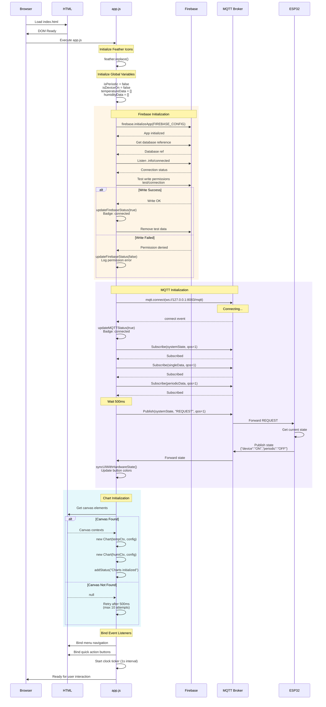
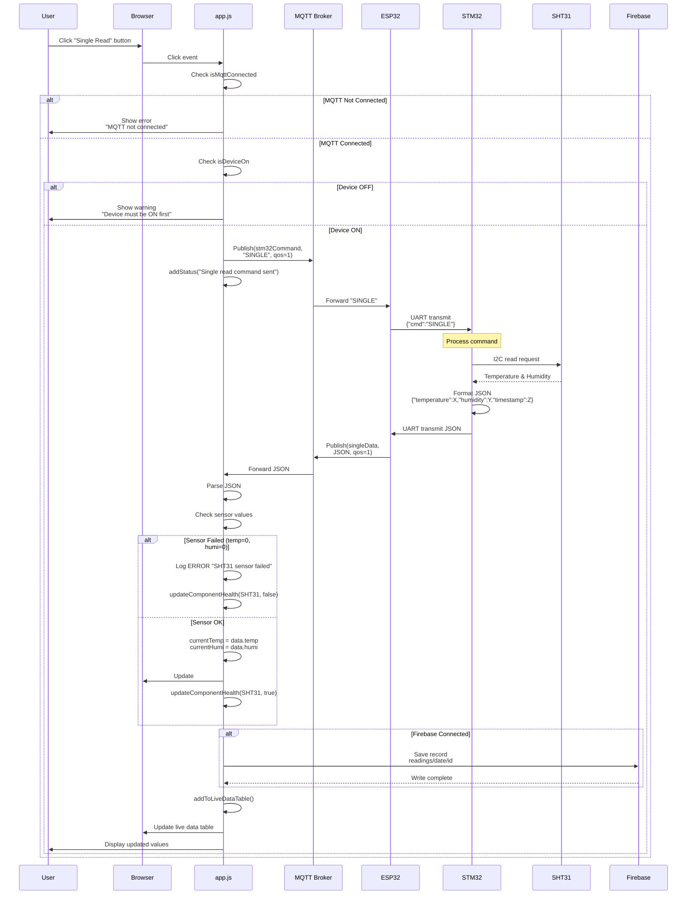
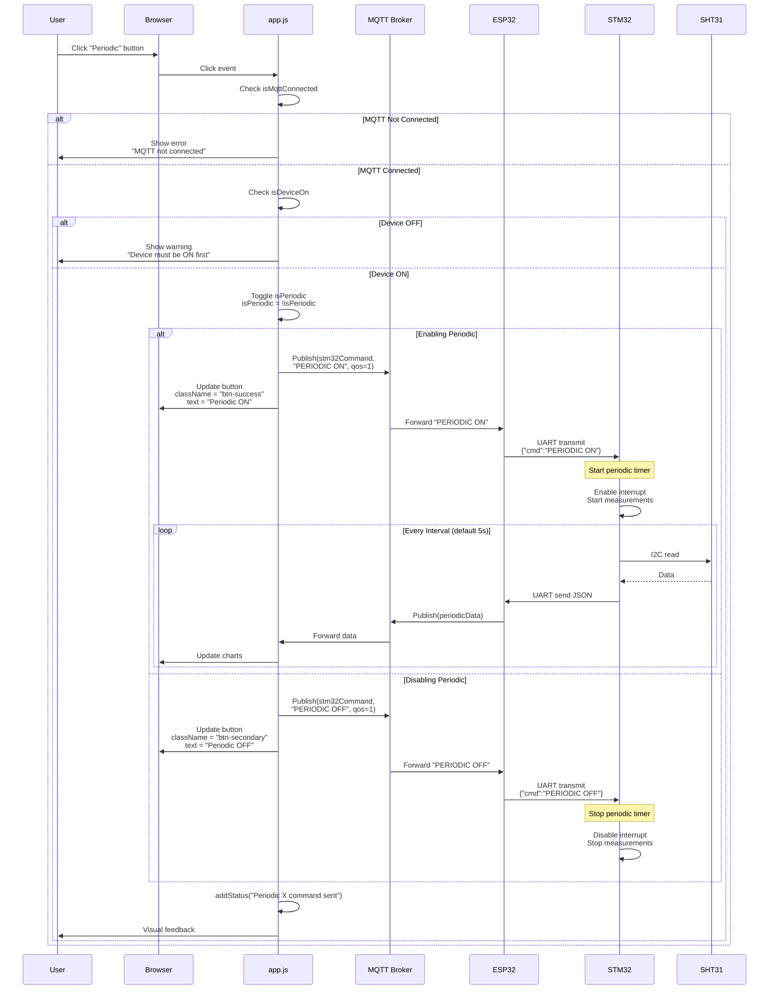
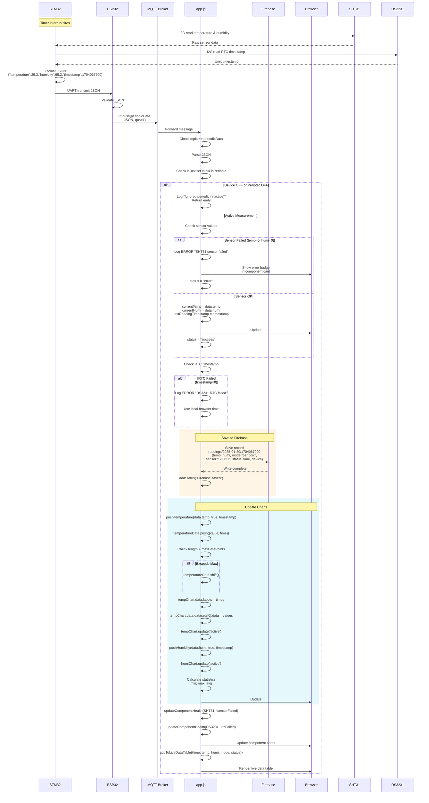
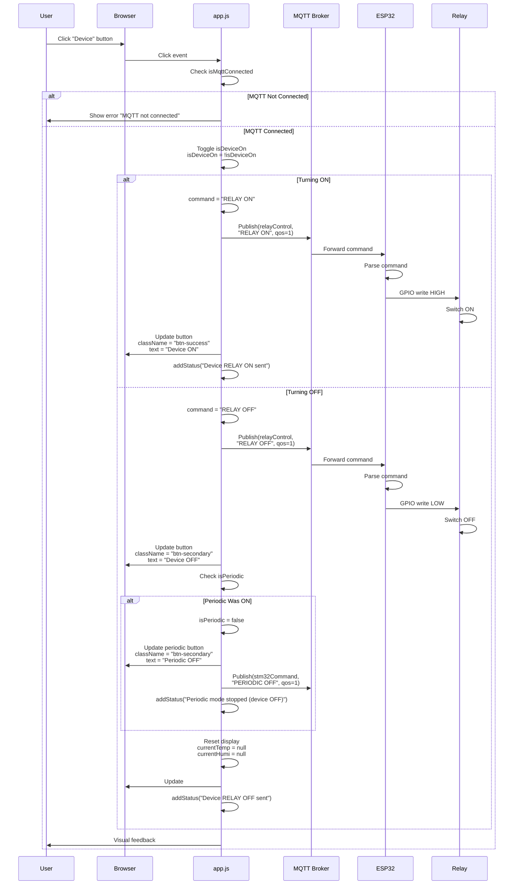
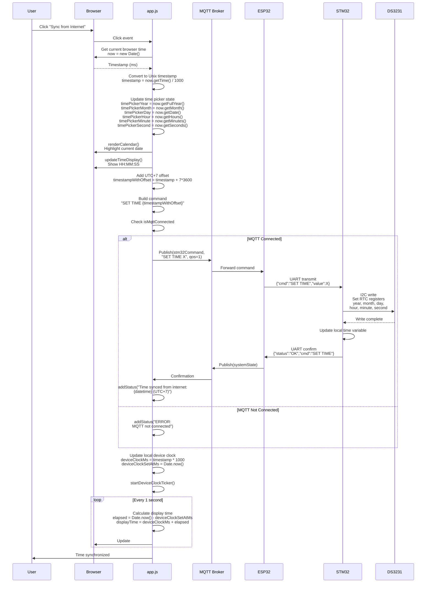
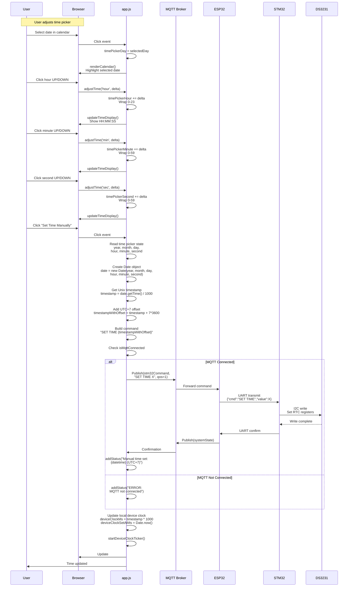
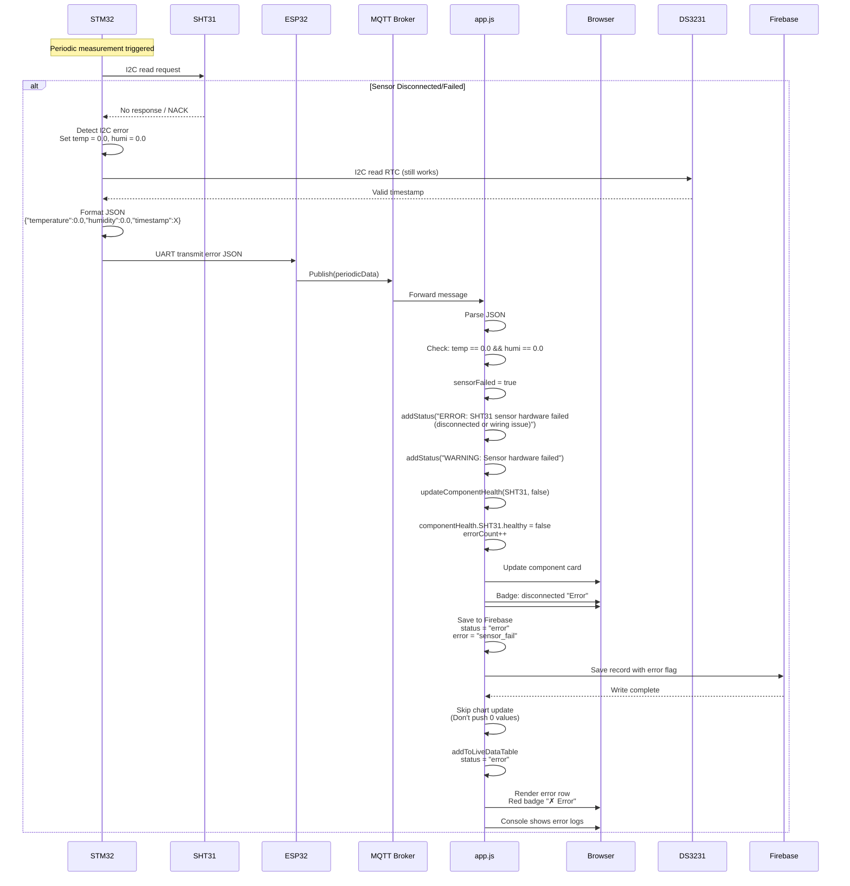

# Web Application - Sequence Diagrams

Comprehensive sequence diagrams documenting time-ordered interactions in the DataLogger web application.

---

## 1. Complete Application Initialization

---

## 2. User Sends Single Read Command

---

## 3. User Toggles Periodic Mode

---

## 4. Periodic Sensor Data Arrives

---

## 5. Relay Control (Device ON/OFF)

---

## 6. Time Sync from Internet

---

## 7. Manual Time Setting

---

## 8. Data Management Filtering & Export

```mermaid
sequenceDiagram
    participant User
    participant Browser
    participant AppJS as app.js
    participant Firebase
    
    User->>Browser: Navigate to "Data Management" page
    Browser->>AppJS: Page switch event
    AppJS->>AppJS: bindDataManagementButtons()
    
    Note over User,Browser: User sets filters
    User->>Browser: Select date range<br/>From: 2025-01-01<br/>To: 2025-01-20
    User->>Browser: Select mode filter<br/>"periodic"
    User->>Browser: Select status filter<br/>"success"
    User->>Browser: Set temp range<br/>Min: 20, Max: 30
    User->>Browser: Set humidity range<br/>Min: 50, Max: 80
    User->>Browser: Select sort<br/>"time-desc"
    
    User->>Browser: Click "Apply Filters"
    Browser->>AppJS: Click event
    
    AppJS->>AppJS: Check isFirebaseConnected
    
    alt Firebase Not Connected
        AppJS->>User: Show error<br/>"Firebase not connected"
    else Firebase Connected
        AppJS->>AppJS: Read all filter inputs<br/>dateFrom, dateTo, mode, status,<br/>tempMin, tempMax, humiMin, humiMax, sortBy
        
        AppJS->>AppJS: Generate date range<br/>dates = []<br/>for d = dateFrom to dateTo<br/>dates.push(YYYY-MM-DD)
        
        AppJS->>AppJS: addStatus("Loading filtered data...")
        
        loop For each date in range
            AppJS->>Firebase: firebase.ref('readings/{date}')<br/>.once('value')
            Firebase-->>AppJS: Snapshot for date
            AppJS->>AppJS: Parse snapshot<br/>Extract records
        end
        
        AppJS->>AppJS: Merge all results<br/>allData = results.flat()
        
        AppJS->>AppJS: Apply mode filter<br/>if (mode && record.mode != mode) remove
        
        AppJS->>AppJS: Apply status filter<br/>if (status && record.status != status) remove
        
        AppJS->>AppJS: Apply temp range filter<br/>if (temp < min || temp > max) remove
        
        AppJS->>AppJS: Apply humidity range filter<br/>if (humi < min || humi > max) remove
        
        AppJS->>AppJS: Apply sorting<br/>Sort by time/temp/humi<br/>asc or desc
        
        AppJS->>AppJS: Cache filtered data<br/>filteredDataCache = filtered
        
        AppJS->>AppJS: renderDataManagementTable(filtered)
        
        AppJS->>Browser: Build HTML table<br/>For each record:<br/>#, Date/Time, Temp, Humi, Mode, Status
        
        AppJS->>AppJS: updateDataStatistics(filtered)
        AppJS->>AppJS: Calculate:<br/>- Total records<br/>- Success rate<br/>- Avg temperature<br/>- Avg humidity
        
        AppJS->>Browser: Update #statsTotal<br/>#statsSuccess<br/>#statsAvgTemp<br/>#statsAvgHumi
        
        AppJS->>AppJS: addStatus("Loaded X records from Y total")
        
        AppJS->>User: Display filtered data
    end
    
    Note over User,Browser: User exports data
    User->>Browser: Click "Export Filtered Data"
    Browser->>AppJS: Click event
    
    AppJS->>AppJS: Check filteredDataCache length
    
    alt No Data
        AppJS->>User: Show warning<br/>"No data to export"
    else Has Data
        AppJS->>AppJS: Build CSV<br/>Headers: #, Date, Time, Temp, Humi, Mode, Status, Sensor, Device
        
        loop For each record in filteredDataCache
            AppJS->>AppJS: Format row<br/>idx, date, time, temp, humi, mode, status, sensor, device
        end
        
        AppJS->>AppJS: Combine to CSV string<br/>csv = headers + rows
        
        AppJS->>Browser: Create Blob(csv, "text/csv")
        AppJS->>Browser: Create download link
        AppJS->>Browser: Trigger download<br/>datalogger_export_{timestamp}.csv
        
        AppJS->>AppJS: addStatus("Exported X records to CSV")
        AppJS->>User: File downloaded
    end
```

---

## 9. Live Data Table Real-time Update

```mermaid
sequenceDiagram
    participant STM32
    participant ESP32
    participant MQTT as MQTT Broker
    participant AppJS as app.js
    participant Browser
    
    Note over STM32,ESP32: Periodic measurement
    STM32->>ESP32: Send sensor data (JSON)
    ESP32->>MQTT: Publish(periodicData)
    MQTT->>AppJS: Forward message
    
    AppJS->>AppJS: handleMQTTMessage(topic, payload)
    AppJS->>AppJS: Parse JSON
    AppJS->>AppJS: Extract {time, temp, humi, mode, status}
    
    AppJS->>AppJS: addToLiveDataTable(data)
    AppJS->>AppJS: liveDataBuffer.unshift(entry)
    
    AppJS->>AppJS: Check buffer length
    
    alt Length > 100
        AppJS->>AppJS: liveDataBuffer.pop()<br/>Remove oldest entry
    end
    
    AppJS->>AppJS: Get filter selection<br/>filter = #liveDataFilter.value
    
    AppJS->>AppJS: Apply filter
    
    alt Filter = "all"
        AppJS->>AppJS: filtered = liveDataBuffer
    else Filter = "success"
        AppJS->>AppJS: filtered = buffer.filter<br/>(d => d.status == 'success')
    else Filter = "error"
        AppJS->>AppJS: filtered = buffer.filter<br/>(d => d.status == 'error')
    end
    
    AppJS->>AppJS: Check filtered length
    
    alt Empty
        AppJS->>Browser: innerHTML = "No data available"
    else Has Data
        loop For each entry in filtered
            AppJS->>AppJS: Format time<br/>HH:MM:SS
            AppJS->>AppJS: Format status badge
            
            alt Status = "success"
                AppJS->>AppJS: Badge: connected "✓ Success"
            else Status = "error"
                AppJS->>AppJS: Badge: disconnected "✗ Error"
            end
            
            AppJS->>AppJS: Build table row<br/><tr>#, time, temp, humi, mode, badge</tr>
        end
        
        AppJS->>Browser: Render to #liveDataTable<br/>tbody.innerHTML = rows
    end
    
    AppJS->>Browser: Update #liveDataCount<br/>textContent = filtered.length
    
    AppJS->>AppJS: Refresh Feather icons<br/>feather.replace()
    
    AppJS->>Browser: Table updated (real-time)
    
    Note over AppJS,Browser: User interacts with table
    
    alt User changes filter
        Browser->>AppJS: Change event
        AppJS->>AppJS: renderLiveDataTable()<br/>Re-filter and re-render
        AppJS->>Browser: Updated table
    end
    
    alt User clicks "Clear Table"
        Browser->>AppJS: Click event
        AppJS->>AppJS: Confirm dialog
        
        alt User confirms
            AppJS->>AppJS: liveDataBuffer = []
            AppJS->>AppJS: renderLiveDataTable()
            AppJS->>Browser: Empty table<br/>addStatus("Live data cleared")
        end
    end
    
    alt User clicks "Export CSV"
        Browser->>AppJS: Click event
        
        alt Buffer empty
            AppJS->>Browser: Show warning<br/>"No data to export"
        else Buffer has data
            AppJS->>AppJS: Build CSV<br/>Headers + rows
            AppJS->>Browser: Create Blob
            AppJS->>Browser: Trigger download<br/>livedata_{timestamp}.csv
            AppJS->>AppJS: addStatus("Live data exported")
        end
    end
```

---

## 10. Error Handling - Sensor Failure

---

## System Characteristics

### Timing Analysis
- **MQTT Message Latency**: 50-100ms (local network)
- **Firebase Write Latency**: 200-500ms (network dependent)
- **Chart Update Animation**: 750ms (easeInOutQuart)
- **State Sync Delay**: 500ms after MQTT connect
- **Clock Ticker Interval**: 1000ms (1 second)

### Message Flow Patterns
- **Command Flow**: User → App → MQTT → ESP32 → STM32 → Hardware
- **Data Flow**: Hardware → STM32 → ESP32 → MQTT → App → UI
- **Sync Flow**: App → MQTT → ESP32 (state query) → MQTT → App (state response)

### Error Recovery
- **MQTT Disconnect**: Auto-reconnect every 2 seconds
- **Firebase Disconnect**: Auto-reconnect via .info/connected listener
- **Sensor Failure**: Log error, skip chart update, save with error flag
- **RTC Failure**: Use local browser time as fallback
- **Chart Init Failure**: Retry 10 times with 500ms delay

### Data Integrity
- **MQTT QoS**: Level 1 (at least once delivery)
- **Firebase Write**: Automatic retry on network failure
- **Buffer Management**: FIFO with configurable max size
- **Timestamp Source**: Prefer device RTC, fallback to browser time

---

**Document Version**: 1.0  
**Last Updated**: 2025-01-XX  
**Total Sequence Diagrams**: 10  
**Coverage**: Complete interaction flows
