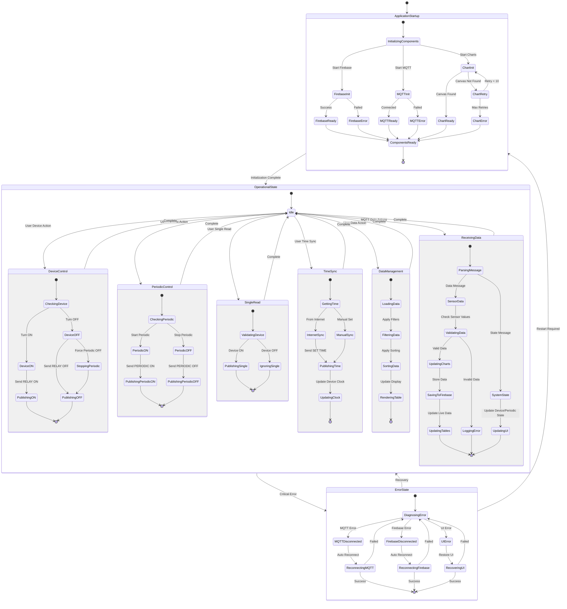

# Web Application - UML Diagrams

This document contains all UML diagrams for the DataLogger web application architecture, including class diagrams, component diagrams, and structural relationships.

## Web Application Class Diagram

```mermaid
classDiagram
    class WebApplication {
        -isPeriodic: boolean
        -isDeviceOn: boolean
        -isMqttConnected: boolean
        -isFirebaseConnected: boolean
        -currentTemp: float
        -currentHumi: float
        -lastReadingTimestamp: number
        -temperatureData: number[]
        -humidityData: number[]
        -liveDataBuffer: object[]
        -logBuffer: object[]
        +initialize() void
        +initializeFirebase() boolean
        +initializeMQTT() boolean
        +initializeCharts() boolean
        +shutdown() void
    }
    
    class MQTTManager {
        -mqttClient: MQTTClient
        -MQTT_CONFIG: object
        -connectionState: ConnectionState
        -subscriptions: string[]
        -messageHandlers: Map<string, Function>
        +connect() boolean
        +disconnect() void
        +subscribe(topic, qos) boolean
        +publish(topic, message, qos) boolean
        +handleMessage(topic, payload) void
        +updateStatus(connected) void
        +requestStateSync() void
        +isConnected() boolean
    }
    
    class FirebaseManager {
        -firebaseDb: Database
        -FIREBASE_CONFIG: object
        -connectionState: ConnectionState
        -realtimeRef: Reference
        +initialize() boolean
        +saveRecord(data) Promise<boolean>
        +loadHistory(dateRange) Promise<object[]>
        +testPermissions() Promise<boolean>
        +updateStatus(connected) void
        +getConnectionState() ConnectionState
        +cleanup() void
    }
    
    class ChartManager {
        -tempChart: Chart
        -humiChart: Chart
        -temperatureData: number[]
        -humidityData: number[]
        -maxDataPoints: number
        -updateInterval: number
        -chartConfig: ChartConfiguration
        +initializeCharts() boolean
        +pushTemperature(value, update, timestamp) void
        +pushHumidity(value, update, timestamp) void
        +updateChartStats(type) void
        +clearChartData() void
        +ensureChartsInitialized() boolean
        +exportChartImage() Blob
    }
    
    class UIController {
        -currentPage: string
        -componentStates: Map<string, object>
        -eventHandlers: Map<string, Function>
        +switchPage(pageId) void
        +updateCurrentDisplay() void
        +updateMQTTStatus(connected) void
        +updateFirebaseStatus(connected) void
        +updateDeviceButton(isOn) void
        +updatePeriodicButton(isOn) void
        +renderLiveDataTable() void
        +renderDataManagementTable(data) void
        +renderFullConsole() void
        +showToast(message, type) void
        +bindEventHandlers() void
    }
    
    class CommandHandler {
        -deviceState: DeviceState
        -commandQueue: Command[]
        -retryCount: number
        +handleDeviceToggle() void
        +handlePeriodicToggle() void
        +handleSingleRead() void
        +handleIntervalConfig(interval) void
        +handleTimeSync() void
        +handleManualTimeSet(dateTime) void
        +handleRelayControl(state) void
        +validateCommand(command) boolean
        +queueCommand(command) void
        +processCommandQueue() void
    }
    
    class StateManager {
        -stateSync: object
        -deviceClockMs: number
        -deviceClockSetAtMs: number
        -lastSyncTimestamp: number
        -stateCacheTimeout: number
        +syncUIWithHardwareState(state) void
        +parseStateMessage(message) object
        +startDeviceClockTicker() void
        +updateDeviceState(key, value) void
        +getDeviceState() object
        +clearStateCache() void
        +validateState(state) boolean
    }
    
    class DataManager {
        -liveDataBuffer: DataRecord[]
        -filteredDataCache: DataRecord[]
        -maxBufferSize: number
        -dataFilters: FilterSettings
        -sortSettings: SortSettings
        +addToLiveDataTable(data) void
        +applyDataFilters() DataRecord[]
        +applySorting(data, sortBy) DataRecord[]
        +updateDataStatistics(data) Statistics
        +exportFilteredData() Blob
        +resetDataFilters() void
        +clearDataBuffer() void
        +getBufferSize() number
        +validateDataRecord(record) boolean
    }
    
    class ComponentHealthMonitor {
        -componentHealth: Map<string, HealthStatus>
        -healthCheckInterval: number
        -alertThresholds: Map<string, number>
        -lastHealthUpdate: number
        +updateComponentHealth(component, isHealthy) void
        +updateComponentCard(component) void
        +getTimeAgo(timestamp) string
        +getOverallHealth() HealthLevel
        +startHealthMonitoring() void
        +stopHealthMonitoring() void
        +isComponentHealthy(component) boolean
        +triggerHealthAlert(component, issue) void
    }
    
    class LoggingSystem {
        -logBuffer: LogEntry[]
        -maxLogsInMemory: number
        -logFilterType: string
        -logLevels: string[]
        -enabledLogTypes: Set<string>
        +addStatus(message, type) void
        +updateConsoleDisplay(logEntry) void
        +renderFullConsole() void
        +filterLogs(type) LogEntry[]
        +clearLogs() void
        +exportLogs() Blob
        +setLogLevel(level) void
        +enableLogType(type) void
        +disableLogType(type) void
    }
    
    class TimeManager {
        -timePickerYear: number
        -timePickerMonth: number
        -timePickerDay: number
        -timePickerHour: number
        -timePickerMinute: number
        -timePickerSecond: number
        -clockTickerInterval: number
        -timeZoneOffset: number
        +renderCalendar() void
        +updateTimeDisplay() void
        +adjustTime(unit, delta) void
        +syncFromInternet() void
        +setManualTime() void
        +getCurrentTime() Date
        +formatDateTime(timestamp) string
        +validateTimeInput(dateTime) boolean
    }
    
    class NavigationManager {
        -currentPage: string
        -pageHistory: string[]
        -navigationHandlers: Map<string, Function>
        +bindMenuNavigation() void
        +switchPage(page) void
        +initializePage(page) void
        +bindCalendarButtons() void
        +bindDataManagementButtons() void
        +bindLogsButtons() void
        +goBack() void
        +goForward() void
        +addToHistory(page) void
    }
    
    class SettingsManager {
        -settings: Settings
        -defaultSettings: Settings
        -settingsKey: string
        +loadSettings() Settings
        +saveSettings(settings) boolean
        +resetToDefaults() void
        +exportSettings() Blob
        +importSettings(file) boolean
        +validateSettings(settings) boolean
        +getSettingValue(key) any
        +setSettingValue(key, value) void
        +applySettings() void
    }
    
    %% Data Transfer Objects
    class DataRecord {
        +timestamp: number
        +temperature: number
        +humidity: number
        +mode: string
        +status: string
        +device: string
        +sensor: string
        +error: string
        +created: number
        +toJSON() string
        +fromJSON(json) DataRecord
        +validate() boolean
    }
    
    class LogEntry {
        +timestamp: number
        +message: string
        +type: string
        +level: string
        +source: string
        +details: object
        +format() string
        +toCSV() string
    }
    
    class Command {
        +type: CommandType
        +parameters: Map<string, any>
        +timestamp: number
        +source: string
        +target: string
        +retryCount: number
        +isValid() boolean
        +execute() boolean
        +retry() boolean
    }
    
    class DeviceState {
        +isDeviceOn: boolean
        +isPeriodic: boolean
        +currentInterval: number
        +lastUpdate: number
        +connectionStatus: ConnectionStatus
        +sensorStatus: Map<string, SensorStatus>
        +update(newState) void
        +serialize() string
        +deserialize(data) void
    }
    
    class ChartConfiguration {
        +type: string
        +data: ChartData
        +options: ChartOptions
        +plugins: Plugin[]
        +responsive: boolean
        +maintainAspectRatio: boolean
        +animations: AnimationOptions
        +scales: ScaleOptions
    }
    
    class FilterSettings {
        +dateFrom: Date
        +dateTo: Date
        +mode: string
        +status: string
        +temperatureMin: number
        +temperatureMax: number
        +humidityMin: number
        +humidityMax: number
        +apply(data) DataRecord[]
        +reset() void
        +validate() boolean
    }
    
    class Statistics {
        +totalRecords: number
        +successRate: number
        +avgTemperature: number
        +minTemperature: number
        +maxTemperature: number
        +avgHumidity: number
        +minHumidity: number
        +maxHumidity: number
        +calculate(data) Statistics
        +format() string
    }
    
    %% Enumerations
    class ConnectionState {
        <<enumeration>>
        DISCONNECTED
        CONNECTING
        CONNECTED
        ERROR
        RECONNECTING
    }
    
    class CommandType {
        <<enumeration>>
        DEVICE_TOGGLE
        PERIODIC_TOGGLE
        SINGLE_READ
        TIME_SYNC
        INTERVAL_CONFIG
        RELAY_CONTROL
        STATE_REQUEST
    }
    
    class HealthLevel {
        <<enumeration>>
        HEALTHY
        WARNING
        ERROR
        CRITICAL
        UNKNOWN
    }
    
    class LogLevel {
        <<enumeration>>
        DEBUG
        INFO
        WARNING
        ERROR
        CRITICAL
    }
    
    class SensorStatus {
        <<enumeration>>
        ACTIVE
        INACTIVE
        ERROR
        UNKNOWN
    }
    
    %% Main Composition Relationships
    WebApplication *-- MQTTManager : contains
    WebApplication *-- FirebaseManager : contains
    WebApplication *-- ChartManager : contains
    WebApplication *-- UIController : contains
    WebApplication *-- CommandHandler : contains
    WebApplication *-- StateManager : contains
    WebApplication *-- DataManager : contains
    WebApplication *-- ComponentHealthMonitor : contains
    WebApplication *-- LoggingSystem : contains
    WebApplication *-- TimeManager : contains
    WebApplication *-- NavigationManager : contains
    WebApplication *-- SettingsManager : contains
    
    %% Manager Interactions
    MQTTManager --> CommandHandler : sends commands
    MQTTManager --> StateManager : updates state
    MQTTManager --> DataManager : receives data
    MQTTManager --> LoggingSystem : logs events
    MQTTManager ..> ConnectionState : uses
    
    FirebaseManager --> DataManager : stores data
    FirebaseManager --> LoggingSystem : logs operations
    FirebaseManager ..> ConnectionState : uses
    
    ChartManager --> DataManager : consumes data
    ChartManager --> UIController : updates display
    ChartManager *-- ChartConfiguration : uses
    
    CommandHandler --> MQTTManager : publishes commands
    CommandHandler --> StateManager : updates device state
    CommandHandler --> TimeManager : handles time commands
    CommandHandler *-- Command : creates
    CommandHandler ..> CommandType : uses
    
    StateManager *-- DeviceState : manages
    StateManager --> UIController : updates UI
    StateManager --> LoggingSystem : logs state changes
    
    DataManager *-- DataRecord : manages
    DataManager *-- FilterSettings : applies
    DataManager *-- Statistics : calculates
    DataManager --> LoggingSystem : logs operations
    
    ComponentHealthMonitor --> UIController : updates health display
    ComponentHealthMonitor --> LoggingSystem : logs health events
    ComponentHealthMonitor ..> HealthLevel : uses
    ComponentHealthMonitor ..> SensorStatus : monitors
    
    LoggingSystem *-- LogEntry : creates
    LoggingSystem --> UIController : displays logs
    LoggingSystem ..> LogLevel : uses
    
    TimeManager --> CommandHandler : triggers time commands
    TimeManager --> StateManager : updates time state
    TimeManager --> UIController : updates time display
    
    NavigationManager --> UIController : controls page display
    NavigationManager --> SettingsManager : loads page settings
    
    SettingsManager --> UIController : applies UI settings
    SettingsManager --> ChartManager : applies chart settings
    SettingsManager --> LoggingSystem : applies log settings
    
    %% Data Flow Dependencies
    DataRecord --> Statistics : used for calculation
    Command --> LogEntry : logged as entry
    DeviceState --> DataRecord : provides context
```



## Component Interface UML Diagram

```mermaid
classDiagram
    %% Core Interfaces
    class IDataProvider {
        <<interface>>
        +getData(criteria) Promise<DataRecord[]>
        +saveData(record) Promise<boolean>
        +deleteData(criteria) Promise<boolean>
        +validateData(record) boolean
    }
    
    class ICommunicationBridge {
        <<interface>>
        +connect() Promise<boolean>
        +disconnect() void
        +send(message) Promise<boolean>
        +receive() Observable<Message>
        +isConnected() boolean
        +getStatus() ConnectionState
    }
    
    class IDisplayController {
        <<interface>>
        +updateDisplay(data) void
        +showMessage(message, type) void
        +clearDisplay() void
        +setTheme(theme) void
        +render() void
    }
    
    class IEventHandler {
        <<interface>>
        +handleEvent(event) void
        +registerCallback(event, callback) void
        +unregisterCallback(event) void
        +triggerEvent(event, data) void
    }
    
    class IStateManager {
        <<interface>>
        +getState(key) any
        +setState(key, value) void
        +subscribe(key, callback) void
        +unsubscribe(key, callback) void
        +clearState() void
    }
    
    class IHealthMonitor {
        <<interface>>
        +checkHealth() HealthStatus
        +getComponentStatus(component) ComponentHealth
        +startMonitoring() void
        +stopMonitoring() void
        +setThreshold(component, threshold) void
    }
    
    %% Implementation Classes
    class MQTTCommunication {
        -client: MQTTClient
        -config: MQTTConfig
        -messageQueue: Message[]
        +connect() Promise<boolean>
        +disconnect() void
        +send(message) Promise<boolean>
        +receive() Observable<Message>
        +isConnected() boolean
        +getStatus() ConnectionState
    }
    
    class FirebaseDataProvider {
        -database: Database
        -config: FirebaseConfig
        -cache: Map<string, any>
        +getData(criteria) Promise<DataRecord[]>
        +saveData(record) Promise<boolean>
        +deleteData(criteria) Promise<boolean>
        +validateData(record) boolean
    }
    
    class ChartDisplayController {
        -charts: Map<string, Chart>
        -canvasElements: Map<string, HTMLCanvasElement>
        -theme: Theme
        +updateDisplay(data) void
        +showMessage(message, type) void
        +clearDisplay() void
        +setTheme(theme) void
        +render() void
    }
    
    class TableDisplayController {
        -tables: Map<string, HTMLTableElement>
        -formatter: DataFormatter
        -sorter: DataSorter
        +updateDisplay(data) void
        +showMessage(message, type) void
        +clearDisplay() void
        +setTheme(theme) void
        +render() void
    }
    
    class DOMEventHandler {
        -listeners: Map<string, EventListener[]>
        -eventQueue: Event[]
        +handleEvent(event) void
        +registerCallback(event, callback) void
        +unregisterCallback(event) void
        +triggerEvent(event, data) void
    }
    
    class GlobalStateManager {
        -state: Map<string, any>
        -subscribers: Map<string, Function[]>
        -persistence: Storage
        +getState(key) any
        +setState(key, value) void
        +subscribe(key, callback) void
        +unsubscribe(key, callback) void
        +clearState() void
    }
    
    class WebHealthMonitor {
        -components: Map<string, ComponentMonitor>
        -thresholds: Map<string, Threshold>
        -alerts: Alert[]
        +checkHealth() HealthStatus
        +getComponentStatus(component) ComponentHealth
        +startMonitoring() void
        +stopMonitoring() void
        +setThreshold(component, threshold) void
    }
    
    %% Interface Implementations
    MQTTCommunication --|> ICommunicationBridge : implements
    FirebaseDataProvider --|> IDataProvider : implements
    ChartDisplayController --|> IDisplayController : implements
    TableDisplayController --|> IDisplayController : implements
    DOMEventHandler --|> IEventHandler : implements
    GlobalStateManager --|> IStateManager : implements
    WebHealthMonitor --|> IHealthMonitor : implements
    
    %% Dependencies
    WebApplication --> ICommunicationBridge : uses
    WebApplication --> IDataProvider : uses
    WebApplication --> IDisplayController : uses
    WebApplication --> IEventHandler : uses
    WebApplication --> IStateManager : uses
    WebApplication --> IHealthMonitor : uses
    
    %% Composition within implementations
    ChartDisplayController *-- ChartManager : contains
    TableDisplayController *-- DataManager : contains
    DOMEventHandler *-- NavigationManager : contains
    GlobalStateManager *-- StateManager : contains
    WebHealthMonitor *-- ComponentHealthMonitor : contains
```



## State Machine UML Diagram



## Package Structure UML Diagram

```mermaid
classDiagram
    namespace Core {
        class WebApplication
        class ApplicationState
        class EventBus
    }
    
    namespace Communication {
        class MQTTManager
        class FirebaseManager
        class MessageRouter
        class ConnectionPool
    }
    
    namespace DataManagement {
        class DataManager
        class DataRecord
        class FilterSettings
        class Statistics
        class DataValidator
    }
    
    namespace UserInterface {
        class UIController
        class ChartManager
        class NavigationManager
        class ComponentRenderer
    }
    
    namespace CommandHandling {
        class CommandHandler
        class Command
        class CommandQueue
        class CommandValidator
    }
    
    namespace StateManagement {
        class StateManager
        class DeviceState
        class ApplicationSettings
        class StateValidator
    }
    
    namespace Monitoring {
        class ComponentHealthMonitor
        class LoggingSystem
        class PerformanceMonitor
        class AlertManager
    }
    
    namespace Utilities {
        class TimeManager
        class DataFormatter
        class ValidationUtils
        class StorageUtils
    }
    
    %% Package Dependencies
    Core --> Communication : uses
    Core --> DataManagement : uses
    Core --> UserInterface : uses
    Core --> CommandHandling : uses
    Core --> StateManagement : uses
    Core --> Monitoring : uses
    Core --> Utilities : uses
    
    Communication --> DataManagement : transfers data
    Communication --> StateManagement : updates state
    Communication --> Monitoring : logs events
    
    UserInterface --> DataManagement : displays data
    UserInterface --> StateManagement : reflects state
    UserInterface --> CommandHandling : triggers commands
    UserInterface --> Utilities : formats data
    
    CommandHandling --> Communication : sends commands
    CommandHandling --> StateManagement : updates state
    CommandHandling --> Monitoring : logs commands
    
    StateManagement --> Monitoring : logs state changes
    StateManagement --> Utilities : validates state
    
    Monitoring --> Utilities : formats logs
    
    %% Internal Package Relationships
    WebApplication --> ApplicationState : manages
    WebApplication --> EventBus : uses
    
    MQTTManager --> MessageRouter : uses
    FirebaseManager --> ConnectionPool : uses
    
    DataManager --> DataRecord : manages
    DataManager --> FilterSettings : applies
    DataManager --> Statistics : calculates
    DataManager --> DataValidator : validates
    
    UIController --> ChartManager : controls
    UIController --> NavigationManager : controls
    UIController --> ComponentRenderer : uses
    
    CommandHandler --> Command : creates
    CommandHandler --> CommandQueue : manages
    CommandHandler --> CommandValidator : validates
    
    StateManager --> DeviceState : manages
    StateManager --> ApplicationSettings : manages
    StateManager --> StateValidator : validates
    
    ComponentHealthMonitor --> LoggingSystem : logs to
    ComponentHealthMonitor --> PerformanceMonitor : uses
    ComponentHealthMonitor --> AlertManager : triggers
```

---

## UML Diagram Conventions

### Class Diagram Elements
- **Classes**: Represented with class name, attributes (-private, +public), and methods
- **Interfaces**: Marked with `<<interface>>` stereotype
- **Enumerations**: Marked with `<<enumeration>>` stereotype
- **Abstract Classes**: Italicized class names

### Relationship Types
- **Composition** (`*--`): Strong ownership relationship (lifetime dependency)
- **Aggregation** (`o--`): Weak ownership relationship (shared ownership)
- **Association** (`-->`): "uses" or "depends on" relationship
- **Inheritance** (`<|--`): "extends" or "inherits from" relationship
- **Realization** (`--|>`): "implements" relationship for interfaces
- **Dependency** (`..>`): Temporary usage relationship

### Visibility Modifiers
- **Public** (`+`): Accessible from outside the class
- **Private** (`-`): Accessible only within the class
- **Protected** (`#`): Accessible within class and subclasses
- **Package** (`~`): Accessible within the same package/namespace

### Stereotypes Used
- `<<interface>>`: Interface definition
- `<<enumeration>>`: Enumerated type
- `<<abstract>>`: Abstract class that cannot be instantiated

### Package Organization
- **Core**: Main application logic and coordination
- **Communication**: External service integration (MQTT, Firebase)
- **DataManagement**: Data processing, filtering, and validation
- **UserInterface**: UI components and display management
- **CommandHandling**: User action processing and command execution
- **StateManagement**: Application and device state coordination
- **Monitoring**: Health monitoring, logging, and alerting
- **Utilities**: Helper functions and common utilities

### Design Patterns Represented
- **Observer Pattern**: Event-driven updates throughout the system
- **Command Pattern**: User actions encapsulated as command objects
- **State Pattern**: Application state management with transitions
- **Bridge Pattern**: Communication abstraction for MQTT/Firebase
- **Facade Pattern**: Simplified interfaces for complex subsystems
- **Strategy Pattern**: Different data filtering and sorting strategies