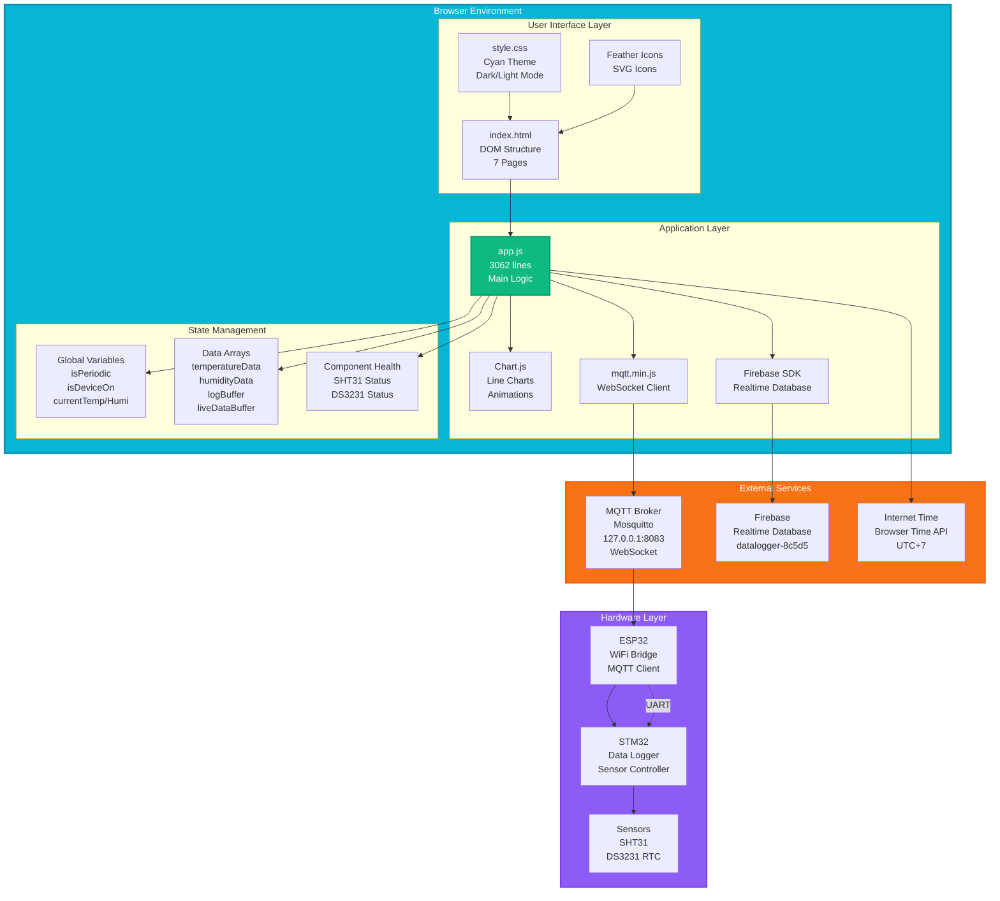
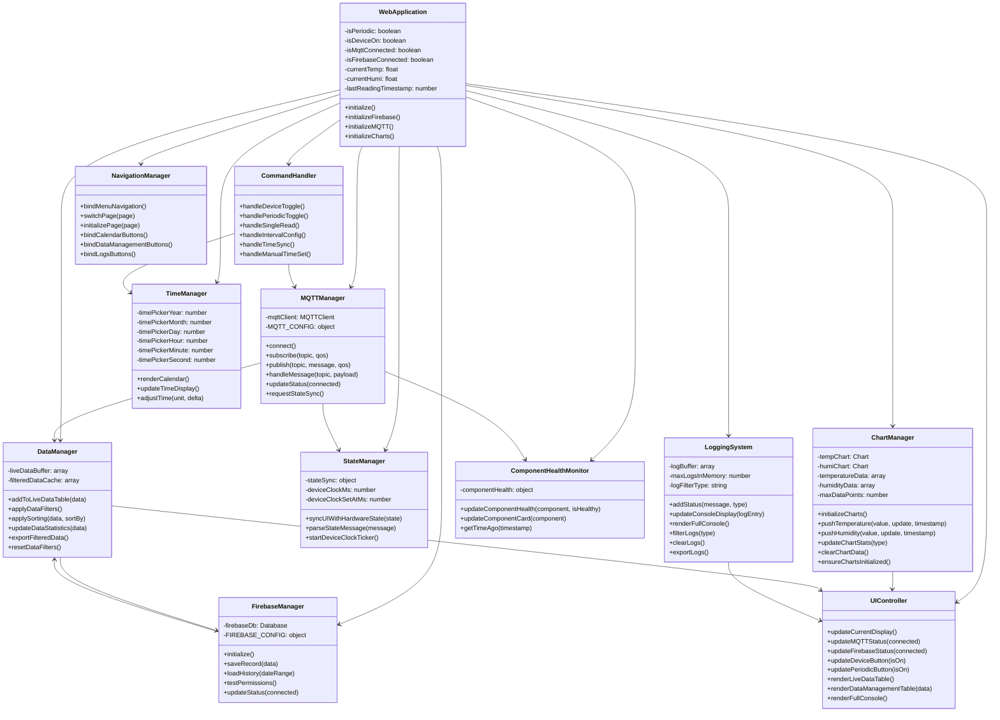
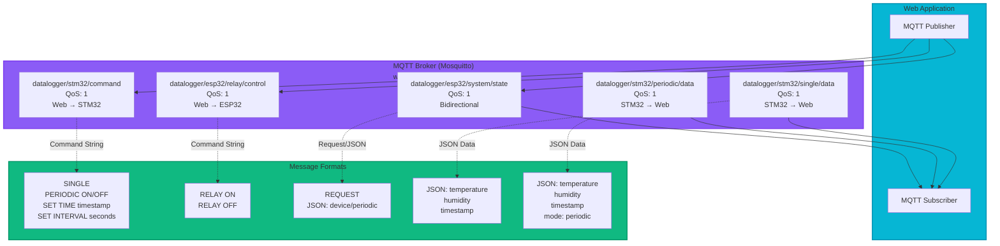
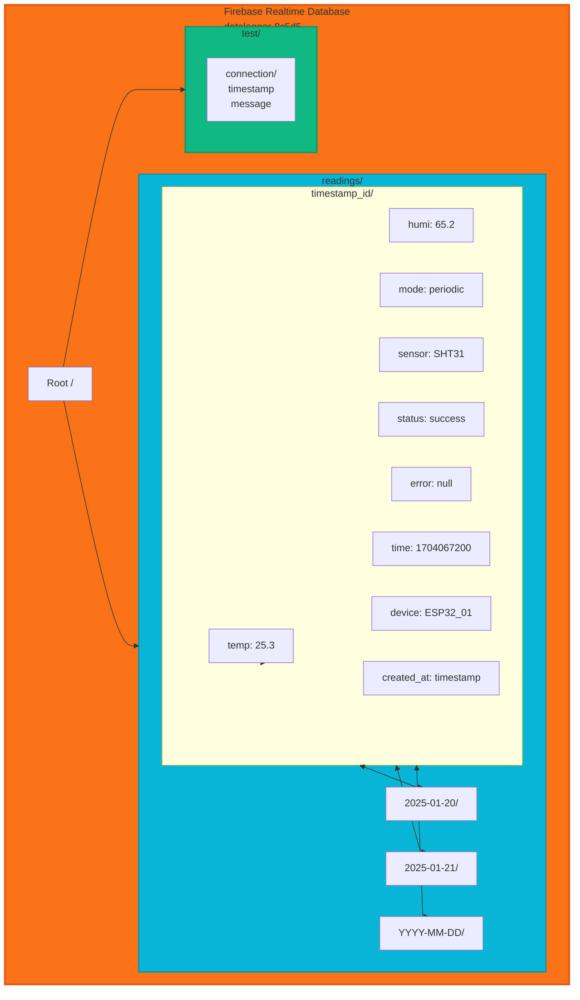
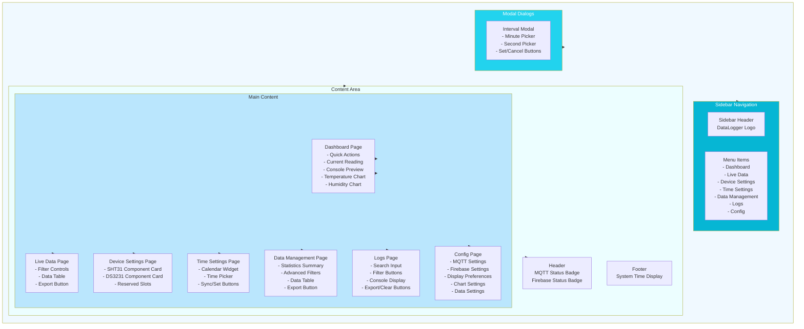
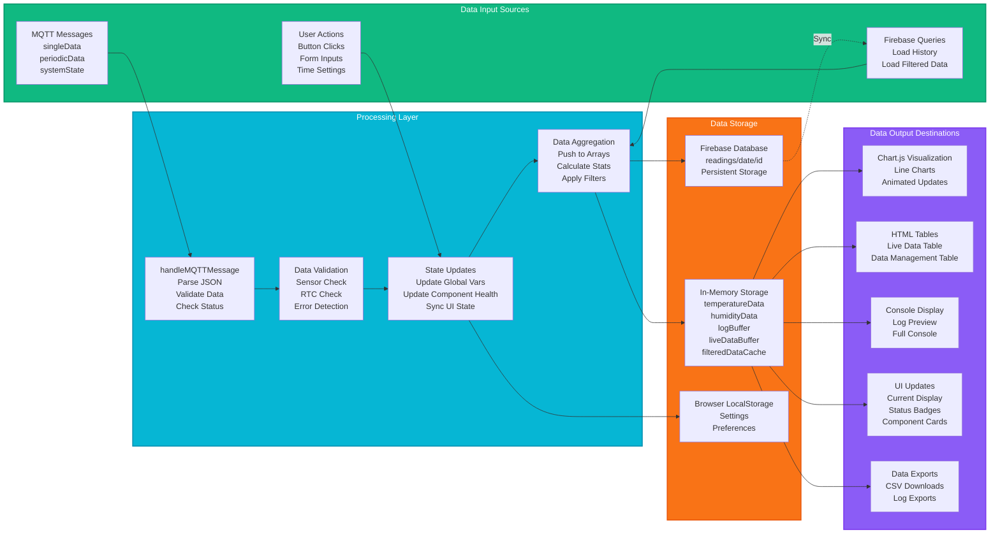
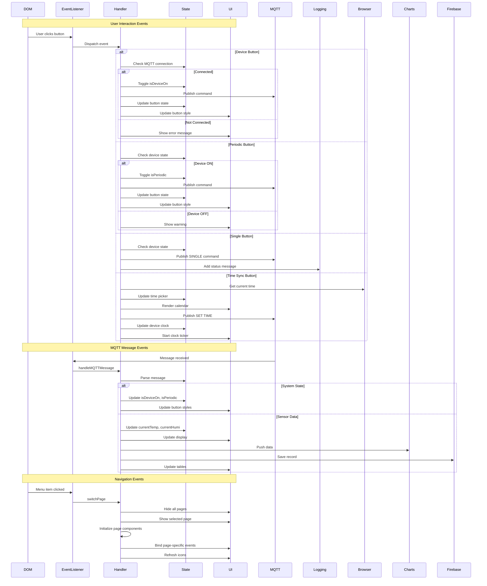
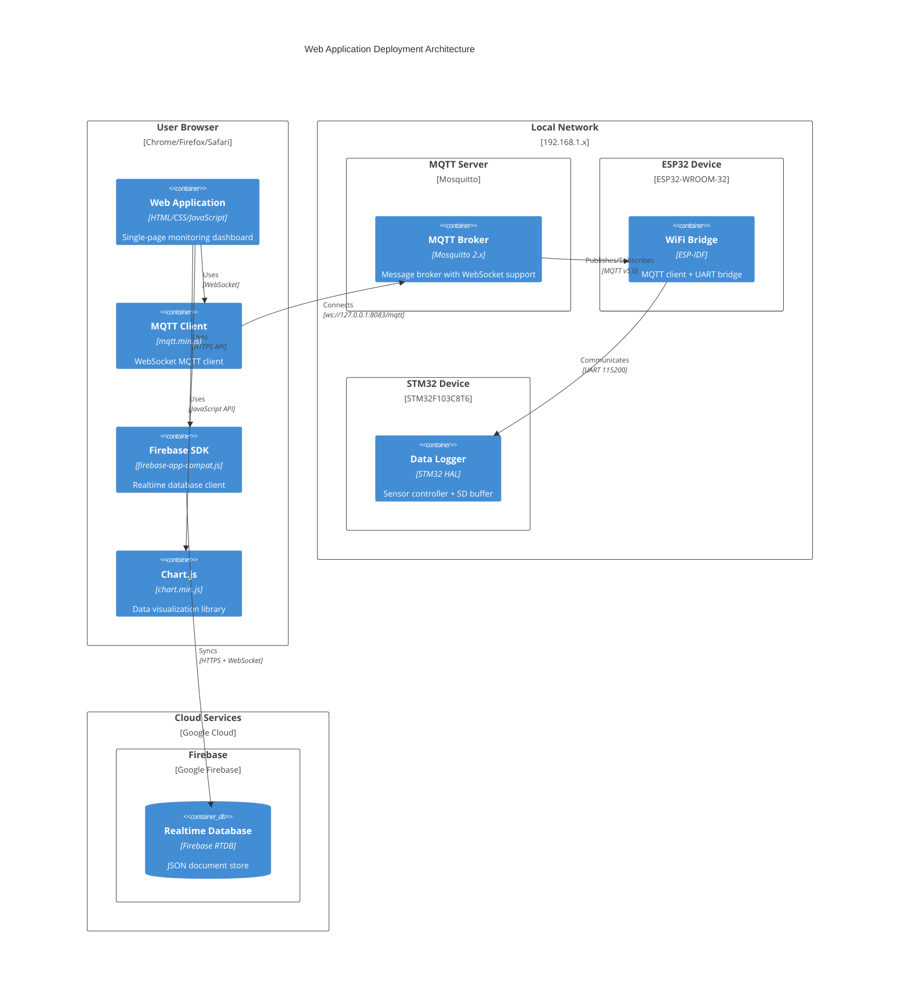

# Web Application - Architecture & UML Diagrams

Comprehensive architecture documentation for the DataLogger web monitoring application.

---

## 1. Complete System Architecture



---

## 2. Application Class Diagram



---

## 3. MQTT Topics & Message Architecture



---

## 4. Firebase Database Structure



---

## 5. State Management Architecture

```mermaid
stateDiagram-v2
    [*] --> Initializing
    
    state Initializing {
        [*] --> LoadingFirebase
        LoadingFirebase --> FirebaseReady: Init Success
        LoadingFirebase --> FirebaseError: Init Failed
        
        FirebaseReady --> ConnectingMQTT
        FirebaseError --> ConnectingMQTT
        
        ConnectingMQTT --> MQTTReady: Connected
        ConnectingMQTT --> MQTTError: Connection Failed
        
        MQTTReady --> InitializingCharts
        MQTTError --> InitializingCharts
        
        InitializingCharts --> ChartsReady: Canvas Found
        InitializingCharts --> ChartsRetry: Canvas Not Found
        
        ChartsRetry --> InitializingCharts: Retry < 10
        ChartsRetry --> ChartsFailed: Retry >= 10
        
        ChartsReady --> [*]
        ChartsFailed --> [*]
    end
    
    Initializing --> Ready: All Components Loaded
    
    state Ready {
        [*] --> Idle
        
        Idle --> DeviceControl: User Clicks Device Button
        DeviceControl --> DeviceON: Toggle ON
        DeviceControl --> DeviceOFF: Toggle OFF
        
        state DeviceON {
            [*] --> Running
            Running --> PeriodicControl: User Clicks Periodic
            PeriodicControl --> PeriodicON: Enable
            PeriodicControl --> Running: Disable
            
            state PeriodicON {
                [*] --> Measuring
                Measuring --> DataReceived: MQTT Message
                DataReceived --> ProcessingData
                ProcessingData --> SavingFirebase
                SavingFirebase --> UpdatingCharts
                UpdatingCharts --> Measuring
            }
        }
        
        state DeviceOFF {
            [*] --> Stopped
            Stopped --> Idle: No Activity
        }
        
        DeviceON --> DeviceOFF: Toggle OFF
        DeviceOFF --> DeviceON: Toggle ON
        
        Idle --> SingleRead: User Clicks Single
        SingleRead --> WaitingData: Command Sent
        WaitingData --> ProcessingData: Data Received
        ProcessingData --> Idle: Complete
        
        Idle --> TimeSettings: User Opens Time Page
        TimeSettings --> SyncingTime: Internet Sync / Manual Set
        SyncingTime --> Idle: Time Synced
        
        Idle --> DataManagement: User Opens Data Page
        DataManagement --> FilteringData: Apply Filters
        FilteringData --> LoadingFirebase: Query Database
        LoadingFirebase --> RenderingTable: Data Loaded
        RenderingTable --> Idle: Complete
    }
    
    Ready --> Error: Critical Failure
    Error --> Ready: Reconnect / Retry
    
    state Error {
        [*] --> MQTTDisconnected
        [*] --> FirebaseDisconnected
        [*] --> SensorFailed
        [*] --> RTCFailed
        
        MQTTDisconnected --> Reconnecting: Auto-retry 2s
        FirebaseDisconnected --> Reconnecting: Auto-retry
        SensorFailed --> [*]: Continue with Errors
        RTCFailed --> [*]: Use Local Time
        
        Reconnecting --> [*]: Success
    }
```

---

## 6. UI Component Hierarchy



---

## 7. Data Flow Architecture



---

## 8. Event Handling System



---

## 9. Chart Integration Architecture

```mermaid
graph TB
    subgraph ChartSystem["Chart.js Integration"]
        subgraph Config["Chart Configuration"]
            TempConfig[Temperature Chart Config<br/>- Type: line<br/>- Color: #06B6D4<br/>- Tension: 0.4<br/>- Animation: 750ms]
            
            HumiConfig[Humidity Chart Config<br/>- Type: line<br/>- Color: #22D3EE<br/>- Tension: 0.4<br/>- Animation: 750ms]
        end
        
        subgraph DataManagement["Data Management"]
            TempArray[temperatureData[]<br/>- Max: 50 points<br/>- FIFO buffer<br/>- {value, time}]
            
            HumiArray[humidityData[]<br/>- Max: 50 points<br/>- FIFO buffer<br/>- {value, time}]
            
            Push[Push Functions<br/>- pushTemperature()<br/>- pushHumidity()<br/>- Lazy init if needed]
        end
        
        subgraph Charts["Chart Instances"]
            TempChart[tempChart<br/>- Canvas: #tempChart<br/>- Labels: times<br/>- Data: values<br/>- Update: 'active']
            
            HumiChart[humiChart<br/>- Canvas: #humiChart<br/>- Labels: times<br/>- Data: values<br/>- Update: 'active']
        end
        
        subgraph Stats["Statistics Display"]
            Calculate[Calculate Stats<br/>- min = Math.min()<br/>- max = Math.max()<br/>- avg = sum/count]
            
            UpdateUI[Update UI Elements<br/>- #tempMin, #tempMax, #tempAvg<br/>- #humiMin, #humiMax, #humiAvg]
        end
        
        subgraph Init["Initialization"]
            Retry[Retry Logic<br/>- Max 10 attempts<br/>- 500ms interval<br/>- Check canvas ready]
            
            LazyInit[Lazy Initialization<br/>- ensureChartsInitialized()<br/>- Called on first push<br/>- Fallback mechanism]
        end
    end
    
    subgraph DataSource["Data Sources"]
        MQTT[MQTT Messages<br/>periodicData topic]
        Firebase[Firebase History<br/>loadHistory()]
    end
    
    subgraph Display["Visual Output"]
        Canvas1[Canvas Element<br/>#tempChart]
        Canvas2[Canvas Element<br/>#humiChart]
        StatsDisplay[Stats Elements<br/>Min/Max/Avg values]
    end
    
    TempConfig --> TempChart
    HumiConfig --> HumiChart
    
    MQTT --> Push
    Firebase --> Push
    
    Push --> TempArray
    Push --> HumiArray
    
    TempArray --> TempChart
    HumiArray --> HumiChart
    
    TempChart --> Canvas1
    HumiChart --> Canvas2
    
    TempChart --> Calculate
    HumiChart --> Calculate
    
    Calculate --> UpdateUI
    UpdateUI --> StatsDisplay
    
    Retry --> TempChart
    Retry --> HumiChart
    LazyInit --> TempChart
    LazyInit --> HumiChart
    
    style ChartSystem fill:#06B6D4,stroke:#0891B2,stroke-width:3px
    style DataSource fill:#10B981,stroke:#059669,stroke-width:2px
    style Display fill:#F59E0B,stroke:#D97706,stroke-width:2px
```

---

## 10. Settings & Configuration Management

```mermaid
graph TB
    subgraph Settings["Settings Management"]
        subgraph MQTT["MQTT Configuration"]
            MQTTHost[Host: 127.0.0.1]
            MQTTPort[Port: 8083]
            MQTTPath[Path: /mqtt]
            MQTTUser[Username: DataLogger]
            MQTTPass[Password: datalogger]
            MQTTClient[Client ID: web_client_1]
        end
        
        subgraph Firebase["Firebase Configuration"]
            FBApiKey[API Key]
            FBProject[Project ID: datalogger-8c5d5]
            FBDbUrl[Database URL]
        end
        
        subgraph Display["Display Preferences"]
            TempUnit[Temperature Unit<br/>C / F / K<br/>Default: C]
            TimeFormat[Time Format<br/>24h / 12h<br/>Default: 24h]
            DateFormat[Date Format<br/>DD/MM/YYYY<br/>MM/DD/YYYY<br/>YYYY-MM-DD]
        end
        
        subgraph Chart["Chart Settings"]
            MaxPoints[Max Data Points<br/>Default: 50<br/>Range: 10-200]
            UpdateInterval[Update Interval (s)<br/>Default: 1<br/>Range: 1-60]
            SkipErrors[Skip Error Readings<br/>Checkbox<br/>Default: false]
        end
        
        subgraph Data["Data Management"]
            DefaultInterval[Default Interval (s)<br/>Default: 5<br/>Min: 1]
            RetentionDays[Retention Days<br/>Default: 30<br/>Min: 1]
            AutoSave[Auto-save to Firebase<br/>Checkbox<br/>Default: true]
        end
    end
    
    subgraph Storage["Storage Mechanism"]
        LocalStorage[Browser LocalStorage<br/>- tempUnit<br/>- timeFormat<br/>- dateFormat<br/>- chartMaxPoints<br/>- chartUpdateInterval<br/>- chartSkipErrors<br/>- dataDefaultInterval<br/>- dataRetentionDays<br/>- dataAutoSave]
        
        ConfigObj[MQTT_CONFIG object<br/>FIREBASE_CONFIG object<br/>In-memory during session]
    end
    
    subgraph Actions["Settings Actions"]
        Load[loadSettingsPage()<br/>Read from localStorage<br/>Populate form inputs]
        
        Save[saveSettings()<br/>Write to localStorage<br/>Apply changes]
        
        Export[exportSettings()<br/>Create JSON file<br/>Download to browser]
        
        Import[importSettings()<br/>Read JSON file<br/>Restore settings]
        
        Restore[restoreDefaults()<br/>Reset to factory values<br/>Clear localStorage]
    end
    
    Settings --> LocalStorage
    Settings --> ConfigObj
    
    LocalStorage --> Load
    Load --> Settings
    
    Settings --> Save
    Save --> LocalStorage
    
    Settings --> Export
    Export --> JSONFile[settings.json]
    
    JSONFile --> Import
    Import --> Settings
    
    Restore --> Settings
    
    style Settings fill:#8B5CF6,stroke:#7C3AED,stroke-width:3px,color:#fff
    style Storage fill:#F97316,stroke:#EA580C,stroke-width:2px,color:#fff
    style Actions fill:#10B981,stroke:#059669,stroke-width:2px,color:#fff
```

---

## 11. Complete Deployment Architecture



---

## System Characteristics

### Architecture Patterns
- **Frontend**: Single-page application (SPA) with dynamic routing
- **Communication**: Publish-Subscribe (MQTT), Real-time sync (Firebase)
- **State Management**: Global variables + component-level state
- **Data Flow**: Unidirectional (input → processing → storage → output)
- **UI Pattern**: Component-based with event-driven updates

### Technology Stack
- **Core**: Vanilla JavaScript (ES6+), HTML5, CSS3
- **Libraries**:
  - Chart.js 3.9.1 (data visualization)
  - MQTT.js (WebSocket MQTT client)
  - Firebase 9.22.0 (realtime database)
  - Feather Icons (SVG icons)
  - TailwindCSS CDN (utility-first CSS)

### Scalability Considerations
- **Data Buffer Limits**: 50 points (charts), 100 entries (logs/live data)
- **Firebase Structure**: Daily partitioning (readings/YYYY-MM-DD/)
- **MQTT QoS**: Level 1 (at-least-once delivery)
- **Chart Performance**: 750ms animations, debounced updates
- **Memory Management**: FIFO buffers with automatic cleanup

### Security Features
- **MQTT Authentication**: Username/password (DataLogger/datalogger)
- **Firebase Rules**: Database access control (must be configured)
- **WebSocket**: Local network only (127.0.0.1)
- **No External Exposure**: Web app accesses local broker only
- **Data Validation**: JSON parsing with error handling

### Responsive Design
- **Layout**: Fixed 260px sidebar + fluid content area
- **Theme Support**: Auto dark/light mode via CSS media query
- **Color Scheme**: Cyan/Aqua primary (#06B6D4) with semantic colors
- **Breakpoints**: Mobile-friendly (grid-template-columns: auto-fit)
- **Icon System**: SVG icons (Feather) with automatic replacement

### Error Recovery Mechanisms
- **MQTT**: Auto-reconnect every 2 seconds on disconnect
- **Firebase**: Auto-reconnect via .info/connected listener
- **Charts**: Retry init 10 times (500ms interval), lazy init fallback
- **Sensor Failure**: Continue operation, log errors, mark unhealthy
- **RTC Failure**: Use browser time as fallback
- **Network Failure**: Queue operations, retry on reconnect

---

**Document Version**: 1.0  
**Last Updated**: 2025-01-XX  
**Total Architecture Diagrams**: 11  
**Coverage**: Complete system architecture from UI to deployment
