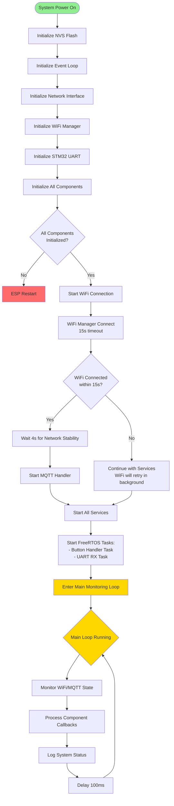
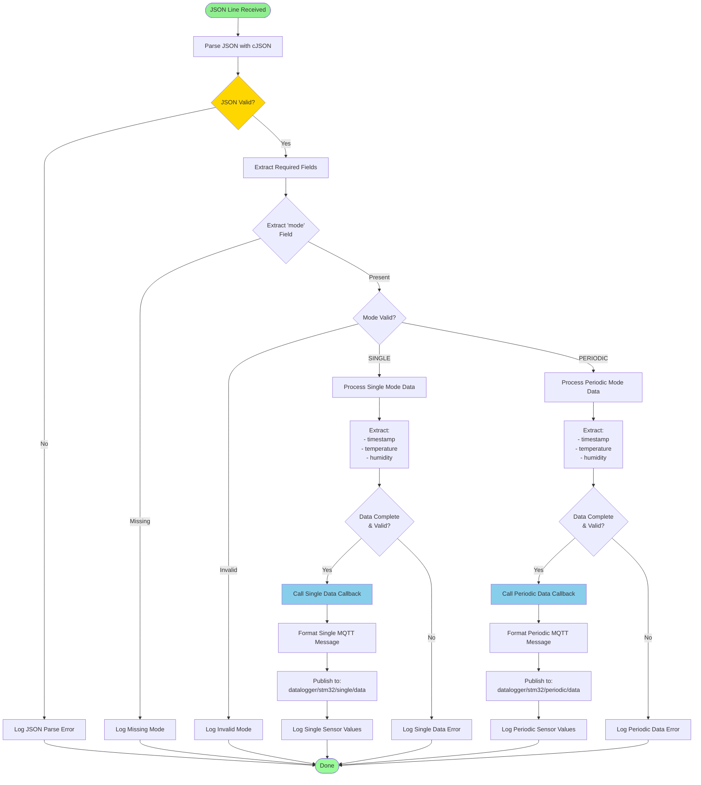

# ESP32 Firmware - Flow Diagrams

This document contains all flow diagrams for the ESP32 firmware architecture, showing control flow, decision logic, and process workflows.

## Main Application Initialization Flow



## WiFi Connection Management Flow

```mermaid
flowchart TD
    Start([WiFi Manager Start]) --> CheckConfig{WiFi Config<br/>Valid?}
    
    CheckConfig -->|No| ConfigError[Log Configuration Error]
    CheckConfig -->|Yes| StartConnect[Begin Connection Process]
    
    ConfigError --> Failed[WiFi State: FAILED]
    
    StartConnect --> SetConnecting[Set State: CONNECTING]
    SetConnecting --> InitStation[Initialize Station Mode]
    InitStation --> RegisterEvents[Register WiFi Event Handlers]
    RegisterEvents --> SetCredentials[Set SSID/Password]
    
    SetCredentials --> ConnectAttempt[WiFi Connect Attempt]
    ConnectAttempt --> WaitResult{Connection Result}
    
    WaitResult -->|Success| Connected[WiFi State: CONNECTED]
    WaitResult -->|Failed| CheckRetry{Retry Count<br/>< Max (5)?}
    WaitResult -->|Timeout| CheckRetry
    
    CheckRetry -->|Yes| IncRetry[Increment Retry Count]
    CheckRetry -->|No| Failed
    
    IncRetry --> DelayRetry[Wait 2 seconds]
    DelayRetry --> ConnectAttempt
    
    Connected --> GetIPInfo[Get IP Address & Network Info]
    GetIPInfo --> GetRSSI[Get Signal Strength (RSSI)]
    GetRSSI --> LogSuccess[Log Connection Success]
    LogSuccess --> EnableEvents[Enable Disconnect Monitoring]
    EnableEvents --> Success[Connection Complete]
    
    Failed --> LogFailure[Log Connection Failure]
    LogFailure --> SetFailedState[Set State: FAILED]
    SetFailedState --> ScheduleRetry[Schedule Background Retry]
    
    Success --> MonitorConnection{Monitor Connection}
    MonitorConnection -->|Disconnect Event| HandleDisconnect[Handle Disconnection]
    MonitorConnection -->|Stable| MonitorConnection
    
    HandleDisconnect --> SetDisconnected[Set State: DISCONNECTED]
    SetDisconnected --> AutoRetry[Start Auto-Retry Process]
    AutoRetry --> DelayRetry
    
    style Start fill:#90EE90
    style Connected fill:#87CEEB
    style Failed fill:#FF6B6B
    style Success fill:#98FB98
```

## MQTT Handler Flow

```mermaid
flowchart TD
    Start([MQTT Handler Start]) --> CheckWiFi{WiFi<br/>Connected?}
    
    CheckWiFi -->|No| WaitWiFi[Wait for WiFi Connection]
    CheckWiFi -->|Yes| CheckStable{Network Stable<br/>for 4s?}
    
    WaitWiFi --> CheckWiFi
    CheckStable -->|No| WaitStable[Wait for Stability]
    CheckStable -->|Yes| InitClient[Initialize ESP MQTT Client]
    
    WaitStable --> CheckStable
    
    InitClient --> SetConfig[Configure MQTT Settings:<br/>- Broker URI<br/>- Client ID<br/>- Credentials]
    SetConfig --> RegisterCallbacks[Register Event Callbacks]
    RegisterCallbacks --> StartClient[esp_mqtt_client_start()]
    
    StartClient --> WaitEvent{MQTT Event?}
    
    WaitEvent -->|CONNECTED| HandleConnected[Handle Connection]
    WaitEvent -->|DISCONNECTED| HandleDisconnected[Handle Disconnection]
    WaitEvent -->|ERROR| HandleError[Handle Error]
    WaitEvent -->|DATA| HandleData[Handle Incoming Data]
    
    HandleConnected --> SetConnected[Set connected = true]
    SetConnected --> ResetRetries[Reset retry_count = 0]
    ResetRetries --> SubscribeTopics[Subscribe to Command Topics]
    SubscribeTopics --> SetReconnectFlag[Set mqtt_reconnected flag]
    SetReconnectFlag --> LogConnected[Log MQTT Connected]
    LogConnected --> WaitEvent
    
    HandleDisconnected --> SetDisconnected[Set connected = false]
    SetDisconnected --> IncRetries[Increment retry_count]
    IncRetries --> CheckMaxRetries{retry_count<br/>< MAX_RETRIES?}
    CheckMaxRetries -->|Yes| CalcBackoff[Calculate Backoff:<br/>min(60s, 2^retry * 1s)]
    CheckMaxRetries -->|No| StopRetries[Stop Retrying]
    CalcBackoff --> DelayBackoff[Wait Backoff Period]
    DelayBackoff --> StartClient
    StopRetries --> LogGiveUp[Log Max Retries Reached]
    LogGiveUp --> WaitEvent
    
    HandleError --> LogError[Log Error Details]
    LogError --> HandleDisconnected
    
    HandleData --> ParseTopic[Parse Topic & Payload]
    ParseTopic --> RouteMessage[Route to Appropriate Handler]
    RouteMessage --> WaitEvent
    
    style Start fill:#90EE90
    style SetConnected fill:#87CEEB
    style StopRetries fill:#FF6B6B
    style HandleData fill:#FFD700
```

## UART Communication Flow

```mermaid
flowchart TD
    Start([UART Init]) --> ConfigPort[Configure UART1:<br/>- 115200 baud<br/>- 8N1 format<br/>- TX: GPIO17, RX: GPIO16]
    ConfigPort --> AllocBuffer[Allocate Ring Buffer<br/>(512 bytes)]
    AllocBuffer --> InstallDriver[Install UART Driver]
    InstallDriver --> RegisterCallback[Register Data Callback]
    RegisterCallback --> StartRXTask[Start UART RX Task]
    StartRXTask --> InitComplete[UART Ready]
    
    InitComplete --> WaitData{Wait for Data}
    
    WaitData -->|STM32 Sends Data| ReceiveBytes[UART ISR: Receive Bytes]
    WaitData -->|Send Command| SendCommand[Transmit Command to STM32]
    
    ReceiveBytes --> WriteBuffer[Write to Ring Buffer]
    WriteBuffer --> CheckLine{Complete Line<br/>Available?}
    CheckLine -->|Yes| ExtractLine[Extract Line from Buffer]
    CheckLine -->|No| WaitData
    
    ExtractLine --> ValidateLine{Line Valid &<br/>Non-Empty?}
    ValidateLine -->|Yes| CallCallback[Call Data Received Callback]
    ValidateLine -->|No| WaitData
    
    CallCallback --> ProcessJSON[JSON Parser Process Line]
    ProcessJSON --> WaitData
    
    SendCommand --> FormatCommand[Format Command<br/>(Add '\n' terminator)]
    FormatCommand --> TransmitUART[UART Transmit Bytes]
    TransmitUART --> LogCommand[Log Transmitted Command]
    LogCommand --> WaitData
    
    style Start fill:#90EE90
    style InitComplete fill:#87CEEB
    style CallCallback fill:#FFD700
    style ProcessJSON fill:#98FB98
```

## JSON Sensor Data Processing Flow



## Relay Control Flow

```mermaid
flowchart TD
    Start([Relay Control]) --> InitRelay[Initialize Relay GPIO<br/>(GPIO_4)]
    InitRelay --> ConfigOutput[Configure as OUTPUT]
    ConfigOutput --> ReadInitState[Read Initial Hardware State]
    ReadInitState --> SetGlobalState[Set g_device_on = hardware_state]
    SetGlobalState --> RegisterCallback[Register State Change Callback]
    RegisterCallback --> RelayReady[Relay Control Ready]
    
    RelayReady --> WaitCommand{Wait for Command}
    
    WaitCommand -->|MQTT Command| ProcessMQTTRelay[Process MQTT Relay Command]
    WaitCommand -->|Button Press| ProcessButtonRelay[Process Button Press]
    WaitCommand -->|Direct API| ProcessDirectCommand[Process Direct API Call]
    
    ProcessMQTTRelay --> ParseCommand{Parse Command}
    ParseCommand -->|"ON"| SetRelayOn[Set Relay State: ON]
    ParseCommand -->|"OFF"| SetRelayOff[Set Relay State: OFF]
    ParseCommand -->|Invalid| LogInvalidCmd[Log Invalid Command]
    
    ProcessButtonRelay --> ToggleRelay[Toggle Current State]
    ToggleRelay --> CheckCurrentState{Current State?}
    CheckCurrentState -->|ON| SetRelayOff
    CheckCurrentState -->|OFF| SetRelayOn
    
    ProcessDirectCommand --> CheckAPICall{API Call Type?}
    CheckAPICall -->|SetState(true)| SetRelayOn
    CheckAPICall -->|SetState(false)| SetRelayOff
    CheckAPICall -->|Toggle()| ToggleRelay
    
    SetRelayOn --> UpdateGPIO_On[gpio_set_level(GPIO_4, 1)]
    SetRelayOff --> UpdateGPIO_Off[gpio_set_level(GPIO_4, 0)]
    
    UpdateGPIO_On --> UpdateState_On[Update relay_control.state = true]
    UpdateGPIO_Off --> UpdateState_Off[Update relay_control.state = false]
    
    UpdateState_On --> CallCallback_On[Call Relay Callback(true)]
    UpdateState_Off --> CallCallback_Off[Call Relay Callback(false)]
    
    CallCallback_On --> UpdateGlobalOn[Update g_device_on = true]
    CallCallback_Off --> UpdateGlobalOff[Update g_device_on = false]
    
    UpdateGlobalOn --> CheckPeriodicForceOff{Relay turning OFF?}
    UpdateGlobalOff --> ForcePeriodicOff[Force g_periodic_active = false]
    
    CheckPeriodicForceOff -->|No| PublishState[Publish System State]
    ForcePeriodicOff --> PublishState
    
    PublishState --> DelaySTM32[Wait 500ms<br/>(STM32 Boot Time)]
    DelaySTM32 --> SendMQTTStatus[Send MQTT Status to STM32]
    SendMQTTStatus --> LogStateChange[Log Relay State Change]
    
    LogInvalidCmd --> WaitCommand
    LogStateChange --> WaitCommand
    
    style Start fill:#90EE90
    style RelayReady fill:#87CEEB
    style SetRelayOn fill:#98FB98
    style SetRelayOff fill:#FFA07A
    style ForcePeriodicOff fill:#FFD700
```

## Button Handler Flow

```mermaid
flowchart TD
    Start([Button Press Detected]) --> DebounceHW[Hardware Debounce<br/>(RC Circuit)]
    DebounceHW --> ISR[GPIO ISR Triggered]
    ISR --> DisableINT[Temporarily Disable Interrupt]
    DisableINT --> QueueNotify[Notify Button Task via Queue]
    QueueNotify --> SWDebounce[Software Debounce<br/>(Wait 50ms)]
    
    SWDebounce --> ReadLevel[Read GPIO Level]
    ReadLevel --> CheckPressed{Level LOW<br/>(Pressed)?}
    CheckPressed -->|No| ReEnableINT[Re-enable Interrupt]
    CheckPressed -->|Yes| WaitRelease[Wait for Button Release]
    
    WaitRelease --> PollLevel[Poll GPIO Level]
    PollLevel --> CheckReleased{Level HIGH<br/>(Released)?}
    CheckReleased -->|No| PollLevel
    CheckReleased -->|Yes| IdentifyButton[Identify Button GPIO]
    
    IdentifyButton --> CheckGPIO{Which GPIO?}
    
    CheckGPIO -->|GPIO_5| RelayButton[Relay Toggle Button]
    CheckGPIO -->|GPIO_17| SingleButton[Single Read Button]
    CheckGPIO -->|GPIO_16| PeriodicButton[Periodic Toggle Button]
    CheckGPIO -->|GPIO_4| IntervalButton[Interval Cycle Button]
    
    RelayButton --> CallRelayCallback[Call Relay Button Callback]
    SingleButton --> CheckDeviceOn1{Device ON?}
    PeriodicButton --> CheckDeviceOn2{Device ON?}
    IntervalButton --> CheckDeviceOn3{Device ON?}
    
    CallRelayCallback --> ToggleRelayState[Toggle Relay Hardware State]
    ToggleRelayState --> UpdateDeviceState[Update g_device_on]
    UpdateDeviceState --> CheckRelayOff{Relay turned OFF?}
    CheckRelayOff -->|Yes| ForcePeriodicOff[Force g_periodic_active = false]
    CheckRelayOff -->|No| PublishRelayState[Publish State Update]
    ForcePeriodicOff --> PublishRelayState
    
    CheckDeviceOn1 -->|No| LogIgnored1[Log "Single ignored - device OFF"]
    CheckDeviceOn1 -->|Yes| SendSingle[Send "SINGLE" to STM32]
    
    CheckDeviceOn2 -->|No| LogIgnored2[Log "Periodic ignored - device OFF"]
    CheckDeviceOn2 -->|Yes| TogglePeriodic[Toggle g_periodic_active]
    
    CheckDeviceOn3 -->|No| LogIgnored3[Log "Interval ignored - device OFF"]
    CheckDeviceOn3 -->|Yes| CycleInterval[Cycle g_interval_index]
    
    SendSingle --> LogSingleCmd[Log Single Command Sent]
    
    TogglePeriodic --> FormatPeriodicCmd{New Periodic State?}
    FormatPeriodicCmd -->|true| SendPeriodicOn[Send "PERIODIC ON" to STM32]
    FormatPeriodicCmd -->|false| SendPeriodicOff[Send "PERIODIC OFF" to STM32]
    
    CycleInterval --> BuildIntervalCmd[Build "SET PERIODIC INTERVAL {ms}"]
    BuildIntervalCmd --> SendInterval[Send Interval Command to STM32]
    
    SendPeriodicOn --> PublishPeriodicState[Publish State Update]
    SendPeriodicOff --> PublishPeriodicState
    SendInterval --> LogIntervalCmd[Log Interval Command Sent]
    
    PublishRelayState --> ButtonComplete[Button Processing Complete]
    LogSingleCmd --> ButtonComplete
    PublishPeriodicState --> ButtonComplete
    LogIntervalCmd --> ButtonComplete
    LogIgnored1 --> ButtonComplete
    LogIgnored2 --> ButtonComplete
    LogIgnored3 --> ButtonComplete
    
    ButtonComplete --> ReEnableINT
    ReEnableINT --> WaitNextPress[Wait for Next Button Press]
    WaitNextPress --> Start
    
    style Start fill:#90EE90
    style CheckGPIO fill:#FFD700
    style CheckDeviceOn1 fill:#FFD700
    style CheckDeviceOn2 fill:#FFD700
    style CheckDeviceOn3 fill:#FFD700
    style ButtonComplete fill:#98FB98
```

## System State Management Flow

```mermaid
flowchart TD
    Start([State Change Event]) --> CheckSource{State Change Source?}
    
    CheckSource -->|Relay State Change| RelayStateChange[Handle Relay State Change]
    CheckSource -->|MQTT Command| MQTTStateChange[Handle MQTT Command State]
    CheckSource -->|Button Press| ButtonStateChange[Handle Button State Change]
    CheckSource -->|System Init| InitStateChange[Handle Initialization State]
    
    RelayStateChange --> UpdateDeviceState[Update g_device_on]
    MQTTStateChange --> UpdatePeriodicState[Update g_periodic_active]
    ButtonStateChange --> UpdateBothStates[Update Both States]
    InitStateChange --> SetInitialStates[Set Initial State Values]
    
    UpdateDeviceState --> CheckDeviceChanged{g_device_on<br/>Changed?}
    UpdatePeriodicState --> CheckPeriodicChanged{g_periodic_active<br/>Changed?}
    UpdateBothStates --> CheckDeviceChanged
    SetInitialStates --> StateReady[State Manager Ready]
    
    CheckDeviceChanged -->|Yes| MarkDeviceChanged[Mark device_changed = true]
    CheckDeviceChanged -->|No| CheckPeriodicChanged
    
    MarkDeviceChanged --> LogDeviceChange[Log Device State Change]
    LogDeviceChange --> CheckPeriodicChanged
    
    CheckPeriodicChanged -->|Yes| MarkPeriodicChanged[Mark periodic_changed = true]
    CheckPeriodicChanged -->|No| CheckAnyChanged{Any State<br/>Changed?}
    
    MarkPeriodicChanged --> LogPeriodicChange[Log Periodic State Change]
    LogPeriodicChange --> CheckAnyChanged
    
    CheckAnyChanged -->|No| StateComplete[State Update Complete]
    CheckAnyChanged -->|Yes| CheckMQTTConnected{MQTT<br/>Connected?}
    
    CheckMQTTConnected -->|No| StateComplete
    CheckMQTTConnected -->|Yes| FormatStateJSON[Format State JSON Message]
    
    FormatStateJSON --> CreateMessage[Create JSON:<br/>{"device": bool, "periodic": bool, "timestamp": int}]
    CreateMessage --> PublishMQTT[Publish to MQTT:<br/>datalogger/esp32/system/state<br/>(retain = true)]
    PublishMQTT --> LogStatePublished[Log State Published]
    LogStatePublished --> StateComplete
    
    StateReady --> MonitorStates[Monitor State Changes]
    MonitorStates --> Start
    
    StateComplete --> MonitorStates
    
    style Start fill:#90EE90
    style CheckSource fill:#FFD700
    style CheckMQTTConnected fill:#FFD700
    style StateComplete fill:#98FB98
    style StateReady fill:#87CEEB
```

## Error Handling and Recovery Flow

```mermaid
flowchart TD
    Start([Error Detected]) --> ClassifyError{Error Type?}
    
    ClassifyError -->|WiFi Connection| WiFiError[WiFi Connection Error]
    ClassifyError -->|MQTT Connection| MQTTError[MQTT Connection Error]
    ClassifyError -->|UART Communication| UARTError[UART Communication Error]
    ClassifyError -->|JSON Parsing| JSONError[JSON Parsing Error]
    ClassifyError -->|Component Init| ComponentError[Component Initialization Error]
    ClassifyError -->|Memory Allocation| MemoryError[Memory Allocation Error]
    
    WiFiError --> LogWiFiError[Log WiFi Error Details]
    LogWiFiError --> CheckWiFiRetries{Retry Count<br/>< Max (5)?}
    CheckWiFiRetries -->|Yes| WaitWiFiRetry[Wait 2s for Retry]
    CheckWiFiRetries -->|No| WiFiGiveUp[Set WiFi State: FAILED]
    WaitWiFiRetry --> RetryWiFi[Retry WiFi Connection]
    RetryWiFi --> MonitorWiFi[Continue Monitoring]
    WiFiGiveUp --> ScheduleManualRetry[Schedule Manual Retry (5s)]
    
    MQTTError --> LogMQTTError[Log MQTT Error Details]
    LogMQTTError --> CheckMQTTRetries{Retry Count<br/>< Max?}
    CheckMQTTRetries -->|Yes| CalcMQTTBackoff[Calculate Exponential Backoff]
    CheckMQTTRetries -->|No| MQTTGiveUp[Stop MQTT Retries]
    CalcMQTTBackoff --> WaitMQTTRetry[Wait Backoff Period]
    WaitMQTTRetry --> RetryMQTT[Retry MQTT Connection]
    RetryMQTT --> MonitorMQTT[Continue Monitoring]
    MQTTGiveUp --> WaitWiFiReconnect[Wait for WiFi Reconnect]
    
    UARTError --> LogUARTError[Log UART Error Details]
    LogUARTError --> CheckUARTBuffer{Buffer<br/>Overflow?}
    CheckUARTBuffer -->|Yes| ClearUARTBuffer[Clear Ring Buffer]
    CheckUARTBuffer -->|No| CheckUARTInit{UART Driver<br/>OK?}
    ClearUARTBuffer --> ResumeUART[Resume UART Operation]
    CheckUARTInit -->|No| ReinitUART[Reinitialize UART Driver]
    CheckUARTInit -->|Yes| ResumeUART
    ReinitUART --> ResumeUART
    
    JSONError --> LogJSONError[Log JSON Parse Error]
    LogJSONError --> DiscardJSONData[Discard Invalid JSON Data]
    DiscardJSONData --> ContinueJSONParsing[Continue JSON Processing]
    
    ComponentError --> LogComponentError[Log Component Error]
    LogComponentError --> CheckCritical{Critical<br/>Component?}
    CheckCritical -->|Yes| SystemRestart[ESP32 System Restart]
    CheckCritical -->|No| DisableComponent[Disable Component]
    DisableComponent --> ContinueWithoutComponent[Continue Without Component]
    
    MemoryError --> LogMemoryError[Log Memory Error]
    LogMemoryError --> FreeUnusedMemory[Free Unused Memory]
    FreeUnusedMemory --> CheckMemoryRecovered{Memory<br/>Recovered?}
    CheckMemoryRecovered -->|Yes| ContinueOperation[Continue Operation]
    CheckMemoryRecovered -->|No| SystemRestart
    
    MonitorWiFi --> RecoveryComplete[Recovery Complete]
    MonitorMQTT --> RecoveryComplete
    ScheduleManualRetry --> RecoveryComplete
    WaitWiFiReconnect --> RecoveryComplete
    ResumeUART --> RecoveryComplete
    ContinueJSONParsing --> RecoveryComplete
    ContinueWithoutComponent --> RecoveryComplete
    ContinueOperation --> RecoveryComplete
    
    SystemRestart --> RestartESP[esp_restart()]
    RestartESP --> Start
    
    RecoveryComplete --> NormalOperation[Return to Normal Operation]
    NormalOperation --> MonitorForErrors[Monitor for New Errors]
    MonitorForErrors --> Start
    
    style Start fill:#90EE90
    style ClassifyError fill:#FFD700
    style SystemRestart fill:#FF6B6B
    style RecoveryComplete fill:#98FB98
    style RestartESP fill:#FF4500
```

---

## Legend

- **Green Nodes**: Start/End points and successful states
- **Yellow Nodes**: Decision points and conditional logic
- **Red Nodes**: Error conditions and critical states
- **Blue Nodes**: Stable operational states
- **Orange Nodes**: Recovery and retry mechanisms

## Notes

- All flows incorporate FreeRTOS task management and queue-based communication
- WiFi connection uses automatic retry with 5 attempts and 2-second intervals
- MQTT implements exponential backoff retry (1s to 60s maximum)
- UART uses 512-byte ring buffer for reliable data reception
- Button handling includes both hardware and software debouncing (50ms)
- Relay state changes include 500ms delay for STM32 boot sequence
- Network stability requires 4-second delay before MQTT initialization
- All components support graceful shutdown and reinitialization
