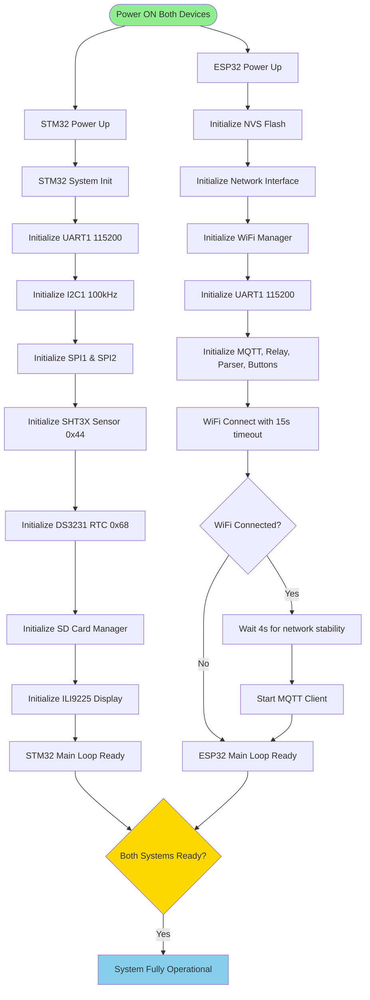
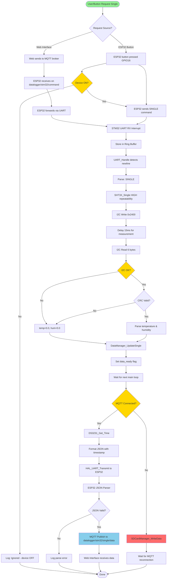
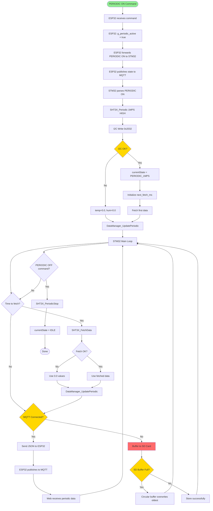
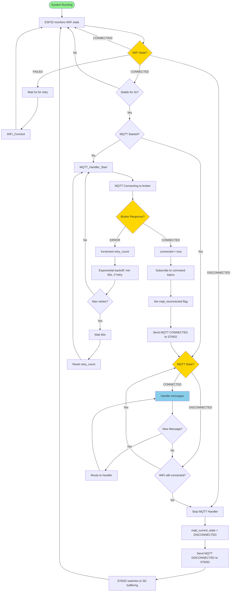
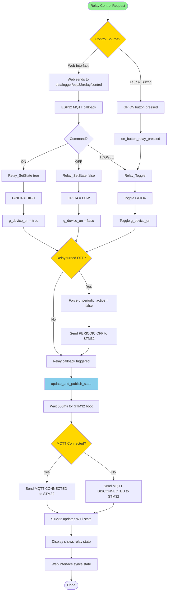
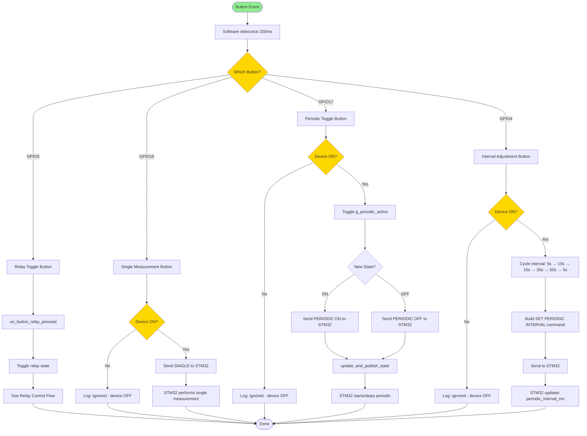
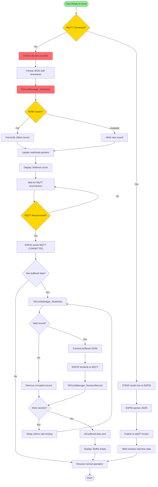
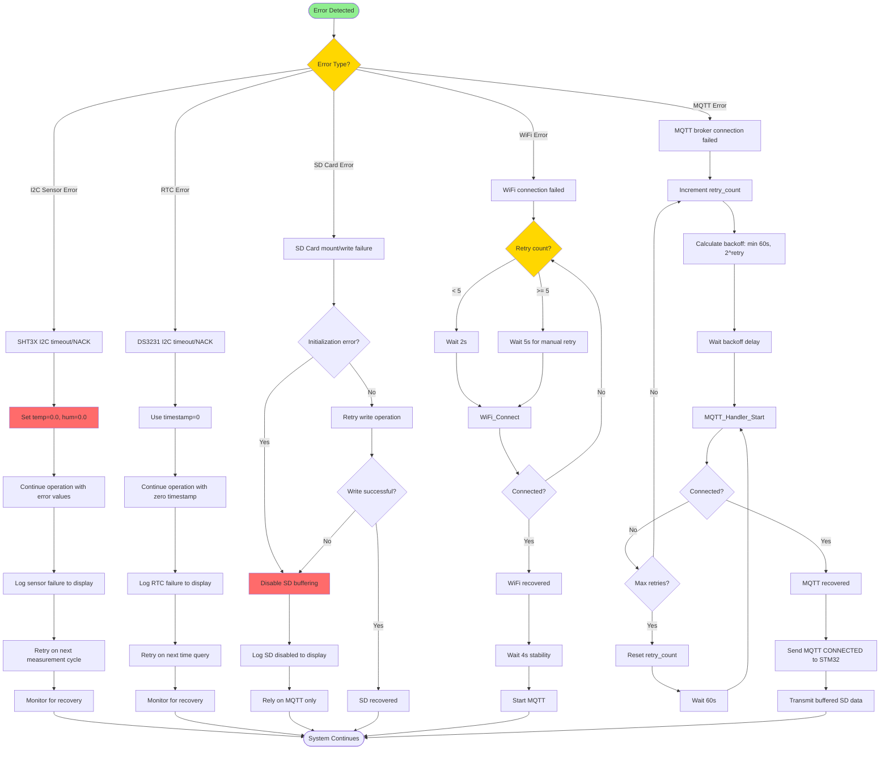
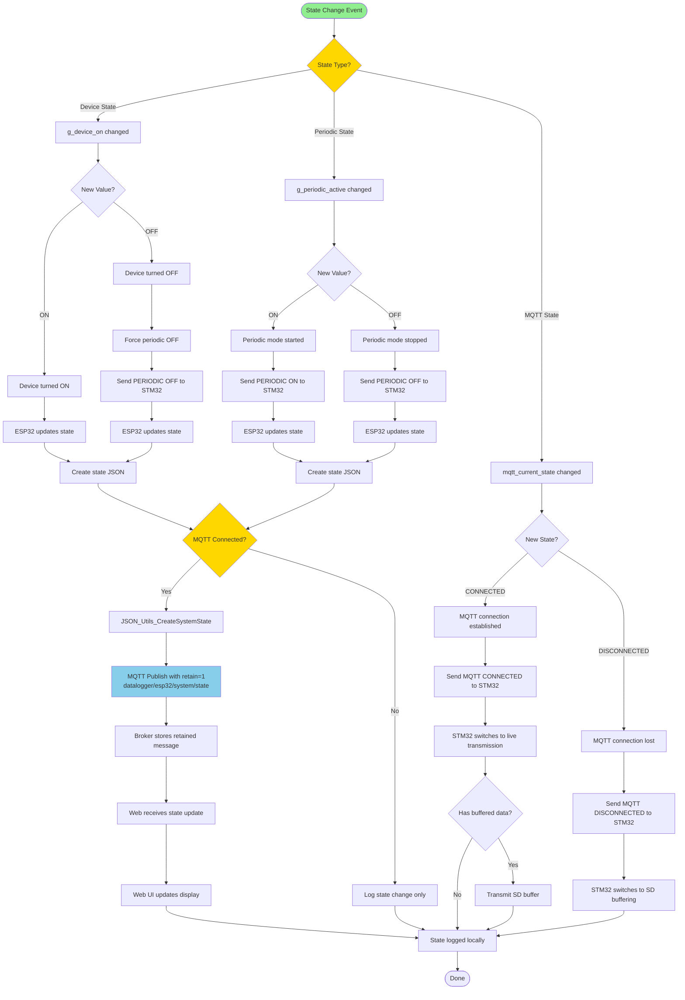
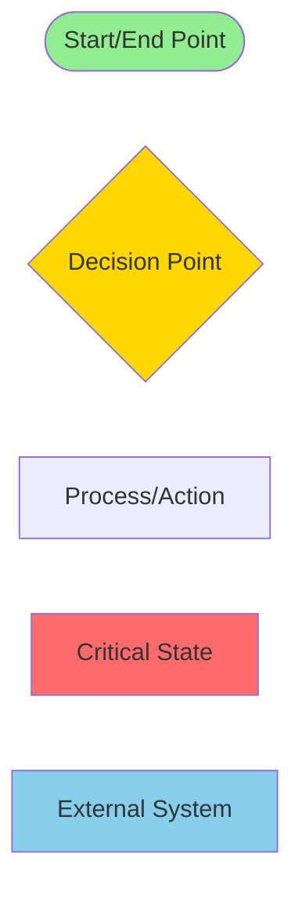

# Complete Firmware System - Flow Diagram

This document describes the integrated control flow of the complete firmware system including STM32 data logger and ESP32 IoT bridge.

## System Startup and Initialization Flow

## Single Measurement End-to-End Flow

## Periodic Measurement Flow

## MQTT Connection State Management Flow

## Relay Control End-to-End Flow

## Button Control Flow (ESP32 Buttons)

## SD Card Buffering and Transmission Flow

## Error Handling and Recovery Flow

## System State Synchronization Flow

## Legend

---

## Key System Features

### Communication Protocol
- **UART**: 115200 baud, 8N1, line-based JSON protocol
- **I2C**: 100kHz for sensors (SHT3X 0x44, DS3231 0x68)
- **SPI**: 18MHz for SD Card, 36MHz for Display
- **MQTT**: v5.0, QoS 0/1, retained state messages

### Timing Requirements
- **WiFi Stabilization**: 4-second delay before MQTT start
- **STM32 Boot Delay**: 500ms after relay toggle
- **Button Debounce**: 200ms software filter
- **Periodic Intervals**: 5s, 10s, 15s, 30s, 60s (user selectable)
- **SD Transmission Rate**: 100ms between records

### State Management
- **Device State**: g_device_on (relay control)
- **Periodic State**: g_periodic_active (measurement mode)
- **MQTT State**: mqtt_current_state (connection status)
- **State Sync**: MQTT retained messages for web synchronization

### Error Recovery
- **WiFi**: 5 auto-retries @ 2s, then manual retry @ 5s
- **MQTT**: Exponential backoff min(60s, 2^retry)
- **Sensor**: Return 0.0 values, continue operation
- **RTC**: Return timestamp=0, continue operation
- **SD Card**: Circular buffer, 204,800 records capacity

### Data Flow Priority
1. **Real-time**: When MQTT connected, direct transmission
2. **Buffered**: When MQTT disconnected, SD card storage
3. **Catch-up**: When MQTT reconnects, transmit buffered data first
4. **Rate Limited**: 100ms delay between buffered transmissions
