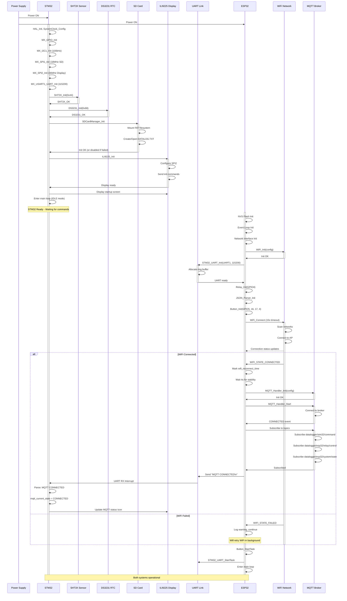
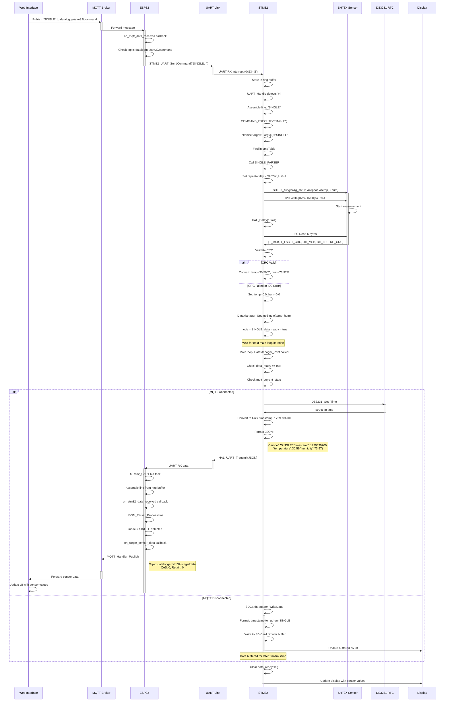
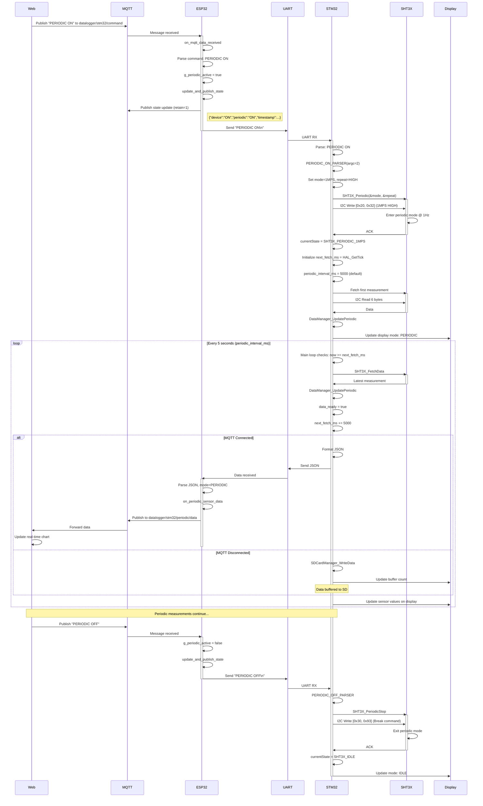
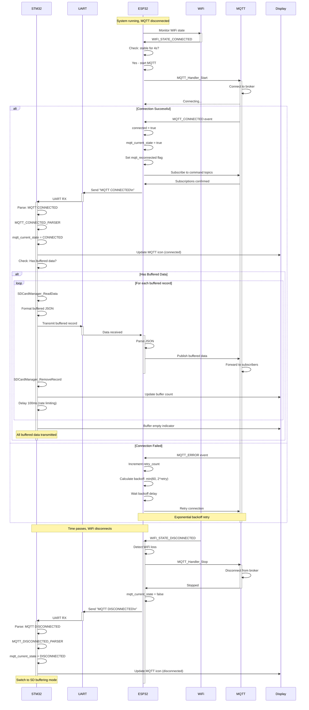
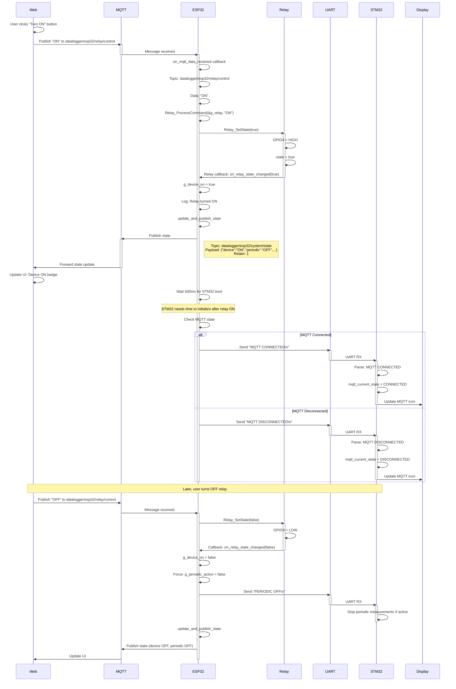
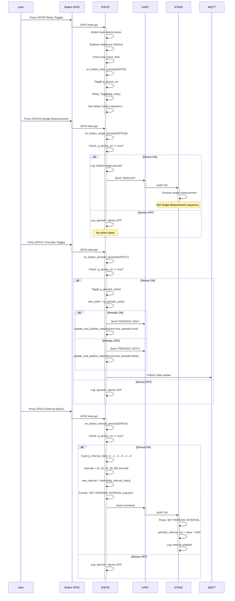
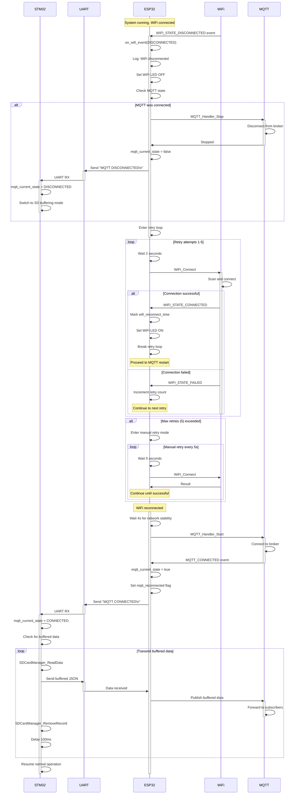
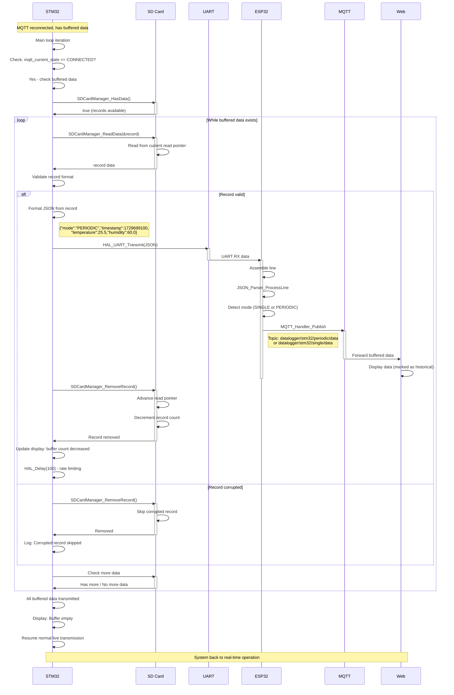
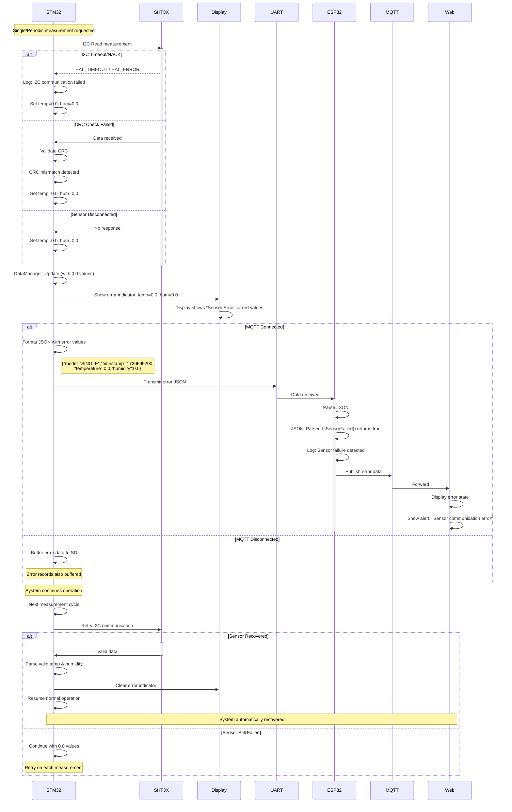

# ESP32 Firmware - Sequence Diagrams

This document contains all sequence diagrams for the ESP32 firmware architecture, illustrating time-ordered interactions between components, systems, and external entities.

## Complete System Initialization Sequence

## Single Measurement End-to-End Sequence

## Periodic Measurement Setup and Operation Sequence

## MQTT Connection State Change and Synchronization

## Relay Control from Web Interface

## Button Press Sequence (ESP32 Buttons)

## WiFi Disconnection and Reconnection

## SD Card Buffer Transmission After Reconnection

## Error Recovery - Sensor Failure Detection

---

## Key Sequence Patterns

### Communication Protocol
- **UART**: Line-based, newline-terminated, 115200 baud
- **Commands**: Plain text (SINGLE, PERIODIC ON/OFF, MQTT CONNECTED/DISCONNECTED, etc.)
- **Data**: JSON format with mode, timestamp, sensor values

### Timing Sequences
- **WiFi Stabilization**: 4-second wait before MQTT start
- **STM32 Boot**: 500ms delay after relay ON before sending MQTT state
- **Debouncing**: 200ms for button presses
- **Rate Limiting**: 100ms between buffered data transmissions
- **Retry Delays**: 2s for WiFi (auto), 5s (manual), exponential for MQTT

### State Synchronization
- **Bidirectional**: ESP32 ↔ STM32 via UART commands
- **MQTT Retained**: State published with retain flag for web sync
- **Callback Chains**: Event → Callback → State Update → Publish

### Error Handling
- **Graceful Degradation**: Use 0.0 values for failed sensors
- **Automatic Retry**: WiFi and MQTT reconnection logic
- **Buffer Fallback**: SD card buffering when MQTT unavailable
- **Recovery Detection**: Automatic resume on sensor/connection recovery
