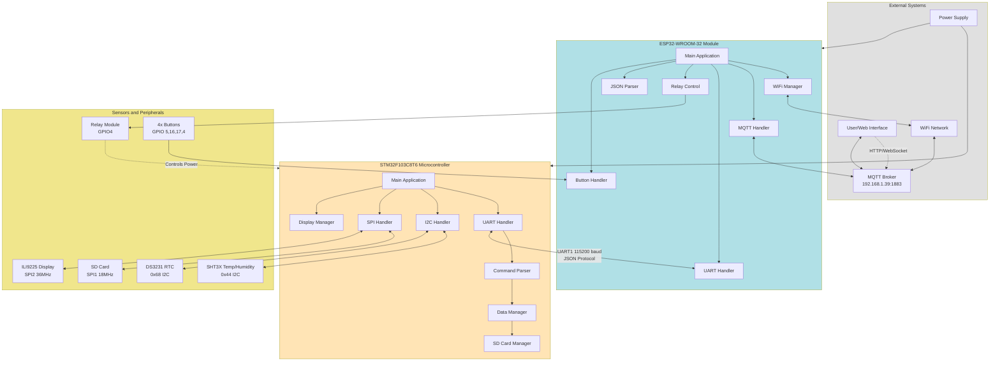
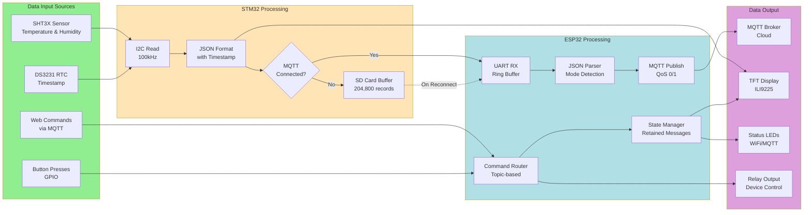
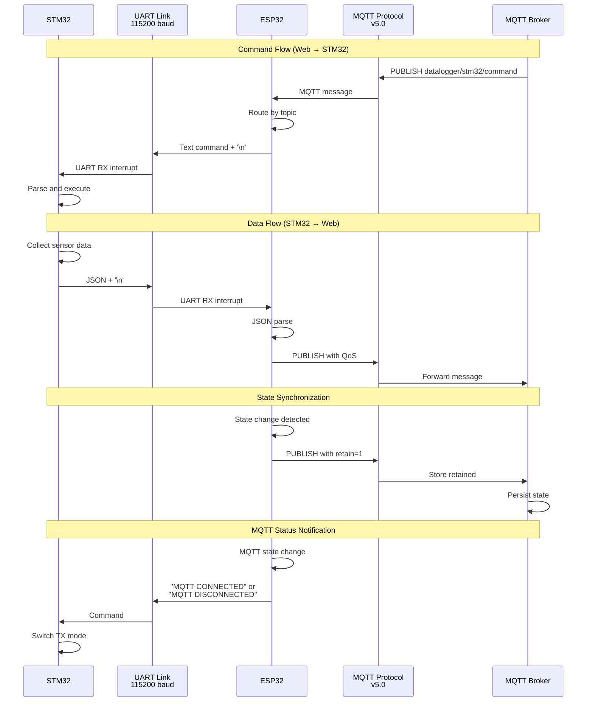
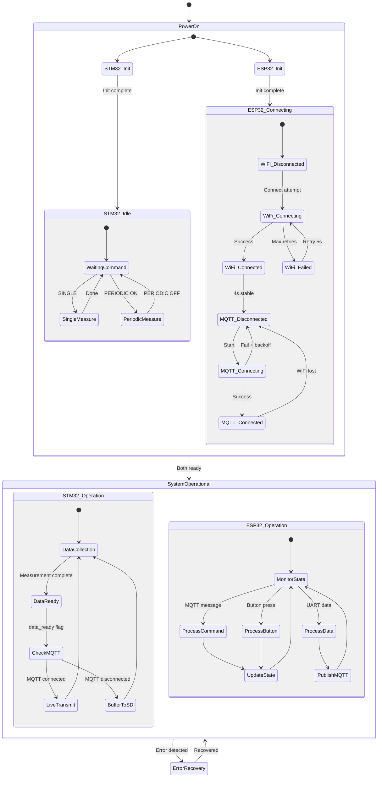
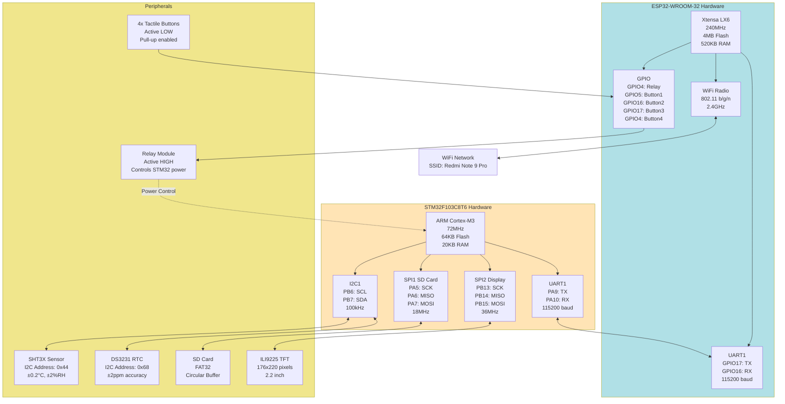
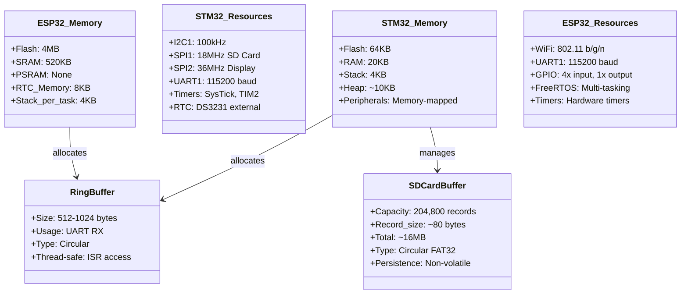
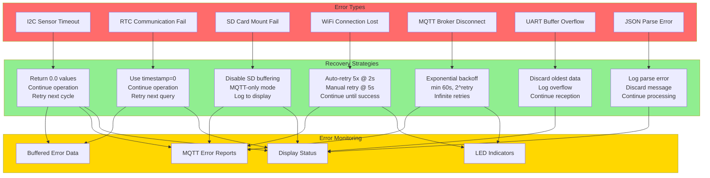
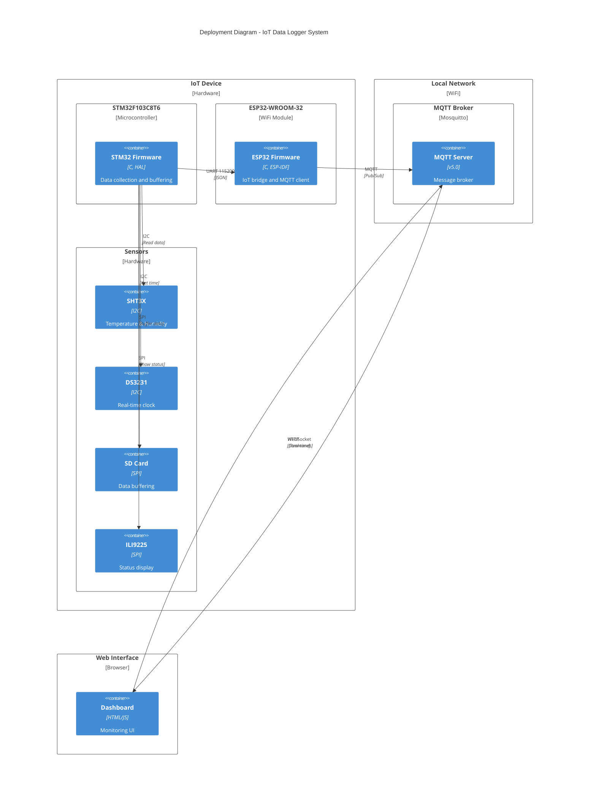

# Complete Firmware System - UML and Architecture Diagrams

This document provides the UML class diagrams and architecture views of the complete integrated firmware system.

## Complete System Architecture



## Complete System Class Diagram

```mermaid
classDiagram
    %% STM32 Classes
    class STM32_Main {
        +I2C_HandleTypeDef hi2c1
        +SPI_HandleTypeDef hspi1, hspi2
        +UART_HandleTypeDef huart1
        +sht3x_t g_sht3x
        +ds3231_t g_ds3231
        +mqtt_state_t mqtt_current_state
        +uint32_t periodic_interval_ms
        +main() int
        +SystemClock_Config() void
    }
    
    class STM32_UART {
        -UART_HandleTypeDef* huart
        -ring_buffer_t rx_buffer
        +UART_Init() void
        +UART_Handle() void
        +UART_RxCallback(uint8_t) void
    }
    
    class STM32_CommandParser {
        +COMMAND_EXECUTE(char*) void
        +SINGLE_PARSER() void
        +PERIODIC_ON_PARSER() void
        +PERIODIC_OFF_PARSER() void
        +SET_TIME_PARSER() void
        +MQTT_CONNECTED_PARSER() void
        +MQTT_DISCONNECTED_PARSER() void
        +SD_CLEAR_PARSER() void
    }
    
    class STM32_DataManager {
        -data_manager_state_t state
        -data_manager_mode_t mode
        +DataManager_Init() void
        +DataManager_UpdateSingle(float, float) void
        +DataManager_UpdatePeriodic(float, float) void
        +DataManager_Print() bool
    }
    
    class STM32_SDCardManager {
        -sd_card_state_t state
        -uint32_t write_pointer
        -uint32_t read_pointer
        -uint32_t record_count
        +SDCardManager_Init() bool
        +SDCardManager_WriteData(char*) bool
        +SDCardManager_ReadData(char*) bool
        +SDCardManager_RemoveRecord() bool
        +SDCardManager_Clear() bool
    }
    
    class STM32_SHT3X {
        -I2C_HandleTypeDef* hi2c
        -float temperature
        -float humidity
        -sht3x_mode_t currentState
        +SHT3X_Init() void
        +SHT3X_Single() SHT3X_StatusTypeDef
        +SHT3X_Periodic() SHT3X_StatusTypeDef
        +SHT3X_FetchData() SHT3X_StatusTypeDef
        +SHT3X_PeriodicStop() SHT3X_StatusTypeDef
    }
    
    class STM32_DS3231 {
        -I2C_HandleTypeDef* hi2c
        +DS3231_Init() void
        +DS3231_Set_Time(struct tm*) DS3231_StatusTypeDef
        +DS3231_Get_Time(struct tm*) DS3231_StatusTypeDef
    }
    
    class STM32_Display {
        +Display_Init() void
        +Display_Update() void
        +Display_ShowSensorData(float, float) void
        +Display_ShowMQTTState(bool) void
        +Display_ShowBufferCount(uint32_t) void
    }
    
    %% ESP32 Classes
    class ESP32_Main {
        +wifi_manager_t g_wifi_manager
        +stm32_uart_t g_stm32_uart
        +mqtt_handler_t g_mqtt_handler
        +relay_control_t g_relay
        +bool g_device_on
        +bool g_periodic_active
        +app_main() void
        +initialize_components() void
        +update_and_publish_state() void
    }
    
    class ESP32_WiFiManager {
        -wifi_state_t current_state
        -uint8_t retry_count
        +WiFi_Init() bool
        +WiFi_Connect() bool
        +WiFi_GetState() wifi_state_t
        +WiFi_IsConnected() bool
    }
    
    class ESP32_MQTT_Handler {
        -esp_mqtt_client_handle_t client
        -bool connected
        -int retry_count
        +MQTT_Handler_Init() bool
        +MQTT_Handler_Start() bool
        +MQTT_Handler_Subscribe() bool
        +MQTT_Handler_Publish() bool
    }
    
    class ESP32_UART {
        -int uart_num
        -ring_buffer_t rx_buffer
        -stm32_data_callback_t callback
        +STM32_UART_Init() bool
        +STM32_UART_SendCommand() bool
        +STM32_UART_ProcessData() void
    }
    
    class ESP32_RelayControl {
        -int gpio_num
        -bool state
        -relay_state_callback_t callback
        +Relay_Init() bool
        +Relay_SetState(bool) bool
        +Relay_Toggle() bool
    }
    
    class ESP32_JSONParser {
        -sensor_data_callback_t single_callback
        -sensor_data_callback_t periodic_callback
        +JSON_Parser_Init() bool
        +JSON_Parser_ProcessLine() bool
        +JSON_Parser_IsValid() bool
    }
    
    class ESP32_ButtonHandler {
        -gpio_num_t gpio_num
        -button_press_callback_t callback
        +Button_Init() bool
        +Button_StartTask() bool
    }
    
    %% Relationships
    STM32_Main --> STM32_UART : uses
    STM32_Main --> STM32_SHT3X : uses
    STM32_Main --> STM32_DS3231 : uses
    STM32_Main --> STM32_DataManager : uses
    STM32_Main --> STM32_SDCardManager : uses
    STM32_Main --> STM32_Display : uses
    STM32_UART --> STM32_CommandParser : triggers
    STM32_CommandParser --> STM32_SHT3X : controls
    STM32_CommandParser --> STM32_DataManager : updates
    STM32_DataManager --> STM32_SDCardManager : buffers to
    
    ESP32_Main --> ESP32_WiFiManager : uses
    ESP32_Main --> ESP32_MQTT_Handler : uses
    ESP32_Main --> ESP32_UART : uses
    ESP32_Main --> ESP32_RelayControl : uses
    ESP32_Main --> ESP32_JSONParser : uses
    ESP32_Main --> ESP32_ButtonHandler : uses
    
    ESP32_UART -.->|UART Communication| STM32_UART : bidirectional
    ESP32_RelayControl -.->|Power Control| STM32_Main : controls
```

## Data Flow Architecture



## Communication Protocol Architecture



## State Machine Architecture



## Hardware Configuration Diagram



## MQTT Topic and Message Architecture

```mermaid
graph TB
    subgraph Broker[MQTT Broker: 192.168.1.39:1883]
        direction TB
        
        subgraph Subscribe[ESP32 Subscribes]
            T1[datalogger/stm32/command<br/>QoS: 1]
            T2[datalogger/esp32/relay/control<br/>QoS: 1]
            T3[datalogger/esp32/system/state<br/>QoS: 1]
        end
        
        subgraph Publish[ESP32 Publishes]
            T4[datalogger/stm32/single/data<br/>QoS: 0, Retain: 0]
            T5[datalogger/stm32/periodic/data<br/>QoS: 0, Retain: 0]
            T6[datalogger/esp32/system/state<br/>QoS: 1, Retain: 1]
        end
    end
    
    subgraph Messages[Message Formats]
        direction TB
        
        CMD1[Commands:<br/>SINGLE<br/>PERIODIC ON<br/>PERIODIC OFF<br/>SET TIME ...]
        
        CMD2[Relay Commands:<br/>ON<br/>OFF<br/>TOGGLE]
        
        CMD3[State Request:<br/>REQUEST]
        
        DATA1[Single Data:<br/>{mode:SINGLE,<br/>timestamp:...,<br/>temperature:...,<br/>humidity:...}]
        
        DATA2[Periodic Data:<br/>{mode:PERIODIC,<br/>timestamp:...,<br/>temperature:...,<br/>humidity:...}]
        
        DATA3[System State:<br/>{device:ON/OFF,<br/>periodic:ON/OFF,<br/>timestamp:...}]
    end
    
    T1 -.-> CMD1
    T2 -.-> CMD2
    T3 -.-> CMD3
    T4 -.-> DATA1
    T5 -.-> DATA2
    T6 -.-> DATA3
    
    Web[Web Interface] -->|Publish| T1
    Web -->|Publish| T2
    Web -->|Publish| T3
    
    T4 -->|Subscribe| Web
    T5 -->|Subscribe| Web
    T6 -->|Subscribe| Web
    
    style Broker fill:#87CEEB
    style Messages fill:#FFE4B5
    style Web fill:#90EE90
```

## Memory and Resource Management



## Error Handling and Recovery Architecture



## System Timing and Synchronization

```mermaid
gantt
    title System Timing Diagram
    dateFormat X
    axisFormat %L ms
    
    section STM32
    System Init           :0, 500
    SHT3X Single 15ms     :600, 615
    I2C Read              :615, 620
    Format JSON           :620, 625
    UART Transmit 10ms    :625, 635
    
    section ESP32
    System Init           :0, 1000
    WiFi Connect 10s      :1000, 11000
    Wait 4s Stable        :11000, 15000
    MQTT Connect 2s       :15000, 17000
    UART Process          :635, 645
    JSON Parse            :645, 650
    MQTT Publish          :650, 655
    
    section Periodic
    Fetch Interval 5s     :20000, 25000
    Next Fetch            :25000, 30000
    Next Fetch            :30000, 35000
    
    section Delays
    WiFi Retry 2s         :milestone, 2000
    Manual Retry 5s       :milestone, 5000
    MQTT Backoff 1s       :milestone, 1000
    MQTT Backoff 2s       :milestone, 2000
    MQTT Backoff 4s       :milestone, 4000
    STM32 Boot 500ms      :milestone, 500
    Button Debounce 200ms :milestone, 200
```



## Deployment Architecture



---

## System Characteristics

### Performance Metrics
- **Measurement Rate**: 0.2 Hz to 1 Hz (configurable 5s-60s intervals)
- **Sensor Accuracy**: ±0.2°C, ±2%RH (SHT3X)
- **RTC Accuracy**: ±2ppm (DS3231)
- **Communication Latency**: <100ms (STM32 → Web)
- **Buffer Capacity**: 204,800 records (~16MB SD card)
- **UART Throughput**: ~11.5 KB/s (115200 baud)
- **MQTT Throughput**: Limited by network, typically <1KB/s for sensor data

### Reliability Features
- **Sensor Failure**: Graceful degradation with 0.0 values
- **Communication Loss**: SD card buffering (>14 days @ 5s intervals)
- **Power Interruption**: Non-volatile SD card storage
- **Network Instability**: Automatic WiFi/MQTT reconnection
- **Data Integrity**: CRC validation for sensor data
- **Clock Drift**: RTC with backup battery

### Scalability
- **Single Device**: Current implementation
- **Multi-Device**: MQTT topic hierarchy ready
- **Extended Sensors**: Modular driver architecture
- **Cloud Services**: MQTT broker can forward to cloud
- **Historical Data**: SD card provides local time-series storage

### Power Consumption
- **STM32 Active**: ~20mA @ 72MHz
- **STM32 Sleep**: Not implemented (always active)
- **ESP32 Active**: ~160mA (WiFi on), ~80mA (WiFi off)
- **ESP32 Sleep**: Not implemented (always active)
- **Total System**: ~200mA @ 5V (relay ON)
- **Relay Control**: Enables power-saving by powering down STM32

### Security Considerations
- **MQTT Authentication**: Username/password (admin/password)
- **Network**: WPA2 WiFi encryption
- **Physical**: Relay can disconnect STM32 power
- **Data Privacy**: Local network only (no internet by default)
- **Future**: TLS/SSL for MQTT can be enabled
