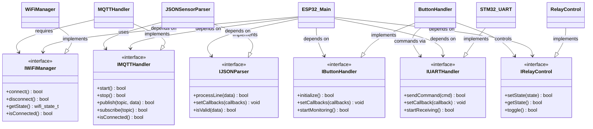

# ESP32 Firmware - UML Diagrams

This document contains all UML diagrams for the ESP32 firmware architecture, including class diagrams, component diagrams, and structural relationships.

## ESP32 Firmware Class Diagram


## Component Interaction UML Diagram



## State Machine UML Diagram


## Package Structure UML Diagram

```mermaid
classDiagram
    %% Package definitions using namespaces
    namespace WiFiPackage {
        class WiFiManager
        class WiFiConfig
        class WiFiState
    }
    
    namespace MQTTPackage {
        class MQTTHandler
        class MQTTConfig
        class MQTTState
    }
    
    namespace UARTPackage {
        class STM32_UART
        class UARTConfig
        class RingBuffer
    }
    
    namespace RelayPackage {
        class RelayControl
        class RelayConfig
        class RelayState
    }
    
    namespace ButtonPackage {
        class ButtonHandler
        class ButtonConfig
        class ButtonState
    }
    
    namespace JSONPackage {
        class JSONSensorParser
        class JSONUtils
        class SensorData
    }
    
    namespace COAPPackage {
        class COAPHandler
        class COAPConfig
    }
    
    namespace CorePackage {
        class ESP32_Main
        class SystemState
        class SystemConfig
    }
    
    %% Package Dependencies
    CorePackage --> WiFiPackage : uses
    CorePackage --> MQTTPackage : uses
    CorePackage --> UARTPackage : uses
    CorePackage --> RelayPackage : uses
    CorePackage --> ButtonPackage : uses
    CorePackage --> JSONPackage : uses
    CorePackage --> COAPPackage : optionally uses
    
    MQTTPackage --> WiFiPackage : depends on
    JSONPackage --> MQTTPackage : uses
    ButtonPackage --> RelayPackage : controls
    ButtonPackage --> UARTPackage : commands via
```

## Object Interaction UML Diagram


## Error Handling UML Diagram


## Memory Management UML Diagram


---

## UML Diagram Conventions

### Class Stereotypes
- `<<interface>>` - Abstract interface definitions
- `<<enumeration>>` - Enumerated types
- `<<singleton>>` - Singleton pattern implementation
- `<<abstract>>` - Abstract base classes

### Relationship Types
- `-->` - Association (uses/depends on)
- `*--` - Composition (owns/contains)
- `o--` - Aggregation (has/references)
- `<|--` - Inheritance (extends/implements)
- `..>` - Dependency (uses temporarily)
- `-.->` - Realization (implements interface)

### Visibility Indicators
- `+` - Public members and methods
- `-` - Private members and methods
- `#` - Protected members and methods
- `~` - Package-private members

### Method Annotations
- `()` - Method with no parameters
- `(type param)` - Method with typed parameters
- `type` - Return type specification
- `void` - No return value

### Class Attributes
- Simple attributes: `+attribute_name : type`
- Constants: `+CONSTANT_NAME : type = value`
- Static members: `{static} +static_member : type`
- Array/Collection: `+items : type[]`

### Package Organization
- Core functionality in `CorePackage`
- Network components in `WiFiPackage` and `MQTTPackage`
- Communication in `UARTPackage`
- Hardware control in `RelayPackage` and `ButtonPackage`
- Data processing in `JSONPackage`
- Optional features in `COAPPackage`

### Design Patterns Implemented
- **Singleton**: MemoryManager, ErrorManager
- **Observer**: Event callbacks throughout system
- **Strategy**: Different error handling strategies
- **Factory**: Memory pool creation
- **State Machine**: WiFi and MQTT state management
- **Command**: Button press handling
- **Facade**: Component managers hide complexity